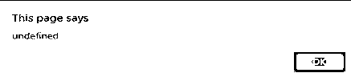

# JavaScript 中的字符串数组

> 原文：<https://www.educba.com/string-array-in-javascript/>


## JavaScript 中的字符串数组简介

JavaScript 支持[各种类型的数组，](https://www.educba.com/array-methods-in-java/) string 数组就是其中之一。字符串数组什么都不是，但它是关于字符串的数组。数组是一个存储多个相似类型值的变量。在字符串数组的上下文中，它只存储字符串值。该字符串是字符的组合。这里有几个字符串的例子——“拉姆”、“希亚姆”、“xyz”、“XYZ”等等。从字符串数组到整数或小数数组没有什么不同。几乎所有的功能都保持不变。

### JavaScript 中的数组类型及示例

有两种类型的字符串数组，如整型数组或浮点型数组。

<small>网页开发、编程语言、软件测试&其他</small>

*   传统阵列
*   作为对象的字符串数组

#### 1.传统阵列

这是一个普通的数组。在这里，我们以这样的方式声明一个数组，索引将从 0 开始。0 后面会跟 1，2，3，….n。

```
var characters = ["AB", "CD", "XY"];
```

用于声明任何变量关键字中的变量。“字符”是数组的名称。AB，CD，XY 是存储在数组中的值。在示例数组声明中，我们可以通过位置 0、1 和 2 来访问值。让我们看看如何访问上述代码的值。

```
<html>
<head>
<title>Array in JavaScript</title>
</head>
<script type="text/javascript">
var characters = ["AB", "CD", "XY"];
alert(characters);    // output will be AB,CD,XY
alert(characters[0]); // output will be AB
</script>
<body>
</body>
</html>
```

**使用 for 循环打印字符串数组:**

```
<html>
<head>
<title>Array in JavaScript</title>
</head>
<script type="text/javascript">
var characters = ["AB", "CD", "XY"];
for(var i=0; i<3; i++){
alert(characters[i]); // this will alert value one by one.
}
</script>
<body>
</body>
</html>
```

上面的代码将逐个警告所有的值。

#### 2.作为对象的字符串数组

这是一种使用键值对对象的[数组。](https://www.educba.com/array-in-unix/)

**声明:**

```
var objectArray = {0: "1", 1: '2', 2: 'Mess',3: 'empty string'};
```

这是一对键和值的数组。如果我们想要使用 0 位置值，我们可以通过使用 objectArray[0]来访问它。

```
<html>
<head>
<title>Array in JavaScript</title>
</head>
<script type="text/javascript">
// String array as an object
var objectArray  = {0: "1", 1: '2', 2: 'Mess',3: 'empty string'};
alert(objectArray [0]); // this will print 1
alert(objectArray [1]); // this will print 2
alert(objectArray [2]); // this will print Mess
alert(objectArray [3]); // this will print empty string
</script>
<body>
</body>
</html>
```

使用这种方法，我们可以分配任何键，而不是 0，1，2 等等。我们也可以用任何弦。我们来看一个例子。

```
<html>
<head>
<title>Array in JavaScript</title>
</head>
<script type="text/javascript">
// String array as an object
var objectArray  = {"first": "1", "second": '2', 2: 'Mess',3: 'empty string'};
alert(objectArray ['first']); // this will print 1
alert(objectArray ['second']); // this will print 2
alert(objectArray [2]); // this will print Mess
alert(objectArray [3]); // this will print empty string
</script>
<body>
</body>
</html>
```

我们可以看到 0 和 1 位置键使用了 first 和 second。输出与上一个示例中的一样。要访问第一个元素值，我们将使用 objectArray['first'])。

**现在，让我们看看下面代码的输出是什么:**

```
<html>
<head>
<title>Array in JavaScript</title>
</head>
<script type="text/javascript">
// String array as an object
var objectArray  = {"first": "1", "second": '2', 2: 'meaow',3: 'empty string'};
alert(objectArray [0]); // this will print undefined
</script>
<body>
</body>
</html>
```

由于没有定义带 0 的键，上面代码的输出将是未定义的。




### 字符串数组上的函数

字符串数组上的函数如下所示，

#### join()函数

这将把[字符串数组](https://www.educba.com/string-array-in-c-sharp/)元素和指定的分隔符连接在一起。以下代码将使用管道操作符(|)连接数组元素。

```
<script type="text/javascript">
var characters = ["AB", "CD", "XY"];
var outputstring  = characters.join(" | ");
alert(outputstring);
</script>
```

上述代码的输出将是-**AB | CD | XY**

#### concat()函数

我们可以用这个函数来连接两个数组。

```
<script type="text/javascript">
var characters1 = ["AB", "CD", "XY"];
var characters2 = ["AB", "CD", "XY"];
var characters = characters1.concat(characters2);
alert(characters);
</script>
```

上述代码的输出将是**–AB，CD，XY，AB，CD，XY**

#### includes()函数

该函数将返回布尔值(真或假)。如果一个指定的字符串存在于一个数组中，那么它将返回 true，否则它将返回 false。让我们看一个例子。

```
<script type="text/javascript">
var characters1 = ["AB", "CD", "XY"];
var characters = characters1.includes("CD");
alert(characters);  // true
var characters = characters1.includes("CDA"); // false
alert(characters);  // true
</script>
```

#### split()函数

该函数将字符串作为输入，并将其拆分到数组中。让我们看一个例子。

```
<script type="text/javascript">
var str = "Welcome to the JavaScript Blogging!";
var result = str.split(" ");
alert(result[0]); // this will print Welcome
alert(result); // this will print Welcome,to,the,JavaScript,Blogging!
</script>
```

### 结论

JavaScript 支持各种类型的数组。在使用 JavaScript 字符串数组时，我们不需要担心数据类型。作为开发人员，我们应该在日常工作中包含字符串数组，以处理编码之类的事情。[字符串数组我们可以使用](https://www.educba.com/strings-array-in-c/)，在运行时我们不确定我们将存储的数据类型。所以，我们可以说字符串数组是一个混合数组，因为它可以组合各种类型的数据值。就像我们可以存储整数，字符或任何其他字符串。

**现在，考验自己的时候到了**

*   默认情况下，数组索引从 0 开始。真的还是假的？
*   在 JavaScript 中不需要在数组声明时定义数据类型。真的还是假的？
*   字符串数组的大多数 JavaScript 数组函数保持不变。真的还是假的？
*   用 JavaScript 写一个程序来使用 string 函数获取所有由分号连接的字符串？

### 推荐文章

这是 JavaScript 中字符串数组的指南。这里我们用一个例子来讨论 javascript 中数组的功能和类型，这个例子包括传统的数组，字符串数组作为对象。您也可以阅读以下文章，了解更多信息——

1.  [在 Java 脚本中反转](https://www.educba.com/reverse-in-javascript/)
2.  [Unix 中的数组](https://www.educba.com/array-in-unix/)
3.  [Java 中的字符串数组](https://www.educba.com/string-array-in-java/)
4.  [String vs StringBuffer](https://www.educba.com/string-vs-stringbuffer/)


