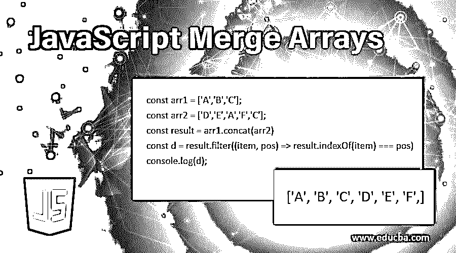

# JavaScript 合并数组

> 原文：<https://www.educba.com/javascript-merge-arrays/>




## JavaScript 中的合并数组简介

在这个主题中，我们将学习如何在 JavaScript 中将数组合并在一起。此外，我们还将学习如何获取合并数组中的唯一元素，或者从合并数组中删除重复元素。在这个主题中，我们将解释三种不同的方法来合并数组，并在 JavaScript 中得到合并后的数组。

### JavaScript 合并数组的方法

下面是提到的 JavaScript 合并数组的方法:

<small>网页开发、编程语言、软件测试&其他</small>

#### 方法 1–Javascript concat 方法

该方法用于在 JavaScript 中合并两个或多个数组。该方法返回一个新数组，不改变现有数组。

**语法:**

```
const result_array = array1.concat([item1[, item2[, ...[, itemN]]]])
```

**参数:**

要连接或合并到新数组中的数组和/或值。

**返回:**

新的数组实例。

##### 示例#1

在这个例子中，我们使用 JavaScript concat()方法合并了两个数组。两个数组都有独特的项目。

```
const arr1 = ['A', 'B', 'C', 'D'];
const arr2 = ['E', 'F', 'G'];
const result = arr1.concat(arr2);
console.log(result);
```

**输出:**


正如我们所看到的，concat()方法合并了两个数组，并返回一个新的数组和结果。

##### 实施例 2

在这个例子中，我们使用 JavaScript concat()方法合并了三个数组。所有数组最初都有唯一的元素。

```
const arr1 = ['A', 'B', 'C', 'D'];
const arr2 = ['E', 'F', 'G'];
const arr3 = ['H', 'I'];
const result = arr1.concat(arr2, arr3);
console.log(result);
```

**输出:**


正如我们已经看到的 concat()方法的语法，它可以将一个或多个数组合并在一起。现在，我们已经通过上面三个阵列的示例看到了这一点。

##### 实施例 3

在这个例子中，我们将看到 concat 方法是否删除了重复的元素。

```
const arr1 = ['A', 'B', 'C', 'D'];
const arr2 = ['E', 'F', 'G', 'A'];
const result = arr1.concat(arr2);
console.log(result);
```

**输出:**


正如我们所看到的，concat 方法有助于将数组合并在一起，但不能从数组中删除重复的元素。

##### 实施例 4

在本例中，我们将对结果合并数组使用 filter 方法来获取结果中的唯一元素或从结果中删除重复元素。

```
const arr1 = ['A','B','C'];
const arr2 = ['D','E','A','F','C'];
const result = arr1.concat(arr2)
const d = result.filter((item, pos) => result.indexOf(item) === pos)
console.log(d);
```

**输出:**


正如我们在上面的例子中看到的，为了从结果合并数组中删除重复的元素，我们使用了 JavaScript filter()方法。

##### 实施例 5

在本例中，我们将使用另一种方法来获取结果中的唯一元素或从结果中删除重复元素。

```
const arr1 = ['A','B','C'];
const arr2 = ['D','E','A','F','C'];
console.log(Array.from(new Set(arr1.concat(arr2))));
```

**输出:**


在这个例子中，我们将得到的合并数组传递给 JavaScript 集合，因为集合具有删除重复元素的属性，但是它们返回的是集合而不是数组。所以通过使用数组。在中，我们将结果从集合转换为数组。

#### 方法 2–Javascript 扩展运算符

使用该操作符，每个数组都被扩展，以允许在新数组中设置数组值。

**语法:**

```
For Array and String:
[...array_name, '6'];
```

##### 示例#1

在这个例子中，我们将看到 javaScript spread 操作符如何合并数组。

```
const arr1 = ['A', 'B', 'C', 'D'];
const arr2 = ['E', 'F', 'G'];
const arr3 = ['H', 'I'];
const result = [...arr1,...arr2,...arr3];
console.log(result);
```

**输出:**


在这个例子中，我们学习了如何使用 JavaScript 来传播合并数组的语法。但是这不是开发人员的首选，也不建议在大型数据集上使用，因为与 JavaScript concat()方法相比，这种方法的运行速度较慢。

##### 实施例 2

在这个例子中，我们将看到 spread 语法方法是否删除了重复的元素。

```
const arr1 = ['A', 'B', 'C', 'D'];
const arr2 = ['E', 'F', 'G', 'A'];
const result = [...arr1,...arr2];
console.log(result);
```

**输出:**


正如我们已经看到的，spread 语法方法有助于将数组合并在一起，但不能从数组中删除重复的元素。

##### 实施例 3

在这个例子中，我们将看到如何在结果中获得唯一的元素或者从结果中删除重复的元素。

```
const arr1 = ['A','B','C'];
const arr2 = ['D','E','A','F','C'];
const arr3 = [...new Set([...arr1 ,...arr2])];
console.log(arr3);
```

**输出:**


在这个例子中，我们将得到的合并数组传递给 JavaScript 集合，因为集合具有删除重复元素的属性，但是它们返回的是集合而不是数组。因此，通过定义数组，我们将结果从集合转换为数组。

#### 方法 3–Javascript 数组推送方法

此方法在数组末尾添加一项或多项，并返回新数组的长度。

**语法:**

```
array_name.push(item1[, ...[, itemN]])
```

**参数:**

**ItemN–**要添加到数组末尾的项目。

**返回:**

调用此 push 方法的数组的新长度。

##### 示例#1

在这个例子中，我们将看到数组推送方法在合并数组时是如何工作的。

```
const arr1 = ['A','B','C'];
const arr2 = ['D','E','A','F','C'];
const lengthofcombinedarray = arr1.push(...arr2);
console.log(arr1);
console.log(lengthofcombinedarray);
```

**输出:**


##### 实施例 2

在这个例子中，我们将如何获得结果中的唯一元素或从结果中删除重复元素。

```
const arr1 = ['A','B','C'];
const arr2 = ['D','E','A','F','C'];
arr1.push(...arr2);
const result = [...new Set(arr1)]
console.log(result);
```

**输出:**


### 结论——JavaScript 合并数组

在一些编程语言中，我们使用额外的操作符来合并数组，但是 JavaScript 提供了不同的方法来合并数组。所以，我们已经学习了 JavaScript 中三种不同的方法来合并数组。

### 推荐文章

这是一个 JavaScript 合并数组的指南。这里我们讨论基本的概念，三种不同的方法来合并数组并在 JavaScript 中得到合并数组。您也可以看看以下文章，了解更多信息–

1.  [JavaScript 中的算术运算符](https://www.educba.com/arithmetic-operators-in-javascript/)
2.  [JavaScript 获取数组长度](https://www.educba.com/javascript-get-array-length/)
3.  [JavaScript 迭代数组](https://www.educba.com/javascript-iterate-array/)
4.  [JavaScript 数组映射()](https://www.educba.com/javascript-array-map/)


