# JavaScript 数组推送

> 原文：<https://www.educba.com/javascript-array-push/>

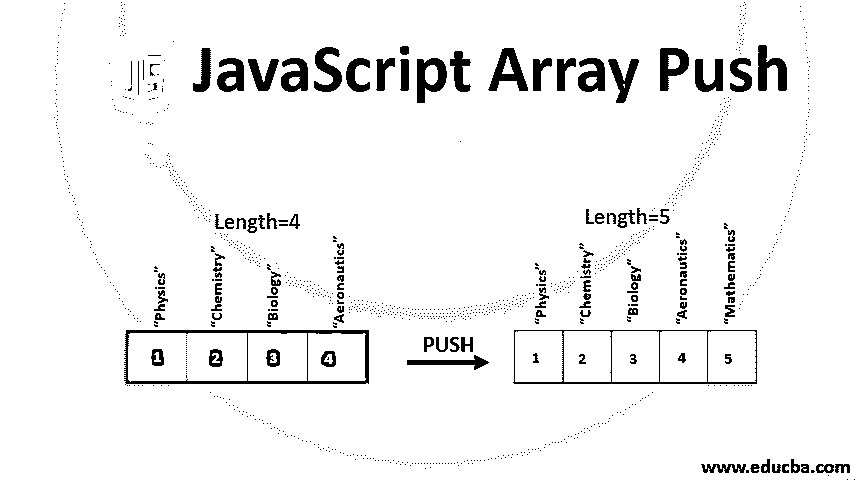


## JavaScript 数组推送简介

下面的文章提供了 JavaScript 数组推送的概要。Javascript 为我们提供了一种惊人的对象类型，它不同寻常地处理数字而不是名称，并且可以在该特定对象中存储任何类型和数量的对象。当我们需要存储多个相似类型、相似质量的对象时，数组非常有用。

命名汽车数组将存储所有汽车的名称。没有必要添加具有相似数据类型的对象。我们可以在 javascript 中添加数字、字符串、浮点值、十进制数字、字符、布尔值，甚至数组。

<small>网页开发、编程语言、软件测试&其他</small>

### 如何在 JavaScript 中声明数组？

我们可以使用 new object 或[]数组以两种方式声明它。最好的方法是使用[]即左右方括号。这样做的原因是使用 new()有时会产生一些问题。

**举例:**

```
var marks = new Array(90, 95);
```

上面的声明将创建一个包含两个项目的数组，即 90 和 95，数组的长度为 2。

```
var marks = new Array(90);
```

该声明将导致创建名为 marks 的数组，该数组将包含 90 个未定义的项，并且 marks 数组的长度也将是 90。

为了避免这种情况，数组被声明为:

```
var marks = [];
```

### 在数组中添加元素

有三种方法可以在 javascript 数组中添加元素，如下所示:

*   **Push():** 当我们必须在数组的最后一个位置添加一个元素或项目时，使用这个方法。
*   **Unshift():** 当我们必须在数组的开头添加一个元素时，我们可以使用 Unshift()方法来做同样的事情。
*   **Splice():** 我们经常要在数组内容中间添加一项。使用 splice()方法，我们可以指定需要添加新元素的位置。

### JavaScript 数组推送的例子

以下是 JavaScript 数组推送的示例:

#### 示例#1

推送数组中的单个元素。

**代码:**

```
<!DOCTYPE html>
<html>
<body>
<p>You can click the button to add a new subject mathematics in the subjects array.</p>
<button onclick="addSubject()">Add Now</button>
<p id="sample"></p>
<script>
var subjects = ["Physics", "Chemistry", "Biology", "Aeronatics"]; document.getElementById("sample").innerHTML = subjects;
function addSubject() { subjects.push("Mathematics");
document.getElementById("sample").innerHTML = subjects;
}
</script>
</body>
</html>
```

**输出:**

**之前点击:**

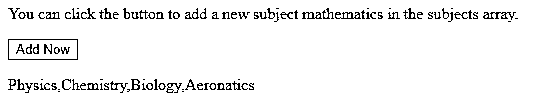


**点击后:**

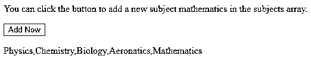


#### 实施例 2

推入数组中的多个元素。

我们可以使用 javascript 的 push()方法在一个数组中添加多个元素或项目。

**代码:**

```
<!DOCTYPE html>
<html>
<body>
<p>You can click the button to add a multiple subjects in the subjects array.</p>
<button onclick="addSubject()">Add Now</button>
<p id="sample"></p>
<script>
var subjects = ["Physics", "Chemistry", "Biology", "Aeronatics"]; document.getElementById("sample").innerHTML = subjects;
function addSubject() { subjects.push("Mathematics","Marathi","English","Project"); document.getElementById("sample").innerHTML = subjects;
}
</script>
</body>
</html>
```

**输出:**

**之前点击:**


**点击后:**

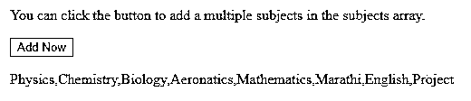


#### 实施例 3

用不同的数据类型推送数组中的多个元素。

我们可以添加不同数据类型的字符串和元素，如整数、浮点数、小数等。我们甚至可以使用 push 方法在数组中添加数组。

**代码:**

```
<!DOCTYPE html>
<html>
<body>
<p>You can click the button to add a multiple datatype elements in the javascript array.</p>
<button onclick="addSubject()">Add Now</button>
<p id="sample"></p>
<script>
var subjects = ["Physics", "Chemistry", "Biology", "Aeronatics"]; document.getElementById("sample").innerHTML = subjects;
function addSubject() { subjects.push(1,36,true);
document.getElementById("sample").innerHTML = subjects;
}
</script>
</body>
</html>
```

**输出:**

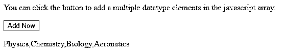


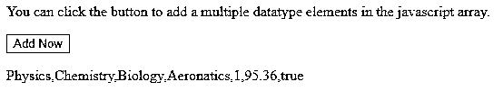


#### 实施例 4

使用 push 向数组中添加数组。

**代码:**

```
<!DOCTYPE html>
<html>
<body>
<p>You can click the button to add a multiple datatype elements in the javascript array.</p>
<button onclick="addSubject()">Add Now</button>
<p id="sample"></p>
<script> var marks =
[["Sid",["Physics",81], ["Chemistry",72], ["Biology",92], ["Aeronatics",93]]]; document.getElementById("sample").innerHTML = marks;
function addSubject() {
marks.push(["Riya",["Physics",93], ["Chemistry",85], ["Biology",91], ["Aeronatics",87]]);
document.getElementById("sample").innerHTML = marks;
}
</script>
</body>
</html>
```

**输出:**

**点击按钮前:**

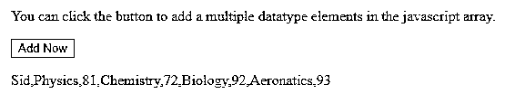


**点击按钮后:**

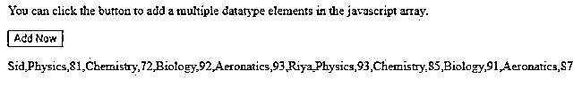


javascript 中的 push()方法在将指定的元素添加到其参数中后，返回当前数组中元素的数量。这始终等于在添加元素之前数组的长度加上被推送的元素数。

#### 实施例 5

push()方法的返回值。

**代码:**

```
<!DOCTYPE html>
<html>
<body>
<p>To check return value of push() method click on the button.</p>
<button onclick="addSubject()">Add Now</button>
<p id="sample"></p>
<script> var marks =
[["Sid",["Physics",81], ["Chemistry",72], ["Biology",92], ["Aeronatics",93]],
["Payal",["Physics",61], ["Chemistry",55], ["Biology",96], ["Aeronatics",56]],
["Amish",["Physics",75], ["Chemistry",68], ["Biology",79], ["Aeronatics",83]]]; document.getElementById("sample").innerHTML = marks.length;
function addSubject() {
var arrLength = marks.push(["Riya",["Physics",93], ["Chemistry",85], ["Biology",91], ["Aeronatics",87]]);
document.getElementById("sample").innerHTML = arrLength;
}
</script>
</body>
</html>
```

**输出:**

**点击按钮前:**

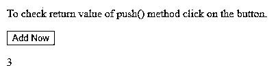


**点击按钮后:**

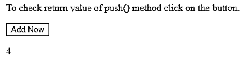


如果要在数组的开头添加元素，则使用 unshift()方法而不是 push()。让我们在一个例子的帮助下快速看一下。

#### 实施例 6

在数组的开头添加新元素。

**代码:**

```
<!DOCTYPE html>
<html>
<body>
<p>You can click the button to add a multiple subjects in the subjects array at the beginning of the array.</p>
<button onclick="addSubject()">Add Now</button>
<p id="sample"></p>
<script>
var subjects = ["Physics", "Chemistry", "Biology", "Aeronatics"]; document.getElementById("sample").innerHTML = subjects;
function addSubject() { subjects.unshift("Mathematics","Marathi","English","Project"); document.getElementById("sample").innerHTML = subjects;
}
</script>
</body>
</html>
```

我们可以在开始时使用 unshift()方法添加单个或多个项目，类似于 push()方法，这也返回给我们数组的新长度。

**输出:**

**点击按钮前:**

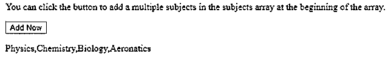


**点击按钮后:**

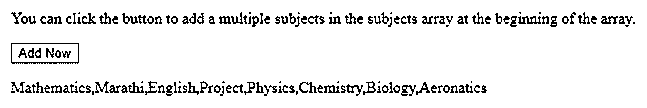


请注意，push()方法和上述所有方法仅适用于 ECMAScript 1 版本的 javascript 和受支持的浏览器，支持这些方法的最低版本如下。

*   铬 0
*   Internet Explorer 5
*   火狐 0
*   旅行队
*   歌剧

### 结论

这样，我们可以在数组上使用多个方法来操作同一个。push()方法是最安全的方法之一，因为它避免了在使用 splice()方法或使用索引直接赋值时在数组中创建未定义的洞。我们可以使用 push()方法在数组末尾添加元素，增加数组长度。

### 推荐文章

这是一个 JavaScript 数组推送的指南。这里我们讨论了简介，在数组中添加元素，以及 javascript 数组推送的例子。您也可以看看以下文章，了解更多信息–

1.  [JavaScript 编译器](https://www.educba.com/javascript-compilers/)
2.  [JavaScript 提示](https://www.educba.com/javascript-prompt/)
3.  [JavaScript 迭代数组](https://www.educba.com/javascript-iterate-array/)
4.  [JavaScript 数组串联](https://www.educba.com/javascript-array-concat/)


