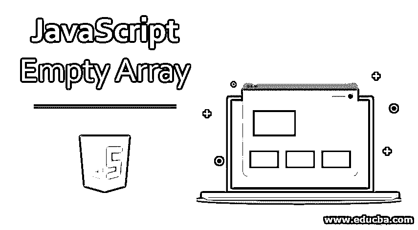
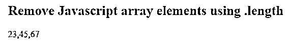
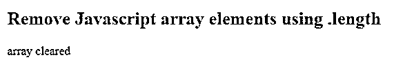
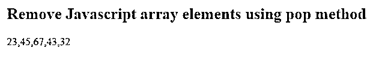
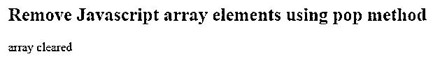
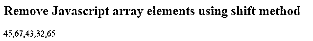
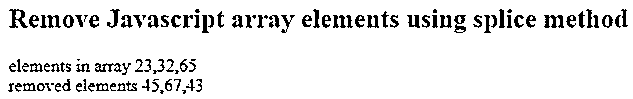
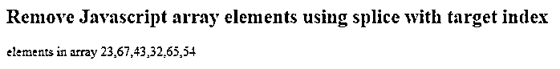
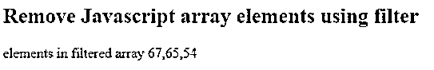
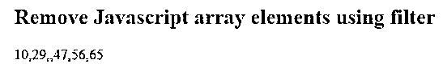

# JavaScript 空数组

> 原文：<https://www.educba.com/javascript-empty-array/>




## JavaScript 空数组简介

清空数组无非是用各种方法去掉数组的元素；可以从数组的开头、数组的结尾、特定的索引值或指定的值开始。与其他编程语言不同，在 JavaScript 中，数组是用于存储不同元素的单个变量。 [Javascript array 允许](https://www.educba.com/javascript-array-concat/)对值进行分组，并对它们执行操作/迭代。用户可以用多种方式添加和移除数组中的元素。由于 Javascript 没有一个简单的 remove 方法来清除数组中的元素，我们有一些其他的方法和技术可以用来清除 Javascript 数组元素。

*   **pop** :清除数组末尾的元素。
*   **shift** :清除数组开头的元素。
*   **splice** :清除数组中指定索引的元素。
*   **filter** :通过分析代码从数组中清除元素。

**语法:**

<small>网页开发、编程语言、软件测试&其他</small>

在弹出和移位的情况下

```
<name of the array>.pop/ shift()
```

在 javascript 中，不需要将特定的参数传递给 pop 或 shift 方法。

在拼接的情况下，

```
<name of the array>.splice(index, number of elements to be removed)
```

我们有一个更简单的方法来清除数组元素，通过设置数组的长度来删除数组末尾的元素。我们需要设置小于当前数组长度的 length 值。

### JavaScript 空数组的例子

下面给出了 JavaScript 空数组的例子:

#### 示例#1

**代码:**

```
<!DOCTYPE html>
<html>
<body>
<h2>Remove Javascript array elements using .length</h2>
<p id="demo"></p>
<script>
var array = [23,45,67,43,32,65];
array.length = 3;
document.write( array );
</script>
</body>
</html>
```

**输出:**




#### 实施例 2

通过将数组的长度设置为 0。

**代码:**

```
<!DOCTYPE html>
<html>
<body>
<h2>Remove Javascript array elements using .length</h2>
<p id="demo"></p>
<script>
var array = [23,45,67,43,32,65];
array.length = 0;
if(array.length == 0)
{
document.write( 'array cleared' );
}
else{
document.write( array );
}
</script>
</body>
</html>
```

**输出:**




#### 实施例 3

使用 pop():pop()方法删除数组的最后一个元素，修改数组及其长度。

**代码:**

```
<!DOCTYPE html>
<html>
<body>
<h2>Remove Javascript array elements using pop method </h2>
<p id="demo"></p>
<script>
var array = [23,45,67,43,32,65];
array.pop();
document.write( array );
</script>
</body>
</html>
```

**输出:**




#### 实施例 4

通过使用 for 循环迭代数组并清除 javascript 数组的元素。

**代码:**

```
<!DOCTYPE html>
<html>
<body>
<h2>Remove Javascript array elements using pop method</h2>
<p id="demo"></p>
<script>
var array = [23,45,67,43,32,65];
for (var i = array.length; i > 0; i--) {
array.pop();
}
if(array.length == 0){
document.write( 'array cleared' );
}
else{
document.write( array );
}
</script>
</body>
</html>
```

**输出:**




#### 实施例 5

使用 shift()方法，它的工作方式[与 pop()方法](https://www.educba.com/pop-in-javascript/)完全相同，但是从数组的开头删除元素，我们不需要提供任何参数，因为 shift()方法只清除数组的第一个元素。

**代码:**

```
<!DOCTYPE html>
<html>
<body>
<h2>Remove Javascript array elements using shift method </h2>
<p id="demo"></p>
<script>
var array = [23,45,67,43,32,65];
array.shift();
document.write( array );
</script>
</body>
</html>
```

**输出:**




如果该数组没有任何数组元素，并且在该数组上实现了 shift()方法，则它将返回 undefined，因为数组长度为 0。

#### 实施例 6

使用 splice()方法删除 javascript 数组的元素。

**代码:**

```
<!DOCTYPE html>
<html>
<body>
<h2>Remove Javascript array elements using splice method </h2>
<p id="demo"></p>
<script>
var array = [23,45,67,43,32,65];
var removed_elements = array.splice(1,3);
document.write( 'elements in array ', array );
document.write('</br>');
document.write( 'removed elements ', removed_elements );
</script>
</body>
</html>
```

**输出:**




splice()也可以用来删除数组中的一系列元素，现在让我们看看如何通过指定值来删除数组中的元素，

首先，我们需要知道用户想要删除的数组中的值，并确定它的索引号。使用此方法只能删除单个项目。

#### 实施例 7

**代码:**

```
<!DOCTYPE html>
<html>
<body>
<h2>Remove Javascript array elements using splice with target index</h2>
<p id="demo"></p>
<script>
var array = [23,45,67,43,32,65,45,54,45];
for( var i = 0; i < array.length; i++){
if ( array[i] === 45) {
array.splice(i, 1);
i--;
}
}
document.write('elements in array ', array);
</script>
</body>
</html>
```

**输出:**




让我们来看看使用 filter 方法通过值来移除数组的元素。

Filter()创建一个新的数组，并且不改变输入数组，它只有一个参数，一个回调方法，当用户遍历数组元素并传递当前值、当前数组索引和输入数组时会触发这个回调方法。

#### 实施例 8

**代码:**

```
<!DOCTYPE html>
<html>
<body>
<h2>Remove Javascript array elements using filter</h2>
<p id="demo"></p>
<script>
var array = [23,45,67,43,32,65,45,54,45];
var filtered_array = array.filter(function(value, index, arr){
return value > 45;
});
document.write('elements in filtered array ', filtered_array);
</script>
</body>
</html>
```

**输出:**




上述方法是我们在日常编程中经常使用的。现在，让我们看看清空 javascript 数组的更多方法。

*   **Lodash 数组移除方法:** Lodash 为数组操作方法提供了一组实用程序库，其中之一就是“Remove”。它的工作方式类似于 filter 方法，但不保存原始值，只将匹配的元素返回到新数组中。
*   **以编程方式创建一个 Remove 方法:**不使用 Lodash，我们可以创建我们的实用方法‘Remove ’,并用它来清空数组。第一个参数是输入数组，它只接受像数字或字符串这样的值。
*   **使用“删除”操作符显式删除数组元素:**我们可以使用删除操作符指定要删除的数组元素。它不影响输入数组的长度，也不影响其他元素的索引，这意味着被删除的元素没有被完全删除[，而是变成未定义的](https://www.educba.com/javascript-undefined/)。

这个删除操作符不会完全删除元素，因为这里的删除是指释放内存空间。

#### 实施例 9

**代码:**

```
<!DOCTYPE html>
<html>
<body>
<h2>Remove Javascript array elements using filter</h2>
<p id="demo"></p>
<script>
var array = [10, 29, 38, 47, 56, 65];
delete array[2];
document.write(array);
</script>
</body>
</html>
```

**输出:**




### 结论

移除/清空 javascript 数组条目很有用，因为我们可以管理数据存储。我们没有可用于清空数组的 remove 方法，但是我们有许多其他方法，正如我们在上面通过例子回顾的那样。

### 推荐文章

这是一个 JavaScript 空数组的指南。这里我们讨论 JavaScript 空数组的介绍和例子。您也可以看看以下文章，了解更多信息–

1.  [JavaScript 中的队列](https://www.educba.com/queue-in-javascript/)
2.  [JavaScript 中的平方根](https://www.educba.com/square-root-in-javascript/)
3.  [JavaScript 关键字](https://www.educba.com/javascript-keywords/)
4.  [JavaScript 字符串替换](https://www.educba.com/javascript-string-replace/)


