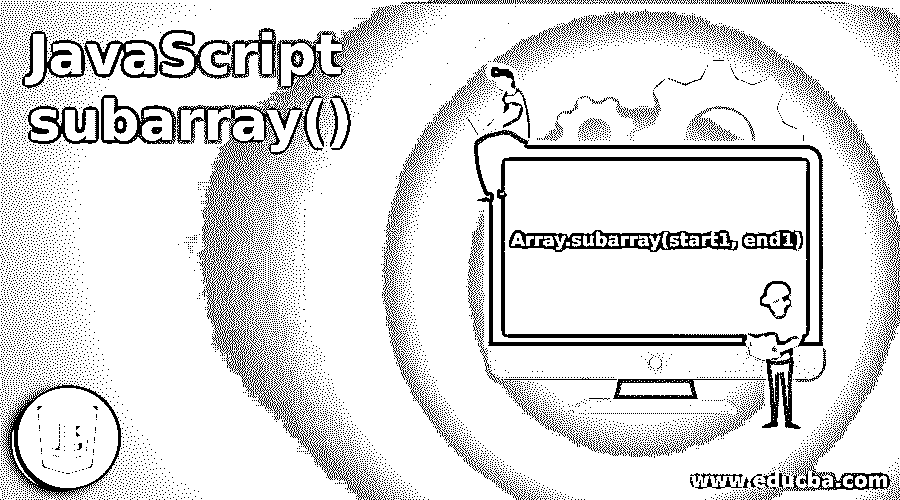
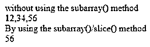
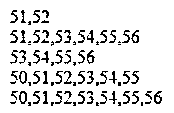
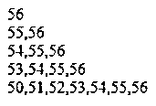
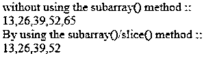

# JavaScript 子数组()

> 原文：<https://www.educba.com/javascript-subarray/>




## JavaScript 子数组介绍()

PHP 编程语言的 JavaScript subarray()方法将提供选定的数组元素和 subarray()方法，以不改变原来的数组。它用于获取原始数组对象的一部分。它只接受两个参数。第一个参数是 start1 参数，第二个是 end1 参数。Start1 参数偏移是包含性的，而 end1 参数偏移是排他性的。JavaScript 子数组()的两个参数是可选的，而这两个参数是强制的。subarray()函数的这两个参数是当前数组的有效索引值。

**语法:**

<small>网页开发、编程语言、软件测试&其他</small>

```
Array.subarray(start1, end1)
```

**参数说明:**

*   **Start1:**PHP 编程语言的 subarray()函数的 start 1 参数是可选参数。这个参数是帮助我们从选择开始的开始位置。
*   **End1:**PHP 编程语言的 subarray()函数的 end 1 参数也是可选参数。这个 End1 参数是结束位置，它帮助我们知道在哪里结束选择。
*   **subarray()的返回值:**subarray()的返回值是由原来的数组对象实际组成的新数组。

### JavaScript subarray()是如何工作的？

*   JavaScript subarray()基于两个参数工作:start1 和 end1，但是这些 subarray()参数不是强制的。
*   为了从原始数组中获取子数组，我们必须遵循一个基本语法

```
array.subarray(element, element)
```

或者

```
array.subarray(element)
```

*   基于下面的语法，整个 subarray()概念是有效的。
*   可以在 subarray()预定义函数/方法中使用一个元素，也可以根据需要使用两个元素。

### JavaScript 子数组()的示例

下面是一些例子:

#### 示例#1

在下面的例子中，为了执行 JavaScript 代码，在标签内部的标签的头部使用了

**语法:**

```
<!DOCTYPE html>
<html>
<title>Our Web Page Design1</title>
<head>
<script>
function profitloops1() {
var arr1 = new Uint8Array([12,34,56]);
var new_arr1 = arr1.subarray(2);
document.write("without using the subarray() method <br>");
document.write(arr1);
document.write("<br>");
document.write("By using the subarray()/slice() method <br>");
document.write(new_arr1);
}
profitloops1();
</script>
</head>
<body>
</body>
</html>
```

**输出:**




#### 实施例 2

在下面的例子中，在脚本标签中创建了一个数组变量“A1 ”,其中包含一些数值。这是借助 Uint8Array()函数完成的。然后用不同的指数值创建 B1、C1、D1、E1 和 F1 变量。对于 B1，使用“1，2”索引值，这意味着只有索引值 1，2 从第 3 <sup>rd</sup> 索引值内的数组调用。它包含“51，52”值。然后创建“C1”变量来存储来自索引值“1”的数组值。然后创建“D1”变量来存储来自数组索引值“3”的数组值。同样，创建“E1”变量来存储索引值 0 和 6 的数组值。然后创建“F1”变量来存储从索引值“0”开始的数组值。像这样，所有不同的子数组被创建并存储在不同的变量中。然后，在 document.write()函数的帮助下，所有子数组元素将在上述不同变量的帮助下打印出来。

**语法:**

```
<!DOCTYPE html>
<html>
<script>
const A1 = new Uint8Array([50, 51, 52, 53, 54, 55, 56 ]);
B1 = A1.subarray(1, 3)
C1 = A1.subarray(1)
D1 = A1.subarray(3)
E1 = A1.subarray(0, 6)
F1 = A1.subarray(0)
document.write(B1 +"<br>");
document.write(C1 +"<br>");
document.write(D1 +"<br>");
document.write(E1 +"<br>");
document.write(F1 +"<br>");
</script>
</html>
```

**输出:**




#### 实施例 3

在下面的例子中，用数组中不同的数值创建了一个 A1 变量。然后创建不同的变量来得到子数组。这里现在使用 subarray()函数内部的负值来知道结果会是什么。对于“-1”索引值，将打印数组中的最后一个元素。对于“-2”索引值，将打印数组的最后两个元素。同样，对于“-3”索引值，将打印数组的最后 3 个元素。对于其他值也是如此。当且仅当 document.write()函数与用于打印数组的变量一起使用时，才会打印所有这些子数组。

**语法:**

```
<!DOCTYPE html>
<html>
<script>
const A1 = new Uint8Array([50, 51, 52, 53, 54, 55, 56 ]);
B1 = A1.subarray(-1)
C1 = A1.subarray(-2)
D1 = A1.subarray(-3)
E1 = A1.subarray(3)
F1 = A1.subarray(0)
document.write(B1 +"<br>");
document.write(C1 +"<br>");
document.write(D1 +"<br>");
document.write(E1 +"<br>");
document.write(F1 +"<br>");
&
</script>
</html>
```

**输出:**




#### 实施例 4

在下面的示例中，创建了一个名为 profitloops1 的新函数。在其中创建了一个新的数组变量来存储值“13，26，39，52，65”。然后创建“new_arr11”来创建和存储来自原始数组的数组元素。这里只考虑 0 到 4 之间的数组索引。0 索引有 13 个值，1 索引有 26 个值，依此类推。这些值将存储在 new_arr11 变量中。然后使用 document.write()函数打印原始数组值和子数组元素。您可以查看代码的输出，以便了解原始数组和子数组之间的区别。

**语法:**

```
<!DOCTYPE html>
<html>
<script>
function profitloops1() {
var arr11 = new Uint8Array([13,26,39,52,65]);
var new_arr11 = arr11.subarray(0,4);
document.write("without using the subarray() method :: <br>");
document.write(arr11);
document.write("<br>");
document.write("By using the subarray()/slice() method :: <br>");
document.write(new_arr11);
}
profitloops1();
</script>
</html>
```

**输出:**




### 推荐文章

这是 JavaScript 子数组()的指南。这里我们讨论一下入门，JavaScript subarray()是如何工作的？还有例子。您也可以看看以下文章，了解更多信息–

1.  [JavaScript getelement byid()](https://www.educba.com/javascript-getelementbyid/)
2.  [在 JavaScript 中嵌套 if](https://www.educba.com/nested-if-in-javascript/)
3.  [JavaScript 光标](https://www.educba.com/javascript-cursor/)
4.  JavaScript 中的[对象](https://www.educba.com/object-in-javascript/)


