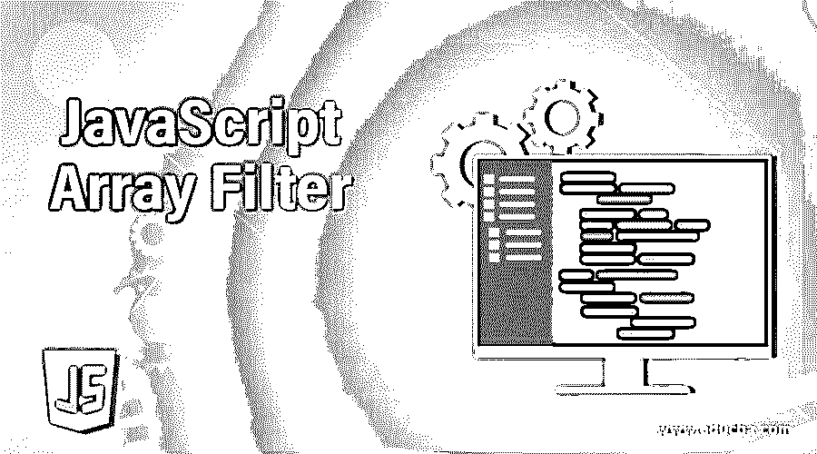
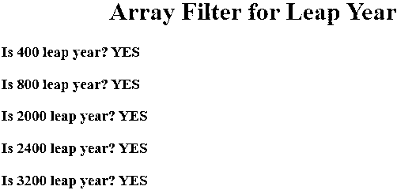
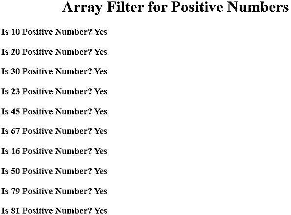
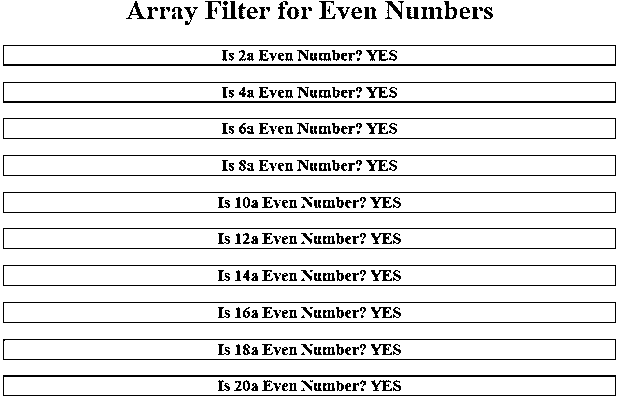
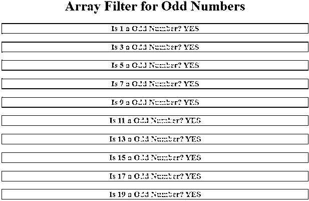
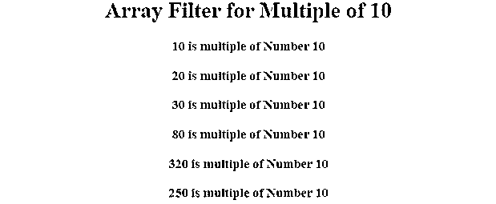

# JavaScript 数组过滤器

> 原文：<https://www.educba.com/javascript-array-filter/>




## JavaScript 数组过滤器简介

JavaScript 中的过滤器数组意味着根据传递给过滤器的条件过滤列表项。当根据名称、价格、日期、特殊字符等从数组中获取数据时，过滤器数组起着至关重要的作用。开发人员可以创建自定义过滤器。列表中的过滤器应用在管道符号(|)后，后跟表达式，如下所示。

**实时场景:**当我们从亚马逊网站购买产品时，我们首先搜索产品。它填充了 1000 种不同价格、品牌、报价大小等的产品。但是因为我们是客户，我们不想要所有这些产品，所以我们简单地对结果集应用了一个过滤器。这种应用需求过滤器列表起着至关重要的作用。

<small>网页开发、编程语言、软件测试&其他</small>

**优点:**

*   通过丢弃不必要的数据来填充准确的数据。
*   易于在 JavaScript 中应用。
*   由如此多的预定义过滤器提供。

### JavaScript 中数组过滤器是如何工作的？

JavaScript 数组过滤器基于 filter()函数对数组值进行过滤。为了更好的理解，你可以观察下面的语法。

**语法:**

```
var outarray= array.filter(function());
```

过滤器函数可以应用于数组或列表，在过滤器中，我们可以为任何布尔运算调用另一个函数。

*   **array:** 它是应用 filer()方法的实际阵列。
*   **function():** 检查 filter()数组上任意条件的函数。
*   **返回值:**filter()的结果给出一组值/带有列表的值。

**Note:** In JavaScript Array is dynamic. JavaScript file can be saved with .js extension or we can include within html file by using <script> tag.

### 实现 JavaScript 数组过滤器的示例

以下是一些例子:

#### 示例#1

闰年的过滤器阵列

**代码:**

```
<!DOCTYPE html>
<html>
<head>
<title>Filter Array</title>
<!--CSS Styles-->
<style>
h3
{
color:green;
}
h1
{
color:blue;
text-align: center;
}
</style>
</head>
<body>
<script>
function isLeapYear(anyYear) { //line1
return (((anyYear % 4 == 0) && (anyYear % 100 != 0)) ||
(anyYear % 400 == 0));//line2
}
function showOutput() { //line3
var leapYears = [400,800,2000,2400,3000,1255,3200,5725,1300,1500].filter(isLeapYear); //line4
document.write("<h1>Array Filter for Leap Year</h1>")
for (var tempVar = 0; tempVar < leapYears.length; tempVar ++){//line5
document.write("<h3>Is "+leapYears[tempVar]+" leap year? YES</h3>"); //line6
}
}
showOutput(); //line7
</script>
</body>
</html>
```

**输出:**




**说明:** Line1 是为了 isLeapYear()函数实现。第 2 行是闰年逻辑。第 3 行 filer()列表的主函数。Line4 Filter()用于过滤列表元素，无论它们是否是闰年。第 5 行列出了分别获取每个元素的迭代。第 6 行显示闰年。

#### 实施例 2

正数的筛选数组

**代码:**

```
<!DOCTYPE html>
<html>
<head>
<title>Filter Array</title>
<!--CSS Styles-->
<style>
h3
{
color:red;
}
h1
{
color:green;
text-align: center;
}
</style>
</head>
<body>
<script>
function isPositiveNumbers(number) { //line1
return number>0 //line2
}
function showMyOutput() { //line3
var positiveNumbersArray = [10,20,30,23,45,67,-1,-5,-15,16,-18,-19,50,79,81].filter(isPositiveNumbers); //line4
document.write("<h1>Array Filter for Positive Numbers</h1>")
for (var j = 0; j < positiveNumbersArray.length; j++){//line5
document.write("<h3>Is "+positiveNumbersArray[j]+" Positive Number? Yes<h3>"); //line6
}
}
showMyOutput(); //line7
</script>
</body>
</html>
```

**输出:**




**说明:** Line1 是为 is NegativeNumbers()函数实现的。第 2 行是正数逻辑。第 3 行 filer()列表的主函数。Line4 Filter()用于过滤列表元素，无论它们是否为正数。第 5 行列出了分别获取每个元素的迭代。第 6 行显示正数。

#### 实施例 3

偶数的过滤器阵列

**代码:**

```
<!DOCTYPE html>
<html>
<head>
<title>Filter Array</title>
<!--CSS Styles-->
<style>
h3
{
color:maroon;
border: solid 1px red;
text-align: center;
}
h1
{
color:navy;
text-align: center;
}
</style>
</head>
<body>
<script>
function isEvenNumbers(number) { //line1
return number%2==0 //line2
}
function showMyOutput() { //line3
var evenNumberArray = [1,2,3,4,5,6,7,8,9,10,11,12,13,14,15,16,17,18,19,20].filter(isEvenNumbers); //line4
document.write("<h1>Array Filter for Even Numbers</h1>")
for (var j = 0; j < evenNumberArray.length; j++){//line5
document.write("<h3>Is "+evenNumberArray[j]+"a Even Number? YES<br>"); //line6
}
}
showMyOutput(); //line7
</script>
</body>
</html>
```

**输出:**




**说明:** Line1 是为了 is EvenNumbers()函数实现。第 2 行用于偶数逻辑。第 3 行 filer()列表的主函数。Line4 Filter()用于过滤列表元素，无论它们是否为偶数。第 5 行列出了分别获取每个元素的迭代。第 6 行显示偶数。

#### 实施例 4

奇数的过滤器阵列

**代码:**

```
<!DOCTYPE html>
<html>
<head>
<title>Filter Array</title>
<!--CSS Styles-->
<style>
h3
{
color:lightblue;
border: solid 1px blue;
text-align: center;
}
h1
{
color:orange;
text-align: center;
}
</style>
</head>
<body>
<script>
function isOddNumbers(number) { //line1
return number%2==1 //line2
}
function showMyOutput() { //line3
var oddNumberArray = [1,2,3,4,5,6,7,8,9,10,11,12,13,14,15,16,17,18,19,20].filter(isOddNumbers); //line4
document.write("<h1>Array Filter for Odd Numbers</h1>")
for (var j = 0; j < oddNumberArray.length; j++){//line5
document.write("<h3>Is "+oddNumberArray[j]+" a Odd Number? YES<br>"); //line6
}
}
showMyOutput(); //line7
</script>
</body>
</html>
```

**输出:**




**说明:** Line1 用于 isOddNumbers()函数实现。第 2 行用于奇数逻辑。第 3 行 filer()列表的主函数。Line4 Filter()用于过滤列表元素，无论它们是否为奇数。第 5 行列出了分别获取每个元素的迭代。第 6 行显示奇数。

#### 实施例 5

数字 10 倍数的滤波器阵列

**代码:**

```
<!DOCTYPE html>
<html>
<head>
<title>Filter Array</title>
<!--CSS Styles-->
<style>
h3
{
color:fuchsia;
border: solid 1px pink;
text-align: center;
}
h1
{
color:red;
text-align: center;
}
</style>
</head>
<body>
<script>
function isMultipleOf10(number) { //line1
return number%10==0 //line2
}
function getMyOutput() { //line3
var multipleOf10Array = [10,20,30,45,66,12,80,320,111,452,782,250].filter(isMultipleOf10); //line4
document.write("<h1>Array Filter for Multiple of 10</h1>")
for (var j = 0; j < multipleOf10Array.length; j++){//line5
document.write("<h3>"+multipleOf10Array[j]+" is multiple of Number 10 </h3>"); //line6
}
}
getMyOutput(); //line7
</script>
</body>
</html>
```

**输出:**




**说明:** Line1 是用于 isMultipleOf10()函数实现的。第 2 行是数字 10 的倍数逻辑。第 3 行 filer()列表的主函数。Line4 Filter()用于过滤列表元素，无论它们是否是数字 10 的倍数。第 5 行列出了分别获取每个元素的迭代。第 6 行显示数字 10 的倍数。

### 结论

Filter array 根据函数中的条件过滤数组值。filter()方法用于过滤数组元素。Filter()函数接受另一个函数来过滤元素。

### 推荐文章

这是一个 JavaScript 数组过滤器的指南。在这里，我们讨论 JavaScript 数组过滤器的介绍以及一些例子，以便更好地理解。您也可以浏览我们的其他相关文章，了解更多信息——

1.  [Javascript 数组到字符串](https://www.educba.com/javascript-array-to-string/)
2.  [JavaScript 空数组](https://www.educba.com/javascript-empty-array/)
3.  [JavaScript 声明数组](https://www.educba.com/javascript-declare-array/)
4.  [JavaScript 数组串联](https://www.educba.com/javascript-array-concat/)


