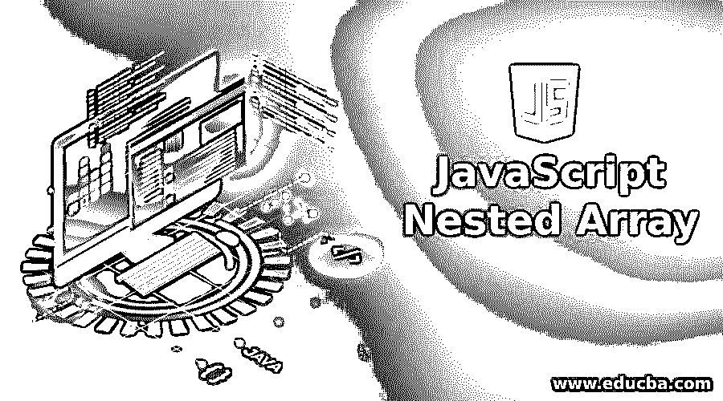
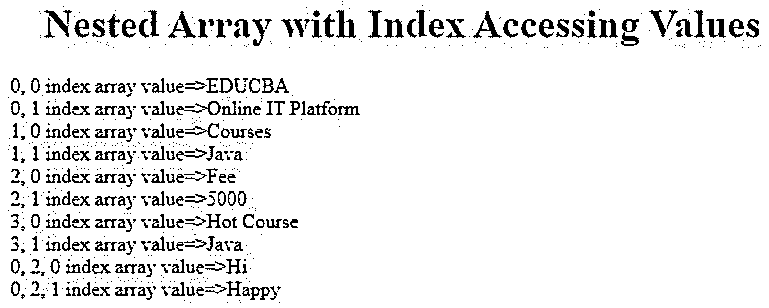
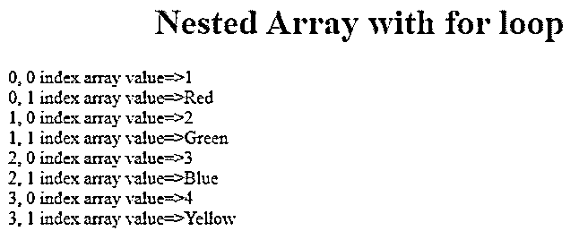
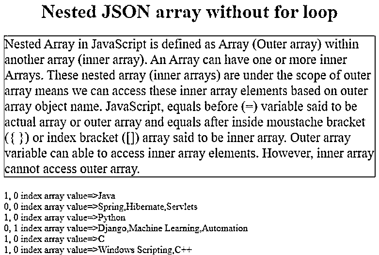

# JavaScript 嵌套数组

> 原文：<https://www.educba.com/javascript-nested-array/>




## JavaScript 嵌套数组简介

JavaScript 中的嵌套数组被定义为另一个数组(内部数组)内的数组(外部数组)。一个数组可以有一个或多个内部数组。这些嵌套数组(内部数组)在外部数组的作用域之下，这意味着我们可以根据外部数组对象名来访问这些内部数组元素。JavaScript 中，变量前的等号(=)表示实际数组或外部数组，变量后的等号位于括号({ })或索引括号([])内，表示内部数组。外部数组变量可以访问内部数组元素。但是，内部数组不能访问外部数组。减少声明多个数组。

### JavaScript 中嵌套数组是如何工作的？

*   嵌套数组也称多维数组。
*   一个数组又有另一组数组值。
*   嵌套数组基于这个内部数组集值工作，通过用外部数组名访问。

**索引数组的语法:**

<small>网页开发、编程语言、软件测试&其他</small>

```
var nestedArray=[[values,[nest value…],…],[values, [nest value…],….],[values, [nest value…],….]]
```

**说明:**

*   **var:** var 据说是 JavaScript 类型声明。它接受任何类型。
*   **nestedArray:** 是外数组。它包含所有内部数组值。
*   **[]:** 是数组声明符号。
*   **[值，[嵌套值…]]:** 数组在另一个数组内，所以它是嵌套数组。

**JSON 数组的语法:**

```
var JSONNestedArray=[
{ "key":[ "value1", "value2", "value3",... ] }, //single key has multiple values means nested array
{ "key":[ "value1", "value2", "value3",... ] },
.
.
.
]
```

### JavaScript 嵌套数组示例

下面是一些例子:

#### 示例#1

没有 for 循环的嵌套数组。

**代码:**

```
<!DOCTYPE html>
<html>
<head>
<title>Nested Array</title>
<!--CSS Styles-->
<style>
h1
{
color:blue;
text-align: center;
}
</style>
</head>
<body>
<script>
function getNestedOutput() { //line1
var courseNestedArray = [ //line2
["EDUCBA","Online IT Platform",["Hi","Happy"]], //0,0 and 0,1 values
["Courses", "Java"], //1,0 and 1,1 values
["Fee", "5000"], //2,0 and 2,1 values
["Hot Course", "Java"] //3,0 and 3,1 values
];
document.write("<h1>Nested Array with Index Accessing Values</h1>");
//line3
document.write("0, 0 index array value=>"+courseNestedArray[0][0]+"<br>");
document.write("0, 1 index array value=>"+courseNestedArray[0][1]+"<br>");
document.write("1, 0 index array value=>"+courseNestedArray[1][0]+"<br>");
document.write("1, 1 index array value=>"+courseNestedArray[1][1]+"<br>");
document.write("2, 0 index array value=>"+courseNestedArray[2][0]+"<br>");
document.write("2, 1 index array value=>"+courseNestedArray[2][1]+"<br>");
document.write("3, 0 index array value=>"+courseNestedArray[3][0]+"<br>");
document.write("3, 1 index array value=>"+courseNestedArray[3][1]+"<br>");
document.write("0, 2, 0 index array value=>"+courseNestedArray[0][2][0]+"<br>");
document.write("0, 2, 1 index array value=>"+courseNestedArray[0][2][1]);
}
getNestedOutput(); //line4
</script>
</body>
</html>
```

**输出:**




**说明:**

*   第 1 行被称为嵌套数组逻辑的函数。
*   第 2 行是包含一些值的嵌套数组声明。
*   第 3 行用于显示嵌套数组的索引值，不使用 for 循环。
*   第 4 行用于调用函数。

#### 实施例 2

带有 for 循环的嵌套数组。

**代码:**

```
<!DOCTYPE html>
<html>
<head>
<title>Nested Array</title>
<!--CSS Styles-->
<style>
h1
{
color:blue;
text-align: center;
}
</style>
</head>
<body>
<script>
function getNestedForOutput() { //line1
var colorNestedValues= [ //line2
["1","Red"], //0,0 and 0,1 values
["2", "Green"], //1,0 and 1,1 values
["3", "Blue"], //2,0 and 2,1 values
["4","Yellow"], //3,0 and 3,1 values
["5","Orange"], //4,0 and 4,1 values
];
document.write("<h1>Nested Array with for loop</h1>");
//line3
for(var index1=0;index1<4;index1++)
{
for(var index2=0;index2<2;index2++)
{
document.write(index1+", "+index2+" index array value=>"+colorNestedValues[index1][index2]+"<br>");
}
}
}
getNestedForOutput(); //line4
</script>
</body>
</html>
```

**输出:**




**说明:**

*   第 1 行被称为嵌套数组逻辑的函数。
*   第 2 行是包含一些值的嵌套数组声明。
*   第 3 行显示嵌套数组的索引值。
*   第 4 行用于调用函数。

#### 实施例 3

没有 for 循环的嵌套 JSON 数组。

**代码:**

```
<!DOCTYPE html>
<html>
<head>
<!--CSS Styles-->
<style>
h1
{
color:green;
text-align:center;
}
p
{
font-size: 22px;
border: solid 1px maroon;
}
</style>
</head>
<body>
<h1>Nested JSON array without for loop</h1>
<p>Nested Array in JavaScript is defined as Array (Outer array) within another array (inner array). An Array can have one or more inner Arrays. These nested array (inner arrays) are under the scope of outer array means we can access these inner array elements based on outer array object name. JavaScript, equals before (=) variable said to be actual array or outer array and equals after inside moustache bracket ({ }) or index bracket ([]) array said to be inner array. Outer array variable can able to access inner array elements. However, inner array cannot access outer array.</p>
<script>
var nestedCourses;
function getMyJSONOutput()//line1
{
nestedCourses = { //line2
"courses": [
{'name':"Java", 'category':["Spring", "Hibernate", "Servlets"]},
{"name":"Python", "category":["Django", "Machine Learning", "Automation"]},
{"name":"C", "category":["Windows Scripting", "C++"] }
]
}
//line 3
document.write("1, 0 index array value=>"+nestedCourses.courses[0].name+"<br>");
document.write("0, 0 index array value=>"+nestedCourses.courses[0].category+"<br>");
document.write("1, 0 index array value=>"+nestedCourses.courses[1].name+"<br>");
document.write("0, 1 index array value=>"+nestedCourses.courses[1].category+"<br>");
document.write("1, 0 index array value=>"+nestedCourses.courses[2].name+"<br>");
document.write("1, 0 index array value=>"+nestedCourses.courses[2].category+"<br>");
}
getMyJSONOutput();//line4
</script>
</body>
</html>
```

**输出:**




**说明:**

*   第 1 行被称为嵌套 JSON 数组逻辑的函数。
*   第 2 行是带有一些值的嵌套 JSON 数组声明。
*   第 3 行用于显示嵌套 JSON 数组的索引值，而不使用 for 循环。
*   第 4 行用于调用函数。

#### 实施例 4

带有 for 循环的嵌套 JSON 数组。

**代码:**

```
<!DOCTYPE html>
<html>
<head>
<!--CSS Styles-->
<style>
h2
{
color: blue;
}
h1
{
color:green;
text-align:center;
}
p
{
font-size: 15px;
border: solid 1px maroon;
}
</style>
</head>
<body>
<h1>Nested JSON array without for loop</h1>
<p>Nested Array in JavaScript is defined as Array (Outer array) within another array (inner array). An Array can have one or more inner Arrays. These nested array (inner arrays) are under the scope of outer array means we can access these inner array elements based on outer array object name. JavaScript, equals before (=) variable said to be actual array or outer array and equals after inside moustache bracket ({ }) or index bracket ([]) array said to be inner array. Outer array variable can able to access inner array elements. However, inner array cannot access outer array.</p>
<p id="demo"></p>
<script>
var nestedCourses, index1, index2, output = "";
function getMyJSONOutput()
{
nestedCourses = {
"courses": [
{'name':"Java", 'category':["Spring", "Hibernate", "Servlets"]},
{"name":"Python", "category":["Django", "Machine Learning", "Automation"]},
{"name":"C", "category":["Windows Scripting", "C++"] }
]
}
for (index1 in nestedCourses.courses) {
output += "<h2>" + nestedCourses.courses[index1].name + "</h2>";
for (index2 in nestedCourses.courses[index1].category) {
output += nestedCourses.courses[index1].category[index2] + "<br>";
}
}
}
getMyJSONOutput();
document.getElementById("demo").innerHTML = output;
</script>
</body>
</html>
```

**输出:**


**说明:**

*   第 1 行被称为嵌套 JSON 数组逻辑的函数。
*   第 2 行是带有一些值的嵌套 JSON 数组声明。
*   第 3 行用 for 循环显示嵌套 JSON 数组的索引值。
*   第 4 行用于调用函数。

### 结论

JavaScript 嵌套数组用于减少声明多个数组。嵌套数组也被称为多维数组。我们可以通过索引括号和小胡子括号(JSON)样式实现嵌套数组。

### 推荐文章

这是一个 JavaScript 嵌套数组的指南。在这里，我们讨论嵌套数组的介绍以及工作和各自的例子。您也可以看看以下文章，了解更多信息–

1.  [设置属性 JavaScript](https://www.educba.com/setattribute-javascript/)
2.  [JavaScript 通过类获取元素](https://www.educba.com/javascript-get-element-by-class/)
3.  [JavaScript 数组串联](https://www.educba.com/javascript-array-concat/)
4.  [JavaScript 数组过滤器](https://www.educba.com/javascript-array-filter/)


