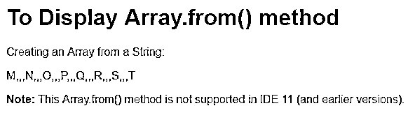
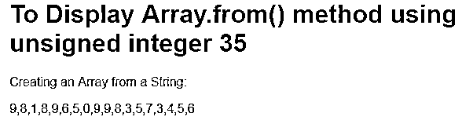
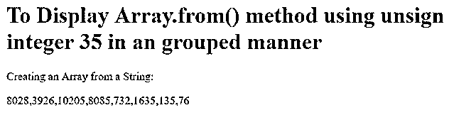
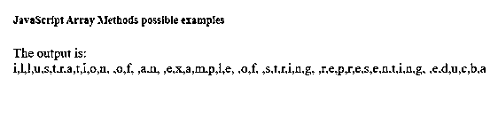
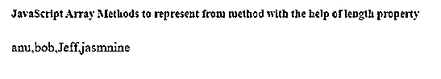

# 来自()的 JavaScript 数组

> 原文：<https://www.educba.com/javascript-array-from/>


## 来自()的 JavaScript 数组简介

JavaScript Array from()方法是从数组引用派生的扩展方法。来自()方法的 Array 专门用于从任何其他引用对象返回一个数组对象，该引用对象具有一个带有某个定义长度的属性和一个用于迭代的对象。因此，Array from()方法几乎类似于创建一个包含一组元素的数组，只是它还可以引用其他数组元素的元素集，这些元素具有一些定义的长度和迭代属性。

### 句法

下面是语法:

<small>网页开发、编程语言、软件测试&其他</small>

```
Array_with_set_of_elements.from(object_reference, map_function, thisValue)
```

上述自变量或 Array _ with _ set _ of _ elements . from 函数传递的参数的意义如下:

*   **Object_reference:** 该参数用于将被引用的对象转换为数组。
*   **map_function:** 这是一种可选参数，当使用映射函数从定义的数组中调用任何特定的项时使用。
*   **thisValue:** 这也是一种可选参数，在以此作为要使用的值来执行地图功能时使用。

在这种情况下，返回值是它返回一个新的数组实例，其中的元素几乎与所考虑的数组集相同。

**Note:** Also, there might be a chance to pass some parameters as a string in which each alphabet within a string is to convert an alphabet of the string into the new instance of the array which will be created using the below syntax.

```
Array.function(alphabet_of_string)
```

**例如:**

```
Array.function(B)
```

这里，B 指的是作为字符串一部分的元素或字母表。

### JavaScript 中 Array From()方法是如何工作的？

array from()方法是 Array references 的一部分，Array references 被认为是从给定数组创建一组新数组实例的扩展。如果需要创建一个具有一组元素的数组作为字符串中的字母表，那么使用一个具有将被引用到新数组中的字母表的新数组来获得整个新数组。

Array from()方法使用 JavaScript 中的 Array，它的特性清楚地定义了这样一个事实，即数组列表的长度甚至元素的类型都是固定的。因为它告诉我们数组是动态的，并且它的定义是不固定的，所以它告诉我们另一个关键事实，即元素及其关联的数组并不像要求的那样密集。

此外，JavaScript 中的数组不能像关联数组那样专门支持带有元素索引的字符串，但可以作为整数使用。另一方面，要正确地支持它并使用括号符号通过非整数值获得适当的可访问性，将不会检索该特定值，但如果括号符号或点符号将用于该对象的属性或集合集，它将检索元素。此外，数组的遍历属性不能应用于如此命名的属性。

如前所述，可以使用 object 属性访问 Object，类似于 String()方法，对象属性的数组列表用于访问与字符串元素相关的字母表。

长度和对象引用之间有很强的关系，用于分别从 JavaScript 数组中定义的数组集中访问元素。

JavaScript Array 支持静态属性和静态方法，其中包括 Array.from()方法，该方法的工作再次依赖于从函数传递的参数类型，这有助于创建具有可变数量参数的数组的新实例，尽管是数组类型和可迭代对象。

### 来自()的 JavaScript 数组示例

下面是来自()的 JavaScript 数组示例:

#### 示例#1

此示例用于定义数组的字符串，并借助 getElementById()方法从该数组中检索元素，getElementById()方法用于获取输出中描述的序列或元素列表。

**代码:**

```
<!DOCTYPE html>
<html>
<body>
<h1>To Display Array.from() method </h1>
<p>Creating an Array from a String:</p>
<p id="demo"></p>
<p><strong>Note:</strong> This Array.from() method is not supported in IDE 11 (and earlier versions).</p>
<script>
var myArr = Array.from("M,N,O,P,Q,R,S,T");
document.getElementById("demo").innerHTML = myArr;
</script>
</body>
</html>
```

**输出:**




#### 实施例 2

此示例表示一个类似字符串结构的 32 位无符号整数数组，然后返回一个新的无符号整数数组，如输出中所述。

**代码:**

```
<!DOCTYPE html>
<html>
<body>
<h1>To Display Array.from() method using unsigned integer 35  </h1>
<p>Creating an Array from a String:</p>
<p id="demo"></p>
<script>
var array = Uint32Array.from('981896509983573456');
document.write(array);
</script>
</body>
</html>
```

**输出:**




#### 实施例 3

此示例通过使用函数将每个数字除以 32 来表示字符串数组的 32 位无符号整数数组。

**代码:**

```
<!DOCTYPE html>
<html>
<body>
<h1>To Display Array.from() method using unsigned integer 35 in an grouped manner </h1>
<p>Creating an Array from a String:</p>
<p id="demo3"></p>
<script>
var array = Uint32Array.from([256897, 125648, 326589, 258748,
23432, 52345, 4345, 2432
], z => z / 32);
document.write(array);
</script>
</body>
</html>
```

**输出:**




#### 实施例 4

此示例用于表示所考虑的数组中的字符串被转换为一组新的转换后的数组。

**代码:**

```
<html>
<head><h5> JavaScript Array Methods possible examples </h5></head>
<body>
<script>
var arr=Array.from("illustration of an example of string representing educba");
document.write("The output is: <br>" +arr);
</script>
</body>
</html>
```

**输出:**




#### 实施例 5

这个例子用来说明 array from()方法用元素的长度集合表示，在这个例子中是作为参数传递的名称集合。

**代码:**

```
<html>
<head><h5> JavaScript Array Methods to represent from method with the help of length property </h5></head>
<body>
<script>
var func = function() {
document.write(Array.from(arguments));
}
func('anu','bob','Jeff','jasmnine');
</script>
</body>
</html>
```

**输出:**




**Note:** There is a very important point to keep in mind before performing every program using array from() method which is the support of OS and it supports in full fledge with google chrome compared to internet explorer.

### 结论

与 Java 引用的其他方法相比，Array from()方法是一个非常有用的方法，因为它有助于使用数组元素中的长度和对象引用属性来访问元素。

### 推荐文章

这是来自()的 JavaScript 数组指南。在这里，我们讨论来自()的 JavaScript Array 的介绍，以及它是如何工作的和编程示例。您也可以看看以下文章，了解更多信息–

1.  [JavaScript 声明数组](https://www.educba.com/javascript-declare-array/)
2.  [Javascript 抛出异常](https://www.educba.com/javascript-throw-exception/)
3.  [JavaScript 文件阅读器](https://www.educba.com/javascript-filereader/)
4.  [JavaScript 中的原始数据类型](https://www.educba.com/primitive-data-types-in-javascript/)


