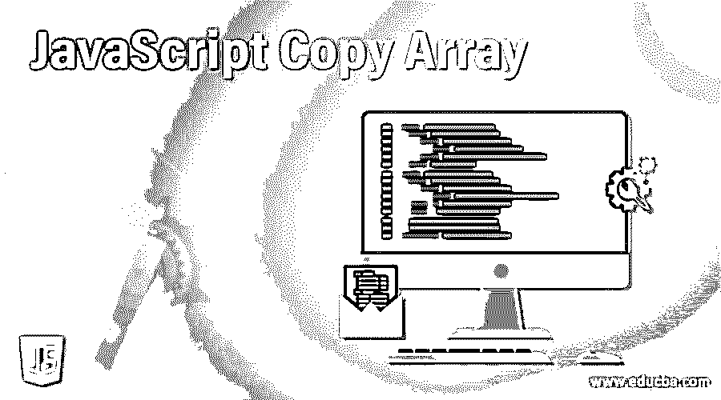
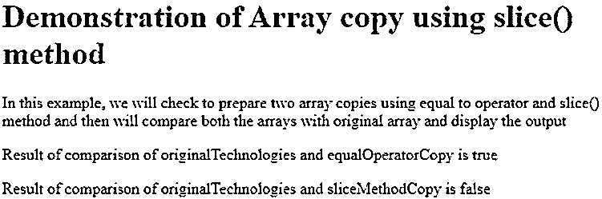
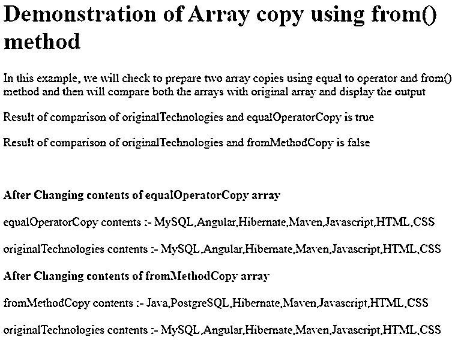
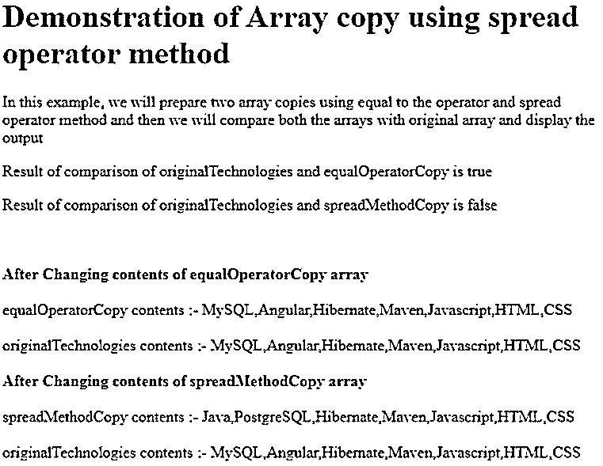

# JavaScript 复制数组

> 原文：<https://www.educba.com/javascript-copy-array/>




## JavaScript 复制数组简介

每当我们试图复制数组时，我们都需要考虑 Javascript 中数组的可变属性。我们只是不能简单地使用等于运算符将数组从一个变量复制到另一个变量。这将导致复制数组的引用，而不是数组的值，即数组的元素。因此，如果使用等于运算符复制数组，那么被占用数组中的任何更改都会反映到原始数组中，反之亦然，因为两个数组引用相同的值。

因此，在 javascript 中，我们提供了名为 slice()的方法，该方法在复制数组时证明是有益的。另一种用于复制数组的方法是 Array.from()。ECMAScript 6 扩展运算符的引入使得复制数组的任务变得简单。

<small>网页开发、编程语言、软件测试&其他</small>

### JavaScript 复制数组的方法

在本文中，我们将研究复制数组的所有三种方法，并以比较的方式查看 equal to 和其他方法的工作方式，这将使您对使用这些方法复制数组有一个清晰的认识，并查看一些示例和语法。

#### 1.切片法

此方法通常用于将参数指定的数组的某个部分复制到一个全新的数组中，方法是将该部分的起始和结束索引进行引用。起点和终点是可选的，只要没有提到，我们可以使用 slice 方法将整个数组复制到一个新的数组中

**语法:**

下面是 slice()方法的语法。

```
let newArray = array.slice([startPoint[, endPoint]])
```

*   **数组**:您希望复制到另一个数组的原始数组。
*   **newArray** :这是作为 slice 方法的返回值返回的新数组
*   Starpoint :这是可选参数，帮助我们指定数组内容要复制的起始索引。该参数的默认值为 0。
*   **EndPoint** :这是可选参数，帮助我们指定数组内容要复制到的结束索引。默认值是该参数数组的最大长度。

#### 2.返回值

它根据参数中提供的 start 和 endpoint 值返回一个包含原始数组中提取的元素的新数组，否则原始数组的所有内容都将复制到新数组中。

**举例:**

考虑一个例子，我们将使用 equal 操作符和 slice()方法复制原始数组两次，如下所示

```
<!DOCTYPE html>
<html>
<body>
<h1>Demonstration of Array copy using slice() method</h1>
<p>In this example, we will check to prepare two array copies using equal to operator and slice() method and then will compare both the arrays with original array and display the output</p>
<p id="sample1"></p>
<p id="sample2"></p>
<script>
varoriginalTechnologies = ["Java", "Angular", "Hibernate", "Maven", "Javascript", "HTML", "CSS"];
varequalOperatorCopy = originalTechnologies;
varsliceMethodCopy = originalTechnologies.slice();
document.getElementById("sample1").innerHTML= "Result of comparison of originalTechnologies and equalOperatorCopy is "+ (equalOperatorCopy==originalTechnologies);
document.getElementById("sample2").innerHTML = "Result of comparison of originalTechnologies and sliceMethodCopy is "+ (sliceMethodCopy==originalTechnologies);;
</script>
</body>
</html>
```

**输出:**




我们可以观察到，通过 equals 运算符复制的数组等于原始数组，因为它们引用了数组的相同内容并具有相同的引用，而使用 slice 方法创建的数组不等于原始数组，因为虽然它们中元素值的内容相同，但它们的引用不同，因为它们都消耗了单独的内存空间，这与 equal 运算符复制数组不同。

#### 3.Array.from()方法

**语法:**

```
Array.from(arrayLikeObject [, mapFunction [, thisArgument]])
```

mapFunction 和 thisArgument 在用法上是可选的，而 arrayLikeObject 是必需的，它可以是任何具有索引和长度属性的对象。Array.from()返回一个由 arrayLikeObject 的元素组成的新数组，并由 mapFunction 进行一些修改。

**举例:**

```
<!DOCTYPE html>
<html>
<body>
<h1>Demonstration of Array copy using from() method</h1>
<p>In this example, we will check to prepare two array copies using equal to operator and from() method and then will compare both the arrays with original array and display the output</p>
<p id="sample1"></p>
<p id="sample2"></p>
<script>
varoriginalTechnologies = ["Java", "Angular", "Hibernate", "Maven", "Javascript", "HTML", "CSS"];
varequalOperatorCopy = originalTechnologies;
varfromMethodCopy = Array.from(originalTechnologies);
document.getElementById("sample1").innerHTML = "Result of comparison of originalTechnologies and equalOperatorCopy is "+ (equalOperatorCopy==originalTechnologies);
document.getElementById("sample2").innerHTML = "Result of comparison of originalTechnologies and fromMethodCopy is "+ (fromMethodCopy==originalTechnologies);;
equalOperatorCopy[0]="MySQL";
document.write("<br><br><b>After Changing contents of equalOperatorCopy array</b><br><br>");
document.write("equalOperatorCopy contents :- "+equalOperatorCopy+"<br><br>originalTechnologies contents :- "+originalTechnologies);
fromMethodCopy[1]="PostgreSQL";
document.write("<br><br><b>After Changing contents of fromMethodCopy array</b>");
document.write("<br><br>fromMethodCopy contents :- "+fromMethodCopy+"<br><br>originalTechnologies contents :- "+originalTechnologies)
</script>
</body>
</html>
```

**输出:**




#### 4.传播算子

我们还可以使用另一种叫做 spread operator 的方法，它可以将一个数组复制到一个新的数组中，如下例所示。这是 ECMAScript 6 中引入的新方法，并得到一些最新版本浏览器的支持。确保您的浏览器及其版本是否支持其使用。它被表示为…

**举例:**

```
<!DOCTYPE html>
<html>
<body>
<h1>Demonstration of Array copy using spread operator method</h1>
<p>In this example, we will prepare two array copies using equal to the operator and spread operator method and then we will compare both the arrays with original array and display the output</p>
<p id="sample1"></p>
<p id="sample2"></p>
<script>
varoriginalTechnologies = ["Java", "Angular", "Hibernate", "Maven", "Javascript", "HTML", "CSS"];
varequalOperatorCopy = originalTechnologies;
varspreadMethodCopy = [...originalTechnologies];
document.getElementById("sample1").innerHTML = "Result of comparison of originalTechnologies and equalOperatorCopy is "+ (equalOperatorCopy==originalTechnologies);
document.getElementById("sample2").innerHTML = "Result of comparison of originalTechnologies and spreadMethodCopy is "+ (spreadMethodCopy==originalTechnologies);;
equalOperatorCopy[0]="MySQL";
document.write("<br><br><b>After Changing contents of equalOperatorCopy array</b><br><br>");
document.write("equalOperatorCopy contents :- "+equalOperatorCopy+"<br><br>originalTechnologies contents :- "+originalTechnologies);
spreadMethodCopy[1]="PostgreSQL";
document.write("<br><br><b>After Changing contents of spreadMethodCopy array</b>");
document.write("<br><br>spreadMethodCopy contents :- "+spreadMethodCopy+"<br><br>originalTechnologies contents :- "+originalTechnologies)
</script>
</body>
</html>
```

**输出:**




### 结论

在 javascript 中，我们可以使用以下三种方法之一将数组复制到一个新的数组中——slice()方法、Array.from()方法和 spread 运算符。使用等于运算符不会创建数组的新副本，而是创建原始数组的引用的副本。

### 推荐文章

这是一个 JavaScript 复制数组的指南。在这里，我们还讨论了 javascript 复制数组的介绍和方法，以及示例和代码实现。您也可以看看以下文章，了解更多信息–

1.  [JavaScript 鼠标移动](https://www.educba.com/javascript-mousemove/)
2.  [JavaScript 串联字符串](https://www.educba.com/javascript-concat-string/)
3.  [JavaScript 布尔()](https://www.educba.com/javascript-boolean/)


