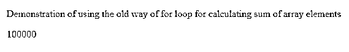
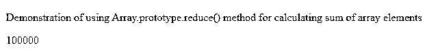
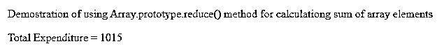

# Javascript 求和数组

> 原文：<https://www.educba.com/javascript-sum-array/>


## Javascript Sum 数组简介

在 javascript 中，我们可以通过使用 Array.prototype.reduce()方法来计算数组元素的总和。javascript 中数组的 reduced 方法帮助我们指定一个名为 reducer function 的函数，我们为数组中的每个元素调用该函数。reduce()方法的输出是一个单个值，该值是对 reducer 函数中定义的数组的每个元素执行的所有操作的集合。我们可以使用 reduce()函数来检索所有数组元素的总和，方法是编写一个相应的 reducer 函数来添加数组元素，并在 reduce 方法中调用这个 reducer 函数。

在本文中，我们将了解如何使用标准的 for 循环旧方法计算数组元素的总和，然后使用优化、高效且方便的 reducing()新方法及其语法和示例。

<small>网页开发、编程语言、软件测试&其他</small>

### 计算数组元素和的老方法

在引入 reduce()方法之前，我们使用 for 循环来计算数组元素的总和。当数组的索引从 0 开始时，我们将从 0 到数组的长度迭代循环，然后计算循环中的和。让我们考虑一个例子，我们将计算所有雇员的总工资，其中每个雇员的工资都存储在数组 sales 中，如下所示。

**代码:**

```
<!DOCTYPE html>
<html>
<body>
<p>Demonstration of using the old way of for loop for calculating sum of array elements</p>
<p id="demo"></p>
<script>
var salaries = [10000, 20000, 30000, 40000] // sums to 100000
var totalSalary = 0;
for (var i = 0; i < salaries.length; i++) {
totalSalary += salaries[i]
}
document.getElementById("demo").innerHTML = totalSalary;
</script>
</body>
</html>
```

它在执行后给出以下输出:




我们可以看到 totalSalary 变量是如何与 Salary 数组的每个元素值相加的，方法是迭代 for 循环来检索数组元素的总和，即所有雇员的总工资。

### Array .原型. reduce()方法

现在，我们将学习用于计算数组元素总和的 reduce()方法。让我们从研究它的语法开始。

```
array.reduce(callback( accumVariable, curValue[, index[, yourArray]] )[, valueInBeginning])
```

*   **回调**–它也被称为 reducer 函数，是一个回调函数或为数组的每个元素执行的函数。请注意，如果我们没有在 valueInBeginning 参数中提供任何初始值，则不会考虑数组中的第一个值。
*   **accum variable**–该变量存储对数组的所有元素执行 reducer 函数后返回的结果。它具有上次调用 reduce()方法时返回的值或 valueInBeginning 参数值(如果指定)。这是回调函数的必需参数，在使用它时需要提到。
*   **curValue**–reducer 函数回调的必需参数，代表 reducer 函数正在执行的数组的当前元素。
*   **Index**–它是正在处理的当前元素的索引，reducer 函数正在为其执行。如果指定了 valueInBeginning，则初始值为零，否则初始值为 1。它是可选的。
*   your array–这是需要为其每个元素调用 reducer 函数的数组。这是一个可选参数。
*   **valueInBeginning**–初始值将作为函数的第一个参数。如果未指定，则数组中位于零索引处的第一个元素将被用作开始时的累加器值，对于 curValue 变量，数组中第一个元素的值将被跳过。如果使用空括号调用 reduce 方法，而没有为空白数组指定任何参数，也没有在开始指定值，即初始值，那么 javascript 将抛出一个 TypeError。
*   **返回值**–reducer 函数/回调函数返回的值是一个单一值，它是对数组中的每个元素执行 reducer 函数所得到的所有值的累加结果。

### 例子

让我们考虑一个简单的例子，在前面的场景中，我们希望计算以数组格式存储的所有雇员的总工资。但是现在，我们将使用 reduce()方法来计算 sum，而不是如下所示的循环的 pf。

**代码:**

```
<!DOCTYPE html>
<html>
<body>
<p>Demonstration of using Array.prototype.reduce() method for calculating sum of array elements</p>
<p id="demo"></p>
<script>
// sums to 100000
let totalSalary = [10000, 20000, 30000, 40000].reduce(function (accumVariable, curValue) {
return accumVariable + curValue
}, 0);
document.getElementById("demo").innerHTML = totalSalary;
</script>
</body>
</html>
```

它在执行后给出以下输出:




让我们再考虑一个例子，我们将计算总支出，其中数组中的值存储在键-值对中，键是支出，如下所示。

**代码:**

```
<!DOCTYPE html>
<html>
<body>
<p>Demostration of using Array.prototype.reduce() method for calculationg sum of array elements</p>
<p id="demo"></p>
<script>
// sums to 1015
let valueInBeginning = 0;
let totalExpenditure = [{expenditure: 210}, {expenditure: 152}, {expenditure: 653}].reduce(
(accumVariable, curValue) => accumVariable + curValue.expenditure
, valueInBeginning
)
document.getElementById("demo").innerHTML = "Total Expenditure = " + totalExpenditure;
</script>
</body>
</html>
```

它在执行后给出以下输出:




通过考虑元素，我们可以使用如上所示的缩减函数来计算总支出。支出值。

### 结论

我们可以通过使用标准的 for 循环来计算数组元素的总和。计算数组元素之和的最新、优化且高效的方法是在 javascript 中使用 reduce()方法，并为其编写一个 reducer 函数或回调函数，以返回累加值。

### 推荐文章

这是一个 Javascript 求和数组的指南。这里我们讨论一下 Array.prototype.reduce()方法的简介，以及用实例计算数组元素和的老方法。您也可以看看以下文章，了解更多信息–

1.  [JavaScript 父节点](https://www.educba.com/javascript-parent-node/)
2.  [JavaScript 事件处理程序](https://www.educba.com/javascript-event-handler/)
3.  [JavaScript 延迟](https://www.educba.com/javascript-delay/)
4.  [JavaScript 浮动](https://www.educba.com/javascript-floating/)


