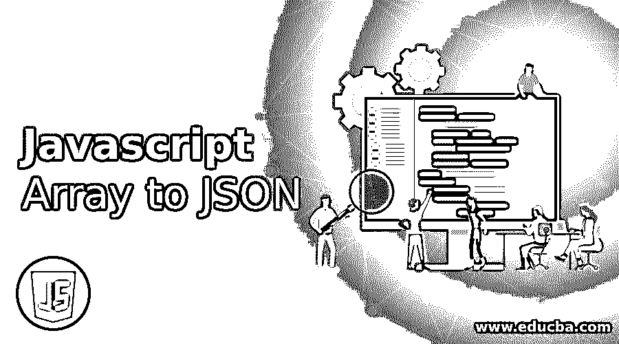
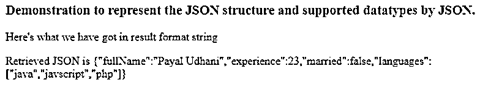
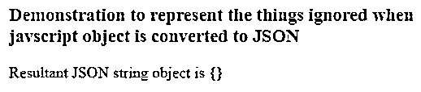
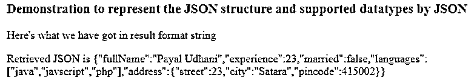
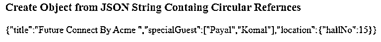
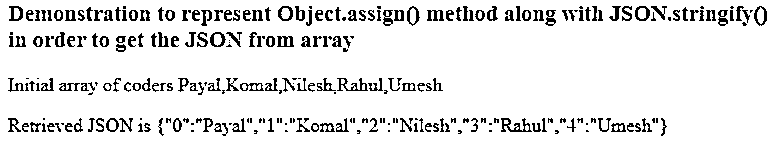

# Javascript 数组到 JSON

> 原文：<https://www.educba.com/javascript-array-to-json/>




## JSON 的 Javascript 数组介绍

在与 web 服务器进行数据传输的过程中，我们可以使用多种数据格式。然而，最常用的标准格式是将 JSON 格式的数据传输到 web 服务器，并以同样的方式接收。JSON 格式通常在花括号{}中发送，通常包含用逗号分隔的键值对。今天，我们将学习如何将 javascript 的 array 对象转换为 JSON 格式，以发送它来与 web 服务器进行数据传输。

当客户端使用 javascript 进行编码时，可以使用 JSON 格式，而服务器端编码可以使用任何服务器端编程语言，即 Java、Ruby、PHP、Python 等。除了 javascript 之外，还有许多其他语言使用 JSON 对象进行数据传输，并为 JSON 数据的操作提供了一个库。

<small>网页开发、编程语言、软件测试&其他</small>

### Javascript 数组到 JSON 的方法

有两种方法可以帮助我们实现将数组转换成 JSON 对象的目标。让我们来学习两者的语法。

*   **stringify()方法**

```
JSON.stringify(Object of Javascript)
```

**javascript 的对象–**它是您希望转换为 JSON 的任何 JavaScript 对象。这个方法返回一个字符串格式的 JSON 对象。结果对象被称为 JSON 编码的、字符串化的对象、序列化的对象或封送的对象。

*   **Object.assign()方法**

此方法将所有源对象复制到其目标对象。

```
Object.assign(targetObject, ...sourceObjects)
```

**目标对象–**是包含所有源对象内容的结果对象。source objects–它们是您希望将其内容复制到 targetObject 中的对象。

#### 1.JSON.stringify()方法

需要以 JSON 字符串格式发送请求数据或从 web 服务器获得响应。这个 javascript 库提供了一个名为 stringify()的方法，该方法将传递的对象转换为相应的 JSON 格式。也可以使用 stringify()将数组转换为 JSON，这将产生 JSON 字符串。我们将首先研究 JSON 的 stringify()方法和 JSON 数据表示格式。

JSON 编码的字符串或 JSON 对象有以下几点需要注意

*   字符串用双引号表示。这意味着如果你的数组对象包含任何用单引号括起来的字符串，它将自动转换成用双引号括起来的字符串。
*   键或对象也转换为的对象-值对中的字符串
*   JSON 支持基本数据类型，如字符串、布尔、数字、null 以及数组和对象。

让我们借助例子来研究我们在上述各点中学到的东西。

```
<!DOCTYPE html>
<html>
<body>
<h3>Demonstration to represent the JSON structure and supported datatypes by JSON</h3>
<p id="sampleDemo1"></p>
<p id="sampleDemo2"></p>
<script>
let coder = {
fullName: 'Payal Udhani', experience: 23,
married: false,
languages: ['java', 'javscript', 'php']
};
let resultantJson = JSON.stringify(coder);
document.getElementById("sampleDemo1").innerHTML = "Here's what we have got in result format "+typeof resultantJson;
document.getElementById("sampleDemo2").innerHTML    =       "Retrieved   JSON  is "+resultantJson;
</script>
</body>
</html>
```

**输出:**




在将 Javascript 对象转换为 JSON 时，作为方法和符号属性的函数属性以及存储 undefined 的对象都会被跳过，因为 JSON 是一种独立于语言的数据表示格式。让我们看看，在一个

```
<!DOCTYPE html>
<html>
<body>
<h3>Demonstration to represent the things ignored when javscript object is converted to JSON</h3>
<p id="sampleDemo"></p>
<script>
let demoForJSON = {
greetings() { // method of function property is ignored while creating JSON
alert("Good Morning");
},
[Symbol("id")]: 987, // symbolic property is also ignored while creating JSON
temporaryObject: undefined // undefined objects are completely ignored while creating JSON
};
document.getElementById("sampleDemo").innerHTML="Resultant JSON string object is "+JSON.stringify(demoForJSON) ;
</script>
</body>
</html>
```

**输出:**




JSON 和 Javascript 数组都支持嵌套对象。在这个例子中，我们有一个地址字段，它包含一个嵌套的

```
<!DOCTYPE html>
<html>
<body>
<h3>Demonstration to represent the JSON structure and supported datatypes by JSON</h3>
<p id="sampleDemo1"></p>
<p id="sampleDemo2"></p>
<script>
let coder = {
fullName: 'Payal Udhani', experience: 23,
married: false,
languages: ['java', 'javscript', 'php'], address:
{"street":23,
"city":'Satara', "pincode":415002}
};
let resultantJson = JSON.stringify(coder);
document.getElementById("sampleDemo1").innerHTML = "Here's what we have got in result format "+typeof resultantJson;
document.getElementById("sampleDemo2").innerHTML       =       "Retrieved     JSON  is "+resultantJson;
</script>
</body>
</html>
```

嵌套数组会自动转换为 JSON。

**输出:**




我们应该确保没有循环引用，这意味着某个对象引用其他对象，而其他对象最终引用可能包含中间对象的原始对象

```
<!DOCTYPE html>
<html>
<body>
<h3>Create Object from JSON String Containg Circular Refernces</h3>
<p id="demo"></p>
<script>
let conferenceHalls = { hallNo: 15
};
let conference = {
title: "Future Connect By Acme ", specialGuest: ["Payal", "Komal"]
};
conference.location = conferenceHalls;   // conference references conferenceHalls conferenceHalls.occupiedBy = conference; // conferenceHalls references conference
document.getElementById("demo").innerHTML = JSON.stringify(conference);
</script>
</body>
</html>
```

**输出:**




#### 2.对象.分配()方法

此方法将所有源对象复制到其目标对象。当数组是一维数组时，object.assign 属性为转换后的 JSON 对象分配一个键，该属性返回 JSON 对象，该对象在 JSON.stringify()方法的帮助下进一步转换为 JSON 字符串。让我们看一个同样的例子。

```
<!DOCTYPE html>
<html>
<body>
<h2>Demonstration to represent Object.assign() method along with JSON.stringify() in order to get the JSON from array.</h2>
<p id="sampleDemo1"></p>
<p id="sampleDemo2"></p>
<script>
let codersList = ['Payal','Komal','Nilesh','Rahul','Umesh'];
document.getElementById("sampleDemo1").innerHTML   =    "Initial    array    of    coders "+codersList;
document.getElementById("sampleDemo2").innerHTML     =      "Retrieved      JSON     is "+JSON.stringify(Object.assign({}, codersList));
</script>
</body>
</html>
```

**输出:**




### 推荐文章

这是一个 Javascript 数组到 JSON 的指南。这里我们讨论 Javascript Array 到 JSON 的方法，以及例子和输出。您也可以看看以下文章，了解更多信息–

1.  [JavaScript 日期解析](https://www.educba.com/javascript-date-parse/)
2.  [JavaScript 迭代数组](https://www.educba.com/javascript-iterate-array/)
3.  [JavaScript 中的 trim()函数](https://www.educba.com/trim-function-in-javascript/)
4.  [JSON 是什么？](https://www.educba.com/what-is-json/)


