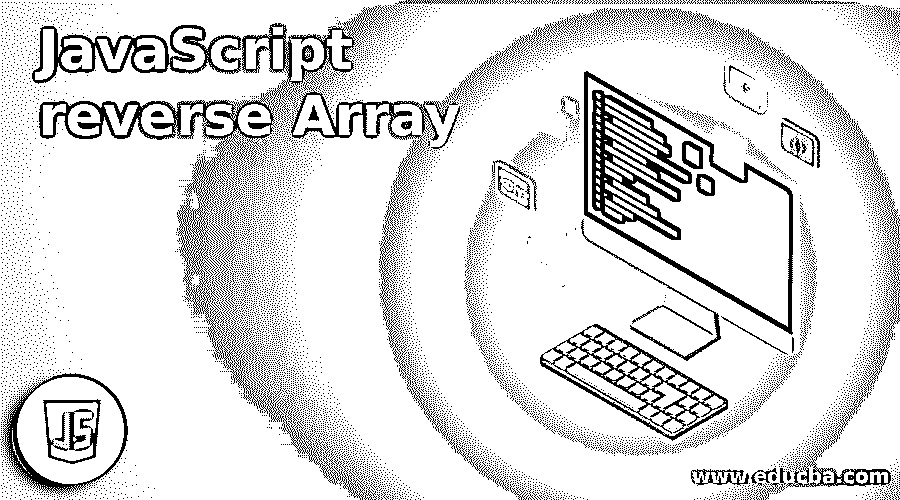
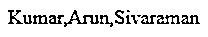
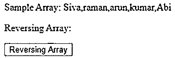
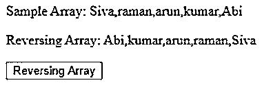
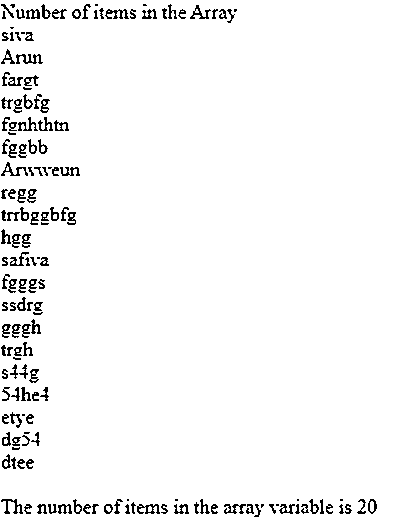
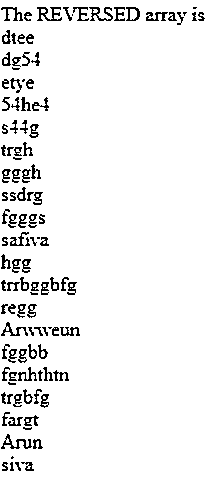

# JavaScript 反向数组

> 原文：<https://www.educba.com/javascript-reverse-array/>




## JavaScript 反向数组简介

JavaScript 有很多默认的方法来开发更安全的客户端网页和定制东西。在数组中有给定数组的序列元素集合，在数组中有名为 reverse()的默认方法，这意味着它将被用作数组，该数组必须在变量中声明和初始化，它还返回元素具有 JavaScript 网页的反向序列。当我们在脚本中使用名为 reverse()的默认方法时，数组元素的顺序是最后一个元素将成为第一个，第一个元素成为顺序中的最后一个。

**语法:**

<small>网页开发、编程语言、软件测试&其他</small>

JavaScript 有自己的语法来初始化网页中的变量和函数。其中一个 JavaScript 方法使用 arrays 元素以降序显示输出。

```
<html>
<head>
<script>
function function_name()
{
var variable name;//variable name declared in the array format
var variable name1 = variable name.reverse();
}
</script>
</head>
<body>
</body>
</html>
```

以上代码是声明 JavaScript 数组和在脚本中使用逆向方法的基本格式之一。

### JavaScript 反向数组是如何工作的？

reverse()方法将在脚本中的不同位置反转数组，变量的第一个元素成为最后一个，最后一个元素成为第一个，因此它遵循 LIFO(后进先出)数据结构序列。如果反向函数将调用数组实例的元素转置到数组列表中的突变位置，它还必须返回对数组的引用。

Reverse 方法总是有意使用一般条件。此方法也可以被调用或应用于实例，类似于不包含长度属性的数组对象，其属性反映了一系列连续的从零开始的数字属性中的最后一个，并且可能没有遵循它的有意义的行为方式。

在 JavaScript 中有许多类型的反向函数反向数组和反向数组，这两个函数将在脚本中以不同的顺序使用。反向数组它将数组作为一个参数，并按降序为相同的元素生成一个新的数组，第二个方法称为 reverseArrayInPlace，用于我们在反向方法中实现的任何内容，它还修改了作为参数给出的数组，以便反转其元素，因为它将在标准反向方法中使用，或者我们在代码中使用一些循环条件来反转数组元素，如 for 循环是反转和遍历数组元素的最佳方式之一。

reverse 方法主要用于并调用按位置顺序反转数组(也称为数组反转),如果我们使用 for 循环以相反的顺序迭代并打印元素，则我们使用 Array.reverse 方法以减少实现数组反转顺序所需的时间，我们使用 slice 方法复制数组元素，该元素的起始索引为零(0 ),然后我们在克隆的数组上使用 reverse 函数。

如果我们使用切片方法，它允许有效地克隆数组，并给我们一个新的对象，它将在 JavaScript 的其他方式中使用。使用 slice()方法时，如果我们想要修改已经在方法中声明的值，也可能会产生意外的输出结果。每当我们使用 reverse()方法时，parallelly slice()方法也适用，如果我们想使用脚本中的数组以 contains 对象作为引用或嵌套数组或简单复杂的实例，slice 方法也不接受 copy 和 deep copy 选项。逆序数组有翻转数组有上下翻转，我们以正常的方式迭代数组逆序函数也计划以正确的方式运行数组元素。

### JavaScript 反向数组的例子

下面是提到的例子:

#### 示例#1

**代码:**

```
<!DOCTYPEhtml>
<html>
<body>
<script>
var array=["Sivaraman","Arun","Kumar"];
var reverse=array.reverse();
document.writeln(reverse);
</script>
</body>
</html>
```

**输出:**




#### 实施例 2

**代码:**

```
<!doctype html>
<html lang="en">
<head>
<meta charset="utf-8">
<title>Welcome To My Domain</title>
<meta name="viewport" content="width=device-width, initial-scale=1">
<link rel="icon" type="image/x-icon" href="favicon.ico">
</head>
<body>
<div>
<p>Sample Array: </p>
<p>Reversing Array: </p>
</div>
<button onclick="rV()">Reversing Array</button>
<script type="text/javascript">
var n=["Siva","raman","arun","kumar","Abi"];
document.getElementById("a").innerHTML =n;
function rV(){
document.getElementById("r").innerHTML =n.reverse();
}
</script>
</body>
</html>
```

**输出:**




点击按钮后:




#### 实施例 3

**代码:**

```
<html>
<head>
<title>Welcome To My Domain</title>
<script type="text/javascript">
var s = new Array("siva", "Arun", "fargt", "trgbfg", "fgnhthtn","fggbb", "Arwweun", "regg", "trrbggbfg", "hgg","safiva", "fgggs", "ssdrg", "gggh", "trgh","s44g", "54he4", "etye", "dg54", "dtee");
Array.prototype.display=function(){
for (i=0;i<this.length;i++){
document.write(this[i] + "<br />");
}
}
document.write("Number of items in the Array<br />");
s.display();
document.write("<br />The number of items in the array variable is " + s.length + "<br />");
document.write("<br />The REVERSED array is<br />");
s.reverse();
s.display();
</script>
</head>
<body>
</body>
</html>
```

**输出:**







在上面的例子中，我们以不同的方式使用了逆序数组元素，我们使用了 display()，reverse()这些是我们在 JavaScript 中的数组中使用的方法，当我们创建一个数组时，默认情况下，它会在堆栈内存中分配内存空间，因为它会在堆栈区域中推送和弹出元素，即使我们在 arraylist 中插入和删除元素时会有性能问题，但在 array 中，它有固定的代码内存分配。如果我们想反转数组中的元素，我们使用 reverse()方法，我们也可以反转元素的数据类型，如字符串。如果数组元素是字符串数据类型，我们也反转字符串，并将其存储在数组中。我们还使用 JavaScript 中的循环和条件语句来迭代字符串。

### 结论

在上面的段落中，我们已经说明了 JavaScript 中称为数组的概念，特别是在反向方法中，我们在变量中使用了提到的数组元素，它将被更改为反向方式，使用 for 循环，我们在脚本中迭代元素。

### 推荐文章

这是一个 JavaScript 反转数组的指南。这里我们分别讨论 JavaScript 反转数组的工作原理和例子。您也可以看看以下文章，了解更多信息–

1.  [JavaScript getElementsByName()](https://www.educba.com/javascript-getelementsbyname/)
2.  [JavaScript 键盘事件](https://www.educba.com/javascript-keyboard-events/)
3.  [JavaScript 中的定时器](https://www.educba.com/timer-in-javascript/)
4.  [JavaScript 混淆器](https://www.educba.com/javascript-obfuscator/)


