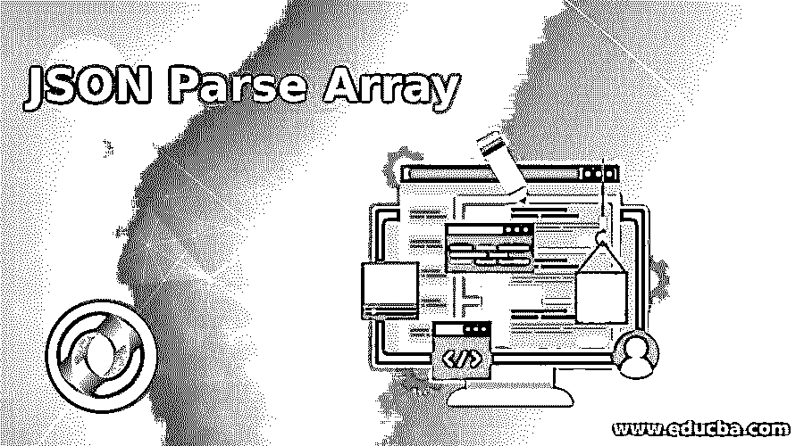
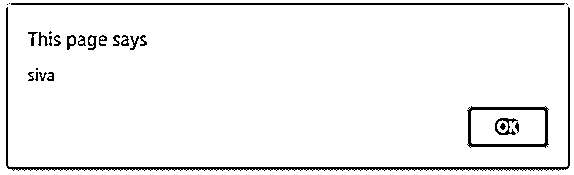
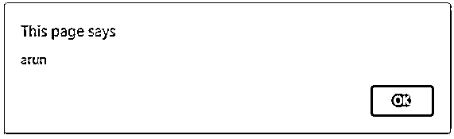
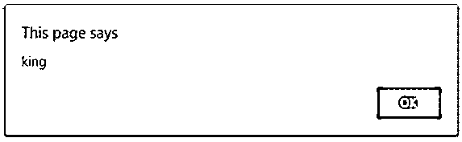
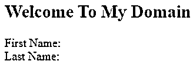
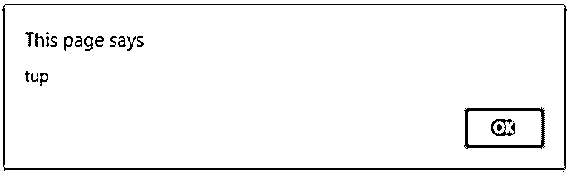

# JSON 解析数组

> 原文：<https://www.educba.com/json-parse-array/>




## JSON 解析数组简介

JSON 是 javascript 对象符号，它是一个用于交换数据的轻量级组件，而客户机和服务器之间的数据格式交换是快速查看的，并且易于在客户机视图中解析数据和生成新转换的格式数据。一般来说，xml 和 [json](https://www.educba.com/what-is-json/) 都是用于接收服务器响应数据的基于文本的模型格式，因为与 xml json 的带宽版本相比，这种文本格式易于覆盖，用户和机器都易于理解。如果我们使用 JSON.parse()内置方法，它将被直接调用并从 javascript 数组中派生，并且返回相同的值，而不是 javascript 实例。

**语法:**

<small>网页开发、编程语言、软件测试&其他</small>

json.parse()方法是在 html 代码中的

```
<html>
<body>
<script>
var variable name;
document.getElementById('").innerHTML=variable name;
JSON.parse(variable name)
---some javascript logic codes---
</script>
</body>
</html>
```

上面的代码使用 DOM 和 innerHTML 标记声明变量名并打印值，借助一个名为 JSON.parse()的预定义方法将服务器响应数据转换为数组格式。

### JSON 解析数组是如何工作的？

每当接收到使用 xml 和 json 格式的服务器响应时，原始数据将被转换成用户定制的格式。它将用于解析 JSON 字符串值，也可以由 javascript 值构造，或者用字符串格式描述对象。首先，json 从 web 服务器中读取用户数据并显示在 web 页面中，首先使用 JSON.stringify()将数据转换为字符串格式，然后再使用 JSON.parse()方法将字符串转换为数组。这个方法解析 JSON 字符串并返回 javascript 的值，无论用户发送什么请求，它们收到的响应数据都是相等的。当我们将字符串值解析为 JSON.parse 方法时，结果数据将被分配给特定的数据变量，此外，我们将数据变量值传递给 javascript 中的 print 语句。ElementByID()是 dom 对象，或者我们使用 console.log 方法来打印数据，也用于验证结果数据内容是否没有改变。我们有时可以在 javascript 中使用 eval，但此处不推荐使用，因为存在安全风险 JSON.parse 方法在 javascript 中也不安全，但在某些情况下更有效，如果我们确定服务器响应数据是否未用于 JSON.parse() 此方法将检查数据是否被正确传递，如果出现任何问题，这意味着如果假设 JSON 不是有效数据，错误或异常也将作为语法错误或其他一些表达式错误抛出。 我们已经提到了不可信的网站或不安全的内容可能会造成高风险，所以可以在脚本中自动删除。

我们使用 JSON.parse 方法有另一个叫做 json_encode 的特性，这是一个很重要的特性，因为当我们从服务器端网站接收数据时，或者我们使用 postman 等任何工具发送请求时，数据在这里被加密和解密，这些加密的数据与 PHP 等后端语言一起使用。JSON.parse 方法还包括称为 reviver options 的第二级参数。如果我们编辑或修改了原始值，该方法可用于修改用户屏幕。多维数组也适用于 JSON.parse()方法，这意味着一个数组用数字或关联索引来表示，而另一个数组同时用数字和关联索引来表示。

### JSON 解析数组的例子

下面是 JSON 解析数组的例子，给出如下:

#### 示例#1

**代码:**

```
<!DOCTYPEhtml>
<html>
<body>
<h2>Welcome To My Domain</h2>
<p id=*"demo"*>
First Name: <br>
Last Name: <br>
</p>
<script>
var s = '{"employees":[' +
'{"firstName":"siva","lastName":"raman" },' +
'{"firstName":"arun","lastName":"kumar" },' +
'{"firstName":"king","lastName":"siva" }]}';
var j = JSON.parse(s);
for (vari = 0; i<j.employees.length; i++) {
var c = j.employees[i];
alert(c.firstName);
}
</script>
</body>
</html>
```

**输出:**













#### 实施例 2

**代码:**

```
<!DOCTYPEhtml>
<html>
<body>
<h2>Welcome To My Domain</h2>
<p id=*"demo"*>
</p>
<script>
var e = '{"name":"Siva","age":32,"Dates" : "May 27, 2020" ,"address":"Tiruppur"}';
var e1 = JSON.parse(e, functionrevivers(key, values) {
if (key == "name") {
values = "Mr./Ms. " + values;
}
if(key == "Dates"){
values= new Date(values);
}
return values;});
document.getElementById("demo").innerHTML =
"Name = " + e1.name + "<br/> Age = " + e1.age + "<br/>Dates = " + e1.Dates + "<br/> Address = " + e1.address;
console.log(e1);
</script>
</body>
</html>
```

**输出:**


#### 实施例 3

**代码:**

```
<!DOCTYPEhtml>
<html>
<body>
<h2>Welcome To My Domain</h2>
<p id="demo">
</p>
<script>
var s = '{"employees":[' +
'{"firstName":"siva","city":"tup" },' +
'{"firstName":"arun","city":"cbe" },' +
'{"firstName":"x","city":"mas" },' +
'{"firstName":"r","city":"rjp" },' +
'{"firstName":"tr","city":"pnb" },' +
'{"firstName":"rew","city":"kar" },' +
'{"firstName":"ert","city":"ker" },' +
'{"firstName":"uuy","city":"mhs" },' +
'{"firstName":"tre","city":"up" },' +
'{"firstName":"df","city":"delhi" },' +
'{"firstName":"gg","city":"goa" },' +
'{"firstName":"ardsfun","city":"sikkim" },' +
'{"firstName":"fbb","city":"jhar" },' +
'{"firstName":"kuu","city":"har" },' +
'{"firstName":"king","city":"jk" }]}';
var j = JSON.parse(s);
for (vari = 0; i<j.employees.length; i++) {
var c = j.employees[i];
alert(c.city);
}
</script>
</body>
</html>
```

**输出:**




在上面的例子中，我们以不同的方式使用 json.parse 方法，我们使用一些特殊的函数，如 alert，用于触发用户判断输出值是否正确，我们使用字符串值声明，使用一些特殊的字符，如'['，' { '，']'，' } '等。这些字符将初始化变量中的值，并将其用于 JSON.parse()等转换方法。我们使用 reviver 方法来检索 JSON 格式字符串中的值。

### 结论

我们可以看到 JSON 方法 parse()用于不同的场景，它的用途是用于容器，而不是特别局限于单一用途。与其他格式工具相比，JSON 是制作 web 项目及其成果的最佳工具之一，最适合用于存储配置数据。

### 推荐文章

这是一个 JSON 解析数组的指南。在这里，我们还讨论了 json parse array 的介绍和工作原理，以及不同的例子和代码实现。您也可以看看以下文章，了解更多信息–

1.  [C#创建 JSON 对象](https://www.educba.com/c-sharp-create-json-object/)
2.  [PostgreSQL JSON](https://www.educba.com/postgresql-json/)
3.  [Python 中的 JSON](https://www.educba.com/json-in-python/)
4.  [JSON vs SOAP](https://www.educba.com/json-vs-soap/)


