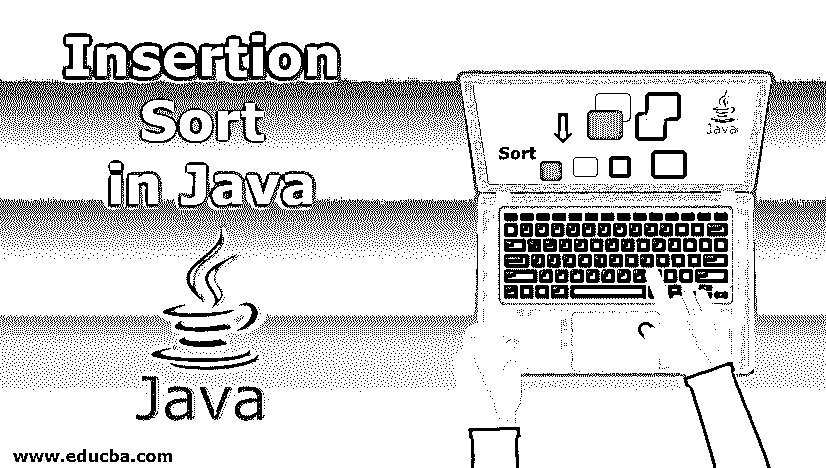
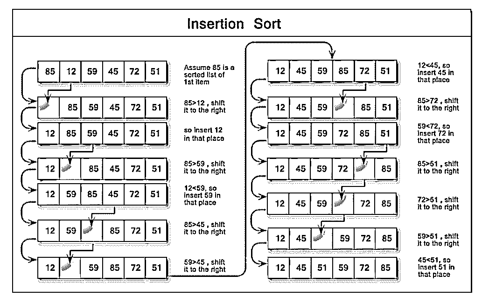
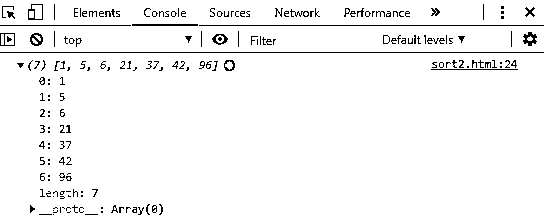
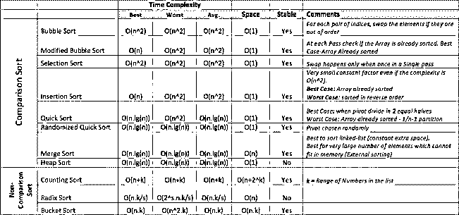

# JavaScript 中的插入排序

> 原文：<https://www.educba.com/insertion-sort-in-javascript/>




## JavaScript 中插入排序的介绍

排序是程序员在开始他们的计算机科学之旅时学习的重要概念之一，不管选择学习哪种编程语言。排序有助于我们以更快、更方便的方式找到我们想要搜索的目标数据，方法是按升序或降序排序。

[排序算法](https://www.educba.com/sorting-algorithms-in-javascript/)用于对元素重新排序，其中一个元素可以是数字，也可以是字符串。根据排序方法和排序元素所遵循的途径，排序算法有很多种类型，每种类型都有其优缺点。

<small>网页开发、编程语言、软件测试&其他</small>

在这篇博客中，我们将关注插入排序，一种易于理解和实现的常见排序。

### JavaScript 中的插入排序是什么？

插入排序是一种简单、易于理解的算法，它通过从左到右逐一排序数据列表中的每个元素，最适合小型数据列表。它也称为比较排序，将当前值与正在排序的同一数据列表中的其他值进行比较。它遵循一种迭代方法，将每个元素以正确的顺序放入数据列表中。

一个算法排序花的时间越多，就说它的性能不好，需要考虑另一个算法来整理数据。插入排序的时间复杂度为 O(n ),或者在最坏的情况下运行二次时间来排序数据列表。这通常不是很有效，不应该用于大型列表。但是，在较小的列表上，它通常优于快速排序或合并排序等高级算法。

插入排序，大多数时候比其他二次排序算法如[冒泡排序](https://www.educba.com/bubble-sort-algorithm/)或选择排序更高效。它的最佳情况是时间为 O(n ),或者是线性的，这发生在输入数组已经排序的情况下。平均而言，插入排序的运行时间仍然是二次的。




在下面的例子中，我们将有一个简单的高级方法来对存储在[数组数据结构](https://www.educba.com/arrays-in-data-structure/)中的数据进行排序，并使用其排序方法对数据进行排序，而无需实现任何算法。

#### 示例–插入排序算法

**代码:**

```
<!DOCTYPE html>
<html>
<body>
</body>
<script>
// Declaring unsorted data and storing it in array data structure
var dataArray = [96,5,42,1,6,37,21]
// Function - Insertion Sort Algo.
function insertSort(unsortedData) {
for (let i = 1; i < unsortedData.length; i++) {
let current = unsortedData[i];
let j;
for(j=i-1; j >= 0 && unsortedData[j] > current;j--) {
unsortedData[j + 1] = unsortedData[j]
}
unsortedData[j + 1] = current;
}
return unsortedData;
}
// print sorted array
console.log(insertSort(dataArray));
</script>
</html>
```

**输出:**

****

**** 

**说明:**在算法中，我们实现了 2 个 for 循环，外层的 for 循环用于迭代数组元素，内层的 for 循环用于按照数组元素值的升序对数组元素进行排序。当前变量保存数组的当前值，变量 j 被设置为比数组的当前索引位置小一的值。我们检查当前元素(current)是否小于第 j <sup>个</sup>位置的数组值(unsorted data[j]**)**，如果是，那么我们对这些值进行排序。

迭代 1–当前(96) : [96，5，42，1，6，37，21]

迭代 2–当前(5) : [5，96，42，1，6，37，21]

迭代 3–当前(42) : [5，42，96，1，6，37，21]

迭代 4–当前(1) : [1，5，42，96，6，37，21]

迭代 5–当前(6) : [1，5，6，42，96，37，21]

迭代 6–当前(37) : [1，5，6，37，42，96，21]

迭代 7–当前(21) : [1，5，6，21，37，42，96]

外部 for 循环迭代从 1 <sup>st</sup> 索引位置开始，因为我们想要将最小的元素移动到左侧，所以我们比较当前元素是否小于其左侧的元素。

### 排序的类型

用于排序数据的算法类型在其排序数据的方法中包含以下概念或思想:

*   比较与非比较策略，
*   迭代与递归实现，
*   分而治之的范式(这个或那个)，
*   随机方法。

让我们考虑几个例子:

1.[合并排序](https://www.educba.com/merge-sort-in-java/)使用分治法对数组中的元素进行排序。

2.插入排序，冒泡排序是一种基于比较的排序。




对数据进行排序后，就可以更容易地找到复杂问题的最佳解决方案。举个例子，

*   搜索特定值，
*   找到最小值或最大值，
*   测试唯一性和删除重复项，
*   计算特定值出现的次数等。

### 结论

在本文中，我们讨论了插入排序的定义及其时间复杂度，以及基于它们的各种其他排序算法。研究各种排序算法有助于我们确定哪种算法更适合某些环境或用例，从而帮助我们以更快的速度对数据进行排序。

### 推荐文章

这是 JavaScript 中插入排序的指南。这里我们分别举例讨论什么是 javascript 中的插入排序及其类型。您也可以阅读以下文章，了解更多信息——

1.  [JavaScript 中的模式](https://www.educba.com/patterns-in-javascript/)
2.  [JavaScript 中的 Case 语句](https://www.educba.com/case-statement-in-javascript/)
3.  [JavaScript 中的条件语句](https://www.educba.com/conditional-statements-in-javascript/)
4.  [JavaScript 对象](https://www.educba.com/javascript-objects/)
5.  [c++中的插入排序|如何实现？](https://www.educba.com/insertion-sort-in-c-plus-plus/)


