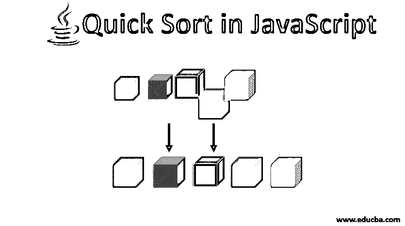
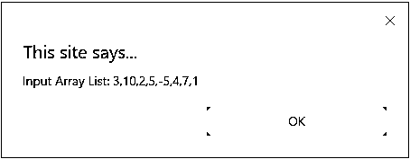
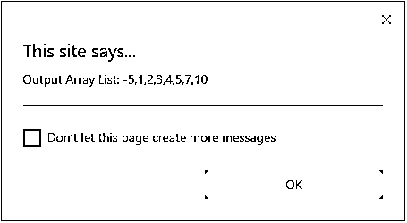

# JavaScript 中的快速排序

> 原文：<https://www.educba.com/quick-sort-in-javascript/>




## JavaScript 快速排序简介

排序算法是数据结构的重要组成部分之一。排序是以特定方式排列一组项目的方式。每当我们讨论更快的排序算法时，快速排序就会发挥作用。就执行时间而言，这是最流行的排序技术之一。由于其性能，这对于任何开发人员或编码人员来说都是比较好的选择。快速排序适用于分治规则。这意味着它把列表分成两个，然后两个列表再递归地分成 4 个，以此类推。在本文中，我们将看到快速排序是如何与示例代码一起工作的。此外，我们将看到它如何比其他各种排序算法更快。我们将看到这个快速排序算法的各个组成部分。

### 快速排序中的操作

快速排序 JavaScript 中有三个主要操作:

<small>网页开发、编程语言、软件测试&其他</small>

*   **列表的划分:**使用分治法划分或排列列表。这是我们可以说这种排序技术的第一步。为此，我们需要一个枢轴元素(中间元素或靠近中间的元素)。
*   **交换项目:**这是任何排序算法的主要目的，以将期望列表作为输出。这是一种从一个值到另一个值的排序替换机制。比如 A = 10B = 20 如果有人要求交换，那么 A 的值将是 20，B 的值将是 10。
*   **递归运算:**这个在快速排序中作用很大。如果没有递归函数，一次又一次地做事情是不可能的，也是不可靠的。这是一个函数调用它自己(同一个函数)来完成工作。这在我们用相同的方法和在相同的环境中一次又一次地执行任何任务时发挥了巨大的作用。

### 排序算法的比较

有各种类型排序算法。因为 JavaScript 是一种编程语言，所以它支持所有的排序算法。每一种排序算法都有其优点和缺点。以下是排序算法及其性能和其他矩阵的列表:

| **排序算法** | **时间复杂度** |
|  | **最佳情况** | **平均案例** | **最坏情况** |
| 冒泡排序 | Ω(N) | θ(N<sup>2</sup> | O(N <sup>2</sup> |
| 选择排序 | ω(N<sup>2</sup> | θ(N<sup>2</sup> | O(N <sup>2</sup> |
| 插入排序 | Ω(N) | θ(N<sup>2</sup> | O(N <sup>2</sup> |
| 合并排序 | Ω(N log N) | Θ(N log N) | O(N 对数 N) |
| 堆排序 | Ω(N log N) | Θ(N log N) | O(N 对数 N) |
| 快速排序 | Ω(N log N) | Θ(N log N) | O(N <sup>2</sup> |

正如我们在列表中看到的，快速排序比冒泡排序、选择排序、插入排序要快得多。

### JavaScript 中的快速排序是如何工作的？

**步骤 1** :获取支点元素——在任何分而治之中，选择正确的支点都起着至关重要的作用。所以，通常，我们试图将数组的中间元素作为枢纽元素。这是我们将单个数组分成两个数组进行排序的元素。

**步骤 2** :将左指针作为输入数组的第一个元素开始。

**步骤 3** :将右指针作为输入数组的最后一个元素开始。

**步骤 4** :现在，我们将左边指针处的元素与所选的 pivot 元素进行比较，并根据业务需求交换值。然后，我们将右指针与 Pivot 元素进行比较。

第五步:将两者移到下一个。使用递归方法一次又一次地执行上述所有步骤。

### JavaScript 中的快速排序示例

这是一个负责 JavaScript 中快速排序的函数。在这种情况下，我们将传递完整的数组列表作为输入，并将得到排序后的数组作为输出。

**代码:**

```
<html>
<head>
<title>Quick Sort in JavaScript</title>
</head>
<script type="text/javascript">
function quick_Sorting(array) {
if (array.length <= 1) {
return array; // if there is only one element then return the same
} else
{
var left = [];
var right = [];
var outputArray = [];
var pivot = array.pop();
var length = array.length;
for (var i = 0; i < length; i++) {
if (array[i] <= pivot) {
left.push(array[i]);
} else {
right.push(array[i]);
}
}
return outputArray.concat(quick_Sorting(left), pivot, quick_Sorting(right));
}
}
var myList = [3, 10, 2, 5, -5, 4, 7, 1];
alert("Input Array List: " + myList);
var sortedList = quick_Sorting(myList);
alert("Output Array List: " + sortedList);
</script>
<body>
</body>
</html>
```

由于其惊人的性能，大多数编码器使用这种排序技术来实现内置的排序功能。在各种编程语言中，quicksort 因其内置的排序功能而被使用。还有各种其他的方法来编写一个程序来执行快速排序操作，所有的函数都达到了分而治之的效果。所以，这种分而治之的方法是用 JavaScript 中的快速排序来处理的重击规则。不仅仅是 JavaScript，所有的编程语言都是如此。

**输出:**







### 推荐文章

这是一个 JavaScript 快速排序的指南。在这里，我们讨论快速排序在 javascript 中是如何工作的，它的操作，以及排序算法的比较和相应的例子。您也可以阅读以下文章，了解更多信息——

1.  [Java 中的快速排序](https://www.educba.com/quick-sort-in-java/)
2.  [JavaScript 中的合并排序](https://www.educba.com/merge-sort-in-javascript/)
3.  [JavaScript 中的递归函数](https://www.educba.com/recursive-function-in-javascript/)
4.  [在 Java 中完成](https://www.educba.com/finalize-in-java/)


