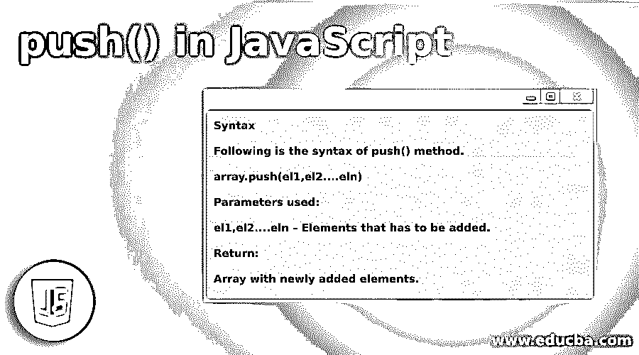
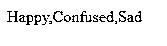
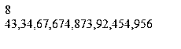
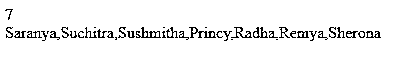
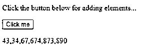
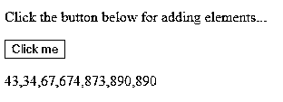
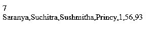

# JavaScript 中的 push()

> 原文：<https://www.educba.com/push-in-javascript/>




## JavaScript 中的 push()简介

在 Javascript 中，push()是一种帮助将一个或多个元素添加到数组末尾的方法。也就是说，使用这个 push()方法将改变数组的长度。此外，它还具有某些其他特征。

它们是:

<small>网页开发、编程语言、软件测试&其他</small>

*   这个方法是故意通用的。
*   此方法可用于类似对象的数组。
*   它可以与 apply()或 call()方法一起使用。
*   给定值的起始位置由属性长度决定。
*   如果属性长度不能转换成数字，0 将被用作索引。

关于 push()方法的更多细节将在下面的章节中讨论。

### 句法

下面是 push()方法的语法。

```
array.push(el1,el2....eln)
```

**使用的参数:**

el1，el2…ELN–必须添加的元素。

**返回:**

具有新添加元素的数组。

### JavaScript 中的 push()是如何工作的？

让我们借助一个例子来看看 push()方法是如何工作的。

假设有一个数组“smp ”,其元素如下所示。

[23, 45, 67, 89, 25, 56]

你想给这个数组增加一些元素 90，87。你所要做的就是像这里描述的那样调用 push 方法。

```
smp.push()
```

调用此方法时，元素 90 和 87 将被添加到数组的末尾，如

[23, 45, 67, 89, 25, 56, 90, 87]

如果你想把元素添加到不同的位置，使用 push()方法是不行的，因为 push()方法只允许把元素添加到数组的末尾。

### 在 JavaScript 中实现 push()的示例

为了更好地理解这种方法，让我们看一些实际的例子。

#### 示例#1

一个简单的 Java 脚本程序，使用 push()方法将某些元素推送到一个样本数组中。

**代码:**

```
<!DOCTYPE html>
<html>
<body>
<script>
var smp=["Happy","Confused"];
smp.push("Sad");
document.writeln(smp);
</script>
</body>
</html>
```

**输出:**




**说明:**首先使用语法<声明 html！DOCTYPE html >。然后，在主体内部，使用标签< script >启动脚本。创建一个包含“快乐”和“困惑”元素的变量 smp。之后，使用 push()方法将元素“Sad”推给它。然后，打印元素。

#### 实施例 2

使用 push()方法将数字元素推送到样本数组的 Java 脚本程序。

**代码:**

```
<!DOCTYPE html>
<html>
<body>
<script>
//JavaScript to implement push() method
function sample() {
// sample array to add numeric elements
var smp= [ 43, 34, 67, 674, 873 ];
// Push the numeric elements to the sample array
document.write(smp.push( 92, 454 , 956));
document.write("<br>");
document.write(smp);
}
//call the function sample
sample();
</script>
</body>
</html>
```

**输出:**




**说明:**首先使用标签<脚本>启动脚本。创建一个包含 push 方法的函数**样本**。然后，创建一个包含某些数字元素“43，34，67，674，873”的变量 **smp** 。之后，使用 push()方法将元素“92，454，956”推给它。然后，打印数组中存在的元素和元素的数量。

#### 实施例 3

使用 push()方法将字符串元素推送到样本数组的 Java 脚本程序。

**代码:**

```
<!DOCTYPE html>
<html>
<body>
<script>
// JavaScript to implement push() method
function sample() {
// sample array to add elements
var smp= ["Saranya", "Suchitra", "Sushmitha", "Princy"];
// Push the elements to the sample array
document.write(smp.push("Radha", "Remya", "Sherona"));
document.write("<br>");
document.write(smp);
}
//call the function sample
sample();
</script>
</body>
</html>
```

**输出:**




**解释:**与示例 2 类似，使用标签<脚本>启动脚本。创建一个包含 push 方法的函数示例。然后，创建一个变量 smp，它包含某些字符串元素，如“Saranya”、“Suchitra”、“Sushmitha”、“Princy”。之后，使用 push()方法向其添加元素“Radha”、“Remya”、“Sherona”。然后，打印数组中存在的元素和元素的数量。

#### 实施例 4

使用执行 push()方法的按钮将数字元素推送到样本数组的 Java 脚本程序

**代码:**

```
<!DOCTYPE html>
<html>
<body>
<p>Click the button below for adding elements...</p>
<button onclick="sample()">Click me</button>
<p id="example"></p>
<script>
var smp= [ 43, 34, 67, 674, 873 ];
document.getElementById("example").innerHTML = smp;
function sample() {
smp.push("890");
document.getElementById("example").innerHTML = smp;
}
</script>
</body>
</html>
```

**输出:**

首先，使用语法声明 html。然后，在正文中创建一个文本，说明“单击下面的按钮添加元素”.之后，创建一个按钮，单击它调用函数 sample()。一旦它被创建，通过使用标签

在执行代码时，将出现以下结果。


如您所见，出现了一个按钮“点击我”。单击它时，输出将如下所示。也就是说，点击按钮时，附加元素 890 被添加到元素中。




如果再次点击该按钮，将再次添加 890。




#### 实施例 5

使用 push()方法将数字元素推送到已经包含字符串元素的示例数组的 Java 脚本程序。

**代码:**

```
<script>
// JavaScript to implement push() method
function sample() {
// sample array to add elements
var smp= ["Saranya", "Suchitra", "Sushmitha", "Princy"];
// Push the elements to the sample array
document.write(smp.push("1", "56", "93"));
document.write("<br>");
document.write(smp);
}
//call the function sample
sample();
</script>
```

**输出:**




**解释:**首先，使用标签<脚本>启动脚本，类似于这里提到的其他例子。创建一个包含 push 方法的函数示例。然后，创建一个变量 smp，它包含某些字符串元素，如“Saranya”、“Suchitra”、“Sushmitha”、“Princy”。之后，使用 push()方法将元素“1”、“56”、“93”推入其中。然后，打印数组中存在的元素和元素的数量。

### 结论

Java script push()是一种在特定数组末尾添加 1 个或 1 个以上元素的方法。正如上一节所解释的那样，调用这个方法时，数组的长度将会改变，因为向它添加了更多的元素。本文详细解释了 push()方法，包括语法、工作原理和示例。

### 推荐文章

这是 JavaScript 中 push()的指南。这里我们讨论 JavaScript 中的 push()介绍，语法，它是如何工作的，代码和输出的例子。您也可以浏览我们的其他相关文章，了解更多信息——

1.  [JavaScript 数组串联](https://www.educba.com/javascript-array-concat/)
2.  [JavaScript 中的动态数组](https://www.educba.com/dynamic-array-in-javascript/)
3.  [JavaScript 中的 pop()](https://www.educba.com/pop-in-javascript/)
4.  [JavaScript 提示](https://www.educba.com/javascript-prompt/)


