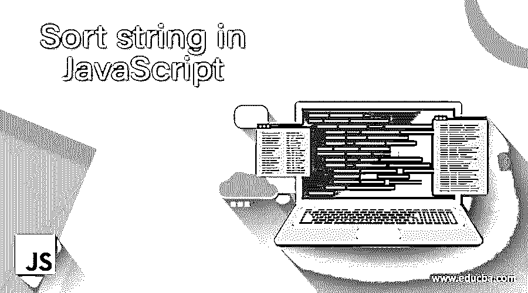
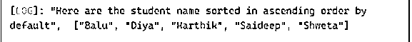
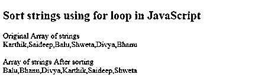
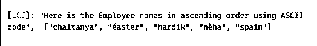
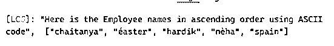
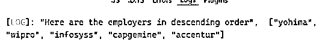

# JavaScript 中的排序字符串

> 原文：<https://www.educba.com/sort-string-in-javascript/>




## JavaScript 中的排序字符串介绍

JavaScript 中的 Sort String 用于根据字母顺序对字符串进行排序，即通过将 UTF-16 代码序列与单位值进行比较，将给定的元素转换为字符串。字符串排序是许多前端开发人员面试中的常见问题，在这里，我们将看到如何用各种方法在 JavaScript 中按字母顺序对字符串进行排序。在 JavaScript 中，我们使用 sort()方法对字符串进行排序，并返回排序后的字符串数组。默认顺序是升序，基于元素到字符串的转换。排序的时间复杂度和空间复杂度不能固定，因为它取决于实现。

**语法:**

<small>网页开发、编程语言、软件测试&其他</small>

下面是排序字符串的语法，

如前所述，sort()方法对元素进行排序，最小值在开始，最大值在最后。

```
<array_name>.sort();
```

假设学生是一个字符串数组，

```
student.sort();
```

不需要将参数传递给 sort()方法。

sort()可以有一个可选参数作为 compareFunction，用于定义定制的排序顺序(如果有)。

sort()方法在对数组元素排序后返回数组。

### JavaScript 中字符串如何排序？

*   我们有两种方法对字符串进行排序，比如使用 sort()方法或者使用 Loop。
*   在使用 sort()方法时，我们使用 JavaScript 预定义的方法对字符串数组进行排序。
*   Sort()方法仅适用于字母字符串。
*   Sort()方法不支持数字数组。
*   有一种简单的方法对元素数组进行排序，即循环一个数组并比较每个元素以将字符串元素放在它的位置上。
*   这里，循环可以应用于数组中的数字

#### 示例#1

使用 Sort()方法在 JavaScript 中对字符串进行简单排序

**代码:**

```
let student_name = ['Karthik', 'Saideep', 'Balu', 'Shweta', 'Diya'];
student_name.sort();
```

console.log('这里默认是按升序排序的学生姓名'，student _ name)；

**输出:**




这里，我们取了一个字符串数组，默认情况下，这些字符串使用 sort()方法按字母顺序排序。

#### 实施例 2

使用 for 循环对字符串进行排序。

**代码:**

```
<!DOCTYPE html>
<html>
<head>
<body>
<h2>Sort strings using for loop in JavaScript</h2>
<script>
function sortString(strArray) {
var i = 0;
var j;
while (i < strArray.length) {
j = i + 1;
while (j < strArray.length) {
if (strArray[j] < strArray[i]) {
var tempStr = strArray[i];
strArray[i] = strArray[j];
strArray[j] = tempStr;
}
j++;
}
i++;
}
}
var sortArray = ['Karthik', 'Saideep', 'Balu', 'Shweta', 'Divya', 'Bhanu'];
document.write("Original Array of strings</br>");
document.write(sortArray);
document.write("</br>");
sortString(sortArray);
document.write("</br>Array of strings After sorting</br>");
document.write(sortArray);
</script>
</body>
</html>
```

**输出:**




所以在这里，我们使用 for 循环，默认情况下对字符串数组进行升序排序。函数 sortString 接受数组“sortArray”作为参数。

两个变量“I”和“j”让你根据数组的长度来比较字符串。

#### 实施例 3

使用 localeCompare()或非 ASCII 字符对字符串进行排序。

**代码:**

```
let employee_Ascii = ['nèha', 'hardik', 'éaster', 'chaitanya', 'spain'];
employee_Ascii.sort(function (str1, str2) {
return str1.localeCompare(str2);
});
console.log('Here is the Employee names in ascending order using ASCII code', employee_Ascii)
```

**输出:**




这里我们使用 localeCompare()函数，它有两个参数 str1 和 str2，用于非 ASCII 字符。

当没有传递比较函数时，数组中所有非未定义的元素首先被转换为字符串。然后将这些值与 UTF-16 代码值进行比较，并按升序排序。未定义的元素被排序或保留到数组的末尾。

当传递了一个比较函数时，如上所示，数组中所有未定义的元素都根据定义的比较函数的返回值进行排序。所有未定义的元素都排序在数组的末尾，没有对这些元素调用 compare 函数。

#### 实施例 4

使用 ASCII 代码对 JavaScript 中的字符串进行排序

**代码:**

```
let employee_Ascii = ['nèha', 'hardik', 'éaster', 'chaitanya', 'spain'];
employee_Ascii.sort(function (a, b) {
return a.localeCompare(b);
});
console.log('Here is the Employee names in ascending order using ASCII code', employee_Ascii);
```

**输出:**




所以这里元素的排序是基于输入元素的 ASCII 值来完成的。

#### 实施例 5

以降序对 JavaScript 中的字符串进行排序

**代码:**

```
var employer = [
'wipro', 'yohima', 'accentur', 'capgemine', 'infosyss'
];
employer.sort(function (x, y) {
if (x > y) {
return -1;
}
if (y > x) {
return 1;
}
return 0;
});
console.log("Here are the employers in descending order", employer);
```

**输出:**




下面是按降序排序的值，它完全基于声明的比较函数。

至此，我们结束了主题“JavaScript 中的排序字符串”。我们已经了解了排序字符串的含义、语法以及用法。见过 JavaScript 中对字符串进行排序的各种方法，一种使用 sort()方法，另一种使用数组元素上的循环，这实际上类似于上面示例中看到的 localeCompare 函数。在 JavaScript 的这一部分，我们已经了解了如何按照字母顺序对字符串进行排序。上面的例子几乎涵盖了所有的概念，简单排序、降序排序、整数排序、使用比较函数等等。谢谢！快乐学习！!

### 推荐文章

这是一个在 JavaScript 中排序字符串的指南。在这里，我们将讨论如何使用各种方法在 JavaScript 中对字符串进行排序，并给出示例和输出。您也可以看看以下文章，了解更多信息–

1.  [JavaScript 父节点](https://www.educba.com/javascript-parent-node/)
2.  [JavaScript 浮动](https://www.educba.com/javascript-floating/)
3.  [JavaScript 计数器](https://www.educba.com/javascript-counter/)
4.  [JavaScript 动画](https://www.educba.com/javascript-animation/)


