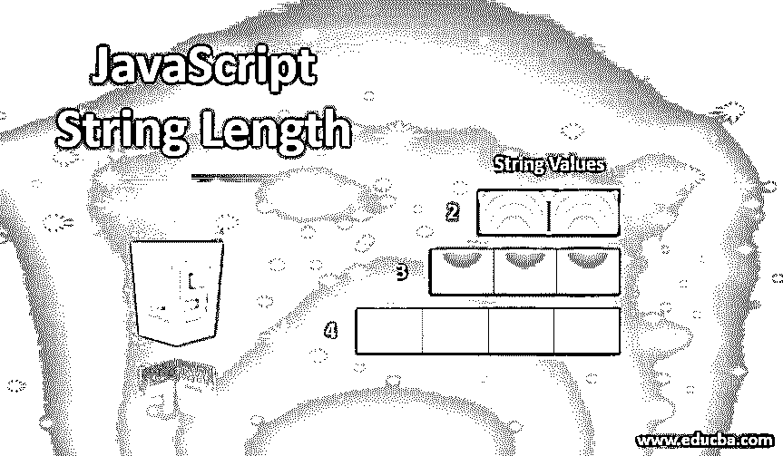
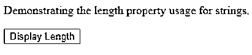
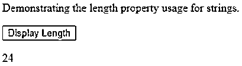
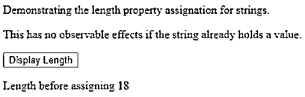
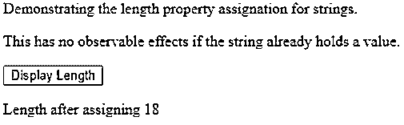
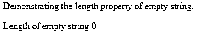

# JavaScript 字符串长度

> 原文：<https://www.educba.com/javascript-string-length/>




## JavaScript 字符串长度介绍

字符串是由多个字符组成的数据类型或类。Javascript 为我们提供了多种属性和方法来处理和操作字符串。我们可以添加、修改和替换字符串内容。我们可以拼接，找到字符，并将其转换为小写和大写，等等。javascript 字符串属性最基本也是最重要的属性之一是它的长度属性。字符串是不可变的，因此对 string 的任何方法调用都会返回一个新的 string 对象，并且原始字符串不会被操作，保持不变。

字符串的长度就是字符串中的字符数，与任何其他对象相似。该属性在 String 对象的帮助下返回字符串中的字符数，它使用该字符串来调用 length 属性。返回值是一个无符号整数。当字符串被转换为字符数组时，字符串的长度总是等于 1 加上字符数组的最高索引，因为数组索引总是从零开始。

<small>网页开发、编程语言、软件测试&其他</small>

最初，没有为字符串指定最大长度。现在，ECMAScript 2016 (ed。7)指定 2^53-1 长度为最大长度。Firefox 的最大长度为 2^30-2，几乎相当于 1 GB，这增加了容量。在 Firefox 65 版本之前，字符串长度被限制为 2^28–1，几乎等于 256MB。这是早期 firefox 中字符串的最大容量。

**语法:**

```
var Stringlength = String.length;
```

其中，Stringlength 是一个变量，用于存储字符串对象中的字符数，该字符串对象由右侧的表达式返回。

我们可以使用以下语法设置字符串的长度:

```
String.length = number;
```

其中 number 是保存字符的字符串对象所需的最大容量

### JavaScript 字符串长度的示例

string.length 是一个 JavaScript 属性，用于查找字符串的长度。javascript 字符串长度的示例如下:

#### 例子# 1-寻找字符串的长度

**代码:**

```
<!DOCTYPE html>
<html>
<body>
<p>Demonstrating the length property usage for strings.</p>
<button onclick="getLength()">Display Length</button>
<p id="sample"></p>
<script>
function getLength() {
var sampleString = "Let's play with strings!"; var stringLength = sampleString.length;
document.getElementById("sample").innerHTML = stringLength;
}
</script>
</body>
</html>
```

**输出:**







输出指定了“让我们玩字符串吧！”字符串是 24。当单击“显示长度”按钮调用 getLength()方法时，单击按钮后会显示该长度。

#### 示例 2–为字符串对象分配长度

为现有字符串指定长度不会影响它的功能。为字符串分配长度的语法如下:

```
String.length = number;
```

我们借助一个例子来证实一下。

**代码:**

```
<!DOCTYPE html>
<html>
<body>
<p>Demonstrating the length property assignation for strings.</p>
<p>This has no observable effects if the string already holds a value.</p>
<button onclick="assignLength()">Display Length</button>
<p id="demo"></p>
<script>
let sampleString = "Javascript Strings";
document.getElementById("demo").innerHTML = "Length before assigning "+sampleString.length;
function assignLength() { sampleString.length = 4;
document.getElementById("demo").innerHTML = "Length after assigning "+sampleString.length;
}
</script>
</body>
</html>
```

**输出:**

在点击按钮之前。




点击按钮后。




#### 示例 3–字符串长度属性的内部工作

length 属性检查字符串中包含的 Unicode 位数。javascript 中的字符串格式是 UTF-16，使用 16 位代码来表示最常用的字符。但是，一些复杂字符需要两个 Unicode 来指定一个字符。因此，有时 length 属性可能不会返回其中的字符数。但是，这种情况很少发生，因为大多数频繁出现的字符只使用一个 Unicode 来表示。

您可以编写一个函数，在计算字符串长度时考虑字符而不是 Unicode 表示。这可以通过使用以下代码来实现-

**代码:**

```
function getCharLen (stringIterator) {
// The above stringIterator iterates on all the characters and
//not on the unicodes of characters which results in correct length of characters return [...stringIterator].length;
}
document.write(getCharLen('C\uE903\uAB78W')); // 3
// It is not recommended but you can use this method whenever
//you want to find out the length of string Object.defineProperty(string.prototype, 'characterLengthOfString', { get () {
return getCharLen(this);
}
});
document.write('C\uE903\uAB78W'.characterLengthOfString); // 3
```

#### 示例# 4–空字符串

空字符串中没有字符。因此，其长度默认为零。我们用一个例子来证实一下:

**代码:**

```
<!DOCTYPE html>
<html>
<body>
<p>Demonstrating the length property of empty string.</p>
<p id="demo"></p>
<script>
let sampleString = "";
document.getElementById("demo").innerHTML = "Length of empty string "+sampleString.length;
</script>
</body>
</html>
```

**输出:**




#### 示例 5–长度属性的属性

可写、可配置和可枚举是任何属性的三个属性。对于长度属性，可写属性设置为否，而长度属性是不可配置和不可计数的。长度属性不可写意味着其值不能从外部更改和修改。它是不可配置的，这意味着它的任何属性(可写、可配置或可枚举)都不能更改。它是不可枚举的，这意味着它的值不能像 for 循环那样在循环中迭代。string 是一个不可变的对象，这意味着对它的每个操作都会导致新的 string 对象的创建，而原始对象不受影响。

**兼容性:**

字符串的长度属性对于以下浏览器可用且兼容，并且还指定了最低支持版本。

**桌面版本:**

*   铬 1.0
*   Internet Explorer 12.0
*   Mozilla Firefox 1.0
*   歌剧
*   旅行队

**手机版:**

*   Android webview 1
*   安卓 18.0 版 Chrome
*   android 4.0 版火狐浏览器
*   android 版 Opera
*   iOS 上的 safari
*   三星互联网 1.0
*   [Node.js](https://www.educba.com/events-in-node-js/)

### 结论

我们可以得出结论，长度属性提到了字符串的最大容量，这意味着它可以存储的最大字符数，因此在迭代和检查 string-like replace、toLowerCase、splice、split、search 等内部方法的条件时使用。这些内部方法将字符串转换为字符数组，然后对其执行功能。通过使用字符串的长度属性，我们可以在我们通常的编码过程中确定字符串的大小及其长度，在使用字符串迭代器进行迭代时，可以进一步使用该属性。这样，我们可以使用 length 属性来操作我们的工作代码和字符串。

### 推荐文章

这是 JavaScript 字符串长度的指南。这里我们讨论 javascript 字符串长度及其代码实现的介绍和例子。您也可以阅读以下文章，了解更多信息——

1.  [JavaScript 中的表单验证](https://www.educba.com/forms-in-javascript/)
2.  [在 JavaScript 中反转](https://www.educba.com/reverse-in-javascript/)
3.  [JavaScript 获取数组长度](https://www.educba.com/javascript-get-array-length/)
4.  [Javascript innerHTML](https://www.educba.com/javascript-innerhtml/)


