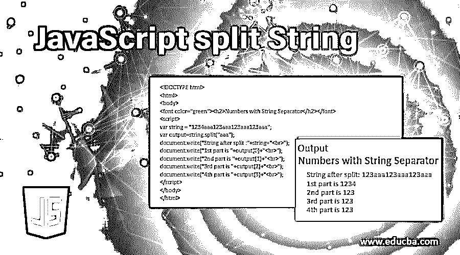
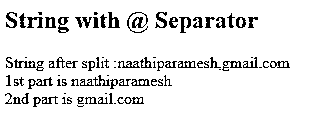
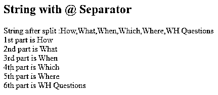
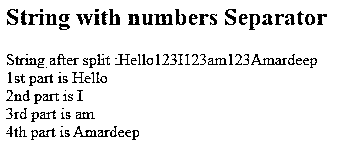
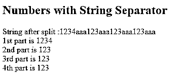
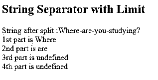
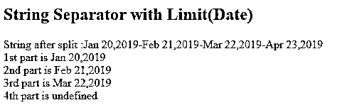

# JavaScript 拆分字符串

> 原文：<https://www.educba.com/javascript-split-string/>




## JavaScript 拆分字符串简介

split 方法用于将一个字符串分成一个子字符串列表，并返回一个新的数组。split 字符串使用 JavaScript 中的 split 方法以特殊方式分隔字符、单词、数字和日期。

****例如:****

<small>网页开发、编程语言、软件测试&其他</small>

我有一个包含一些单词和日期的字符串，然后我想处理日期并执行一些操作，简单地使用了 split 方法。拆分后，我们可以在日期上做所需的动作。

### JavaScript 中的拆分字符串是如何工作的？

*   JavaScript 有一个原型对象来拆分字符串，这是 split()方法。
*   **split()方法可以直接拆分带有特殊字符或索引位置的字符串。**

 ******语法 1:****

 **```
var s="Any!String";
var out=s.split("!")//separator
```

****解释:****

*   **任何！字符串分割使用！特殊人物。**
***   输出字符串被替换为 ****，**** JavaScript 逗号后视为单词。*   以上任何一个都存储在第 0 个<sup>第</sup>索引中，字符串存储在第 1 个<sup>第</sup>索引中。**

 ******语法二:****

 **```
var s="Any!String";
var out=s.split("!",1);//separator,limit
```

****解释:****

Separator 告诉您在哪个字符串之后必须分割，limit 告诉您在输出中必须包含多少个索引字符串。1 表示第 0 <sup>个</sup>和第 1 <sup>个</sup>个索引字符串必须包含。(我们知道字符串索引从 0 开始)。

### JavaScript 拆分字符串的示例

以下是 JavaScript 拆分字符串的示例:

#### **示例# 1–带字符串的分隔符@**

 ******语法:****

```
var s="Some@String"
var out=s.split("@")//separator
```

****代号:****

```
<!DOCTYPE html>
<html>
<body>
<font color="green"><h2>String with @ Separator</h2></font>
<script>
var string = "naathiparamesh@gmail.com";
var out = string.split("@");
document.write("String after split :"+out+"<br>");
document.write("1st part is "+out[0]+"<br>");
document.write("2nd part is "+out[1]);
</script>
</body>
</html>
```

****输出:****




****解释:****

*   @ Separator 将字符串分成两部分。一个在@分隔符之前，另一个在@分隔符之后。
*   第 1 <sup>个</sup>部分或第 0 <sup>个</sup>指标值为 naathiparamesh。
*   第 2 <sup>第</sup>部分或第 1 <sup>第</sup>部分的指标值为 gmail.com。
*   因此，它清楚地告诉我们字符串在@ separator 后面分开。

#### 示例 2–字符串与？分离器

****语法:****

```
var s="Some?String"
var out=s.split("?")//separator
```

**代码:**

```
<!DOCTYPE html>
<html>
<body>
<font color="green"><h2>String with @ Separator</h2></font>
<script>
var stringWHQ = "How?What?When?Which?Where?WH Questions";
var output=stringWHQ.split("?");
document.write("String after split :"+output+"<br>");
document.write("1st part is "+output[0]+"<br>");
document.write("2nd part is "+output[1]+"<br>");
document.write("3rd part is "+output[2]+"<br>");
document.write("4th part is "+output[3]+"<br>");
document.write("5th part is "+output[4]+"<br>");//<br> gives new line
document.write("6th part is "+output[5]+"<br>");
</script>
</body>
</html>
```

****输出:****




****解释:****

*   使用问号(？)问号后的单词由逗号(，)分隔。
*   **输出[索引]值给出期望的输出。**

 **#### **示例 3–从字符串中拆分数字**

 ******语法:****

```
var s="Hello123I123am123Amardeep";
var out=s.split("123");
```

****代号:****

```
<!DOCTYPE html>
<html>
<body>
<font color="green"><h2>String with numbers Separator</h2></font>
<script>
var stringNumbers = "Hello123I123am123Amardeep";
var output=stringNumbers.split("123");
document.write("String after split :"+stringNumbers+"<br>");
document.write("1st part is "+output[0]+"<br>");
document.write("2nd part is "+output[1]+"<br>");
document.write("3rd part is "+output[2]+"<br>");
document.write("4th part is "+output[3]+"<br>");
</script>
</body>
</html>
```

****输出:****




****解释:****

*   上面的字符串有带数字的单词。我们用数字分割字符串。
*   拆分后，每个字符串都有自己的索引值。
*   相应的值我们可以通过输出[index]值得到。

#### **示例 4–带字符串分隔符的数字**

 ******语法:****

```
var s="123aaa123aaa123aaa123";
var out=s.split("aaa");
```

**代码:**

```
<!DOCTYPE html>
<html>
<body>
<font color="green"><h2>Numbers with String Separator</h2></font>
<script>
var string = "1234aaa123aaa123aaa123aaa";
var output=string.split("aaa");
document.write("String after split :"+string+"<br>");
document.write("1st part is "+output[0]+"<br>");
document.write("2nd part is "+output[1]+"<br>");
document.write("3rd part is "+output[2]+"<br>");
document.write("4th part is "+output[3]+"<br>");
</script>
</body>
</html>
```

****输出:****




****解释:****

*   上面的字符串有带单词的数字。我们用绳子把数字分开。
*   拆分后，每个字符串都有自己的索引值。
*   相应的值我们可以通过输出[index]值得到。

#### **示例 5–带限制器的字符串分隔符**

 ******语法:****

```
var s="How-are-you-man?";
var out=s.split("-",3);//separator, limit
```

****代号:****

```
<!DOCTYPE html>
<html>
<body>
<font color="green"><h2>String Separator with Limit</h2></font>
<script>
var string = "Where-are-you-studying?";
var output=string.split("-",2);
document.write("String after split :"+string+"<br>");
document.write("1st part is "+output[0]+"<br>");
document.write("2nd part is "+output[1]+"<br>");
document.write("3rd part is "+output[2]+"<br>");
document.write("4th part is "+output[3]+"<br>");
</script>
</body>
</html>
```

****输出:****




****解释:****

*   以上代码 string.split()有分隔符和限制。
*   分隔符决定字符串在哪里被拆分。
*   **Limit 决定了字符串拆分停止的位置。在限制之后，它会忽略并几乎删除剩余的单词。**
***   我们可以看到上面的代码用–分隔符分开，用–分隔符分开后，limit 2 只给出 2 个单词。*   在 2 个索引值之后，下一个值被自动忽略，因此 3 个<sup>第</sup>和 4 个<sup>第</sup>索引值的输出未定义。**

 ****#### **示例 6–带分隔符和限制的日期拆分字符串**

 ******语法:****

```
var string = "Jan 20,2019-Feb 21,2019-Mar 22 ";
var output=string.split("-",3);//separator, limit
```

**代码:**

```
<!DOCTYPE html>
<html>
<body>
<font color="green"><h2>String Separator with Limit(Date)</h2></font>
<script>
var string = "Jan 20,2019-Feb 21,2019-Mar 22,2019-Apr 23,2019";
var output=string.split("-",3);
document.write("String after split :"+string+"<br>");
document.write("1st part is "+output[0]+"<br>");
document.write("2nd part is "+output[1]+"<br>");
document.write("3rd part is "+output[2]+"<br>");
document.write("4th part is "+output[3]+"<br>");
</script>
</body>
</html>
```

****输出:****




****解释:****

*   以上代码 string.split()有分隔符和限制。
*   分隔符决定字符串在哪里被拆分。
*   极限决定了，弦在哪里分裂，就在哪里停止。在限制之后，它会忽略并几乎删除剩余的单词。
*   我们可以看到上面的代码用–分隔符分开，用–分隔符分开后，limit 3 只给出 3 个单词。
*   在第 3 <sup>个</sup>指标值被自动忽略后，第 4 <sup>个</sup>指标值的输出未定义。

 **### 结论

String.split()分隔符可以用任意字符分割字符串，String.split()分隔符，限制器可以用任意字符分割字符串，直到所需的索引限制。

### 推荐文章

这是一个 JavaScript 拆分字符串的指南。在这里，我们讨论了 JavaScript 中的介绍和分割字符串是如何工作的，以及示例和代码实现。您也可以阅读以下文章，了解更多信息——

1.  [JavaScript 数学函数](https://www.educba.com/javascript-math-functions/)
2.  [JavaScript 中的算术](https://www.educba.com/arithmetic-operators-in-javascript/)
3.  [JavaScript 中的控制语句](https://www.educba.com/control-statement-in-javascript/)
4.  [JavaScript 静态方法](https://www.educba.com/javascript-static-method/)


**************************