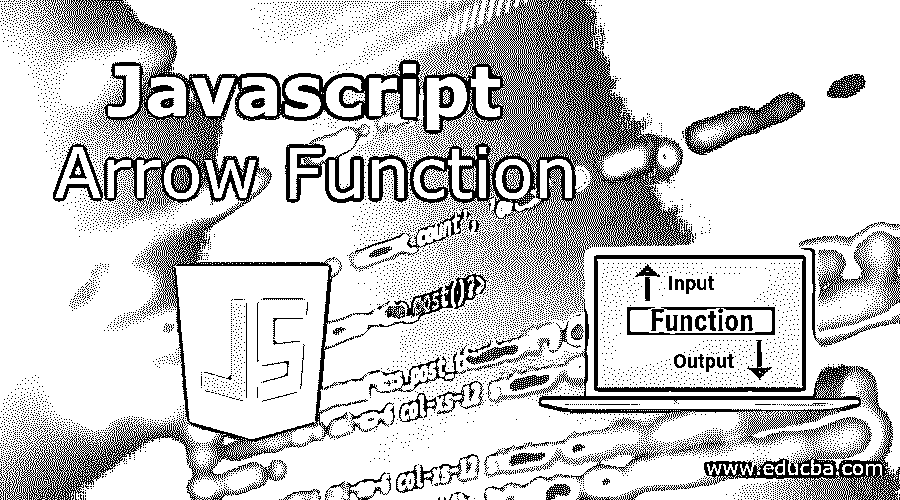
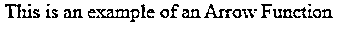
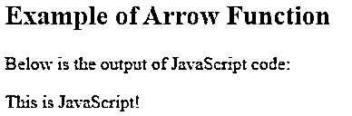
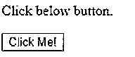
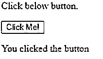

# JavaScript 箭头函数

> 原文：<https://www.educba.com/javascript-arrow-function/>




## JavaScript 箭头函数简介

JavaScript 中的箭头函数是一种更简单的编写函数的方式。箭头函数是在 ES6 中引入的，它提供了在 JavaScript 中编写函数的简短和“切题”的方式。它们更适合作为编写常规函数的替代方法，但这些箭头函数的用途有限，严格来说不能用作构造函数或任何方法。ES6:从技术上讲，ECMAScript 6 是标准化脚本语言的最新版本。这是 ES5 之后的一个更新，对核心语言进行了广泛的改进。通过许多重大改进，ES6 使开发人员更容易编码。

下面给出了 arrow 函数的语法:

<small>网页开发、编程语言、软件测试&其他</small>

箭头函数采用“= >”格式，也称为“粗箭头”函数。

不带任何参数的 Arrow 函数的基本语法如下所示:

```
"() => { …}",
```

这里，我们避免使用“function”关键字。而一个带语句块的箭头函数看起来是:“a => { return a + a }”。在这里，代码块像任何普通的函数体一样工作。

### 箭头功能是如何工作的？

通过特定的代码，Arrow 函数减少了代码的长度，完全不使用两个关键字:Function 和 return。如果我们想要一个函数将两个数相加，使用 Arrow 函数，它看起来会是这样的:add =()= > 1+5；这里的 add 是函数，它实现了箭头函数，并传递了要计算的数字。

**举例:**

没有箭头函数的简单代码将如下所示:

**代码:**

```
example = function() {
return "Hello World.";
}
```

现在，上面的代码带有一个箭头函数:

**代码:**

```
example = () => {
return "Hello World.";
}
```

在这里，我们没有关键字 function，但是它可以工作。要有效地使用 arrow 函数，该函数必须只有一条语句。此外，如果我们有一个返回值的语句，我们可以去掉括号和 return 关键字。像这样:例= () = >“你好世界。”;这就像第一个例子一样。

### 例子

我们现在将演示一个简单的箭头函数的例子。

#### 示例#1

**代码:**

```
<!DOCTYPE html>
<html>
<body>
<p id="sample"></p>
<script>
var example;
example = () => "This is an example of an Arrow Function";
document.getElementById("sample").innerHTML = example();
</script>
</body>
</html>
```

**说明:**

*   我们已经创建了一个简单的 HTML5 页面，我们将在其中实现 JavaScript 代码。为了改进，我们在段落标签中使用了 id 标签。“演示”被分配给段落标签。在 HTML 标签之后，JavaScript 代码以结束。无论你的 JS 代码和函数是什么，都必须在这些标签之间。
*   现在，在开始时，我们声明了一个变量 hello，在下一行中，我们用箭头函数和文本值给新创建的变量赋值，如代码所示。这里，我们有一行代码，因此我们可以删除括号和两个关键字 function 和 return。后来在 getElementById 中，我们用我们创建的箭头函数将我们先前定义的 Id 标记称为“demo”。用保存代码。在执行时，它将在网页上打印“这是一个箭头函数的例子”。

**输出:**




另一个带参数的 JavaScript 代码。

#### 实施例 2

**代码:**

```
<!DOCTYPE html>
<html>
<body>
<h2>Example of Arrow Function</h2>
<p>Below is the output of JavaScript code:</p>
<p id="sample"></p>
<script>
var example;
example = val => "This is " + val;
document.getElementById("sample").innerHTML = example("JavaScript!");
</script>
</body>
</html>
```

**说明:**

*   就像第一个代码示例一样，我们在 HTML <脚本>标签中添加了[我们的 JavaScript 代码](https://www.educba.com/what-is-javascript/)。一个名为 example 的声明变量，并用它实现了 arrow 函数。这里我们接受一个参数，它将在下一行的括号中传递。
*   当打印输出时，它打印声明的变量值和参数中传递的值的组合。在执行时，上面的代码将打印类似“这是 JavaScript”的输出。

**输出:**




#### 实施例 3

**代码:**

```
<!DOCTYPE html>
<html>
<body>
<p>Click below button. </p>
<button id="button1">Click Me!</button>
<p id="sample"></p>
<script>
var example;
example = () => {   document.getElementById("sample").innerHTML += " You clicked the button "; }
document.getElementById("button1").addEventListener("click", example);
</script>
</body>
</html>
```

**说明:**

*   在上面的例子中，我们演示了一个带有按钮的箭头功能。类似于早期的 HTML 标签代码，JS 代码在
*   使用 getElementById 传入按钮，并为 EventListener 传递一个示例。执行时，文本和按钮将反映在屏幕上。

**输出:**




在点击按钮的情况下，将显示“您点击了该按钮”。请参考输出的屏幕截图。




谈到 JavaScript 中 Arrow 函数的重要性，有必要说明编写一行代码是多么容易。易于开始和易于结束，证明自己是 ES6 最受欢迎的功能之一。它从“this”关键字中获益匪浅。基本上，这个关键字根据上下文被赋予不同的值，但是使用 Arrow 函数，我们不需要绑定它，它会绑定它的作用域，并从赋予它的源中获取值。

现在我们已经了解了使用箭头功能是多么的容易和舒适，有几件事你必须知道。首先，理解箭头函数的匿名性，调试没有名字的东西是很困难的。绝对没有自我参照的方法。

### 结论

我们已经了解了 Arrow 函数是何时引入的，以及它是如何让开发者受益的。正确使用和不使用时很重要。我们用一个简单的例子演示了箭头函数的工作原理。我们已经看到了 arrow 函数如何影响这个关键字，以及我们如何不再需要使用这些关键字:function 和 return。箭头函数是一个很好的工具，但是有它的局限性，不能和构造或方法一起使用。

### 推荐文章

这是一个 JavaScript 箭头函数的指南。这里我们讨论 JavaScript 中的 arrow 函数的介绍、工作原理以及相应的例子。我们还可以浏览其他推荐文章，了解更多信息——

1.  [在 JavaScript 中反转](https://www.educba.com/reverse-in-javascript/)
2.  [addevent listener JavaScript](https://www.educba.com/addeventlistener-javascript/)
3.  [JavaScript 数组映射()](https://www.educba.com/javascript-array-map/)
4.  [JavaScript 数组包含()](https://www.educba.com/javascript-array-includes/)


