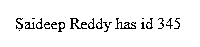
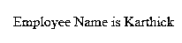
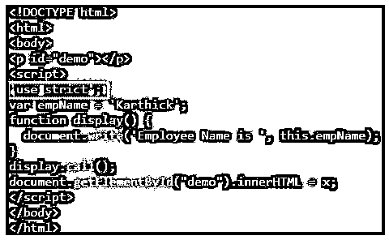

# JavaScript 调用函数

> 原文：<https://www.educba.com/javascript-call-function/>


## JavaScript 调用函数概述

在 JavaScript 中调用函数类似于其他编程语言，比如通过名称调用函数/方法，并传递用括号括起来的参数。这个 JavaScript 函数 call()方法是预定义的，用于为不同的对象编写方法，并用于调用包含该值和单独提供的参数的函数。Call()为该函数提供了一个新值。

**语法:**

<small>网页开发、编程语言、软件测试&其他</small>

```
function.call(thisArg, arg1, arg2,…..argn);
```

*   参数 thisArg 是可选的，指的是为调用函数而给定的值，在某些情况下，thisArg 可能不是方法看到的实际值。
*   arg1，arg2，…是函数的参数。
*   该方法返回所调用函数的结果以及该值和参数。
*   通过 call()，一个对象可以使用属于另一个对象的另一个方法，通过 call(0，一个函数可以编写一次，然后在另一个对象中继承，无需重写。
*   call()函数有点类似于 apply()方法，不同之处在于参数，call()方法接受参数列表，而 apply()接受单个参数数组。

### JavaScript 调用函数的例子

下面给出了 JavaScript 调用函数的例子:

#### 示例# 1

**代码:**

```
<!DOCTYPE html>
<html>
<body>
<script>
function Emp(empid,empname) {
this.empid = empid;
this.empname = empname;
}
function Employee(empid,empname) {
Emp.call(this,empid,empname);
}
document.write(new Employee(123,"Karthick Reddy").empname);
</script>
</body>
</html>
```

**输出:**


Employee 函数使用 call()方法调用另一个函数 Emp，其中传递了这个关键字和参数。

#### 实施例 2

**代码:**

```
<!DOCTYPE html>
<html>
<body>
<p id="multiply"></p>
<script>
function multiFunction(x, y) {
return x * y;
}
var multiple = multiFunction.call(multiple, 27, 2);
document.getElementById("multiply").innerHTML = multiple;
</script>
</body>
</html>
```

**输出:**


#### 实施例 3

**代码:**

```
<!DOCTYPE html>
<html>
<body>
<p id="demo"></p>
<script>
var employee = {
details: function() {
return this.firstName + " " + this.lastName + " has id " + this.id;
}
}
var employee1 = {
firstName:"Karthick",
lastName: "Reddy",
id: "234"
}
var employee2 = {
firstName:"Saideep",
lastName: "Reddy",
id: "345"
}
var x = employee.details.call(employee2);
document.getElementById("demo").innerHTML = x;
</script>
</body>
</html>
```

**输出:**




#### 实施例 4

让我们看看带有参数的 call()方法。

**代码:**

```
<!DOCTYPE html>
<html>
<body>
<p id="sample"></p>
<script>
var employee = {
details: function(city, country) {
return this.firstName + " " + this.lastName + " lives in " + city;
}
}
var employee1 = {
firstName:"Karthick",
lastName: "Reddy"
}
var employee2 = {
firstName:"Saideep",
lastName: "Reddy"
}
var x = employee.details.call(employee2, "Alberta");
document.getElementById("sample").innerHTML = x;
</script>
</body>
</html>
```

**输出:**


#### 实施例 5

让我们看看如何使用 call()方法调用匿名函数。

在这里，我们将创建一个匿名函数并使用 call()来调用，这有助于向每个对象添加一个 print()函数，帮助打印数组中元素的索引。

**代码:**

```
<!DOCTYPE html>
<html>
<body>
<p id="demo"></p>
<script>
const employees = [
{ domain: 'Retail', name: 'Karthick' },
{ domain: 'Banking', name: 'Saideep' }
];
for (let i = 0; i < employees.length; i++) {
(function(i) {
this.print = function() {
document.write(i + ' ' + this.domain
+ ' lead is ' + this.name + '</br>');
}
this.print();
}).call(employees[i], i);
}
document.getElementById("demo").innerHTML = x;
</script>
</body>
</html>
```

**输出:**


#### 实施例 6

让我们看看如何在不指定第一个参数的情况下使用 call()方法调用函数。

如果用户没有将第一个参数传递给 call()函数，那么这些变量的值将更改为全局对象，然后显示该值。

**代码:**

```
<!DOCTYPE html>
<html>
<body>
<p id="demo"></p>
<script>
var empName = 'Karthick';
function display() {
document.write('Employee Name is ', this.empName);
}
display.call();
document.getElementById("demo").innerHTML = x;
</script>
</body>
</html>
```

**输出:**




#### 实施例 7

通过使用“严格模式”

**语法:**

```
 'use strict';
```

在严格模式下，这个值不能被认为是一个全局对象，它的值将是未定义的，即不能读取值。

**代码:**

```
<!DOCTYPE html>
<html>
<body>
<p id="demo"></p>
<script>
'use strict';
var empName = 'Karthick';
function display() {
document.write('Employee Name is ', this.empName);
}
display.call();
document.getElementById("demo").innerHTML = x;
</script>
</body>
</html>
```

**输出:**




.call()函数将此中存在的值强制应用于。应用 call()

#### 实施例 8

**代码:**

```
<!DOCTYPE html>
<html>
<body>
<p id="sample"></p>
<script>
var sayHello = function(){
document.write('Hello, ' + this.firstName);
};
var sayGoodbye = function(){
document.write('Goodbye, ' + this.firstName);
};
var employee1 = {
firstName:"Karthick",
lastName: "Reddy",
age: '24'
}
var employee2 = {
firstName:"Saideep",
lastName: "Reddy",
age: '23'
}
document.write('with call() method');
document.write('</br>');
sayHello.call(employee1);
document.write('</br>');
sayGoodbye.call(employee2);
document.write('</br></br>');
document.write('with apply() method');
document.write('</br>');
sayHello.apply(employee1);
document.write('</br>');
sayGoodbye.apply(employee2);
</script>
</body>
</html>
```

**输出:**


call()和 apply()方法都在 employee1 和 employee2 的范围内运行 sayHello()和 sayGoodbye()，并且都做同样的事情。这些函数只能在其他函数上调用，只有当用户希望用一组参数来填充这个调用时，差别才会出现。Call()方法仅限于简单的方法调用，但是当用户想要编写函数所需的参数数量未知的代码时，就会出现 apply()方法。

Call()逐个接受参数，而 apply()以数组的形式接受参数。此外，通过 call()方法，将此作为第一个参数传递，用户还可以传递附加值，每个附加值都是 call()方法的一个附加参数。

### 结论

我们已经知道如何在 javascript 中调用一个函数，call()方法到底是什么，它对降低用户代码质量有什么作用。每当我们使用函数时，都应该注意“this”这个关键词。我们能够比较 call()和 apply()方法之间的差异，并提供一些匿名调用函数、带参数的 call()方法、不带第一个参数的 call()以及“use strict”语句的实例。

### 推荐文章

这是一个 JavaScript 调用函数的指南。这里我们讨论 JavaScript 调用函数的概述和例子以及代码实现。您也可以看看以下文章，了解更多信息–

1.  [Javascript 嵌套函数](https://www.educba.com/javascript-nested-functions/)
2.  [Javascript 设计模式](https://www.educba.com/javascript-design-patterns/)
3.  [JavaScript 中的队列](https://www.educba.com/queue-in-javascript/)
4.  [JavaScript 函数声明](https://www.educba.com/javascript-function-declaration/)


