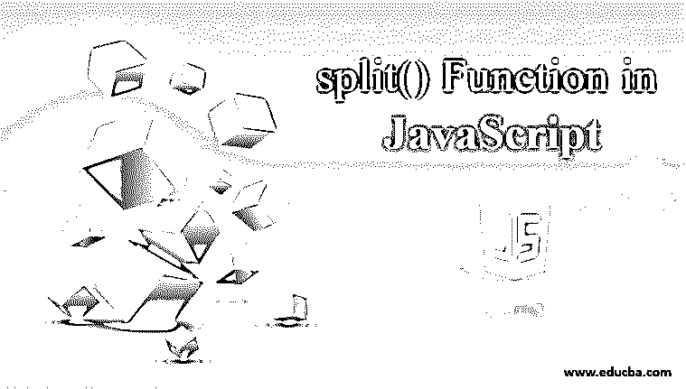
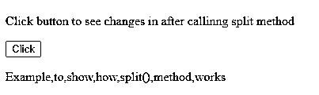
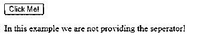
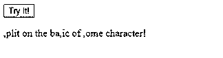
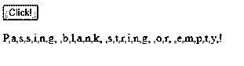
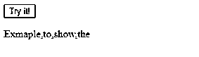
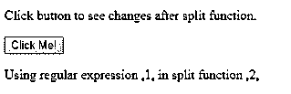

# JavaScript 中的 split()函数

> 原文：<https://www.educba.com/split-function-in-javascript/>




## JavaScript 中 split()函数介绍

JavaScript 为我们提供了许多字符串方法来根据我们的要求修改我们当前的字符串，split()方法就是其中之一。JavaScript 中的 Split 函数用于拆分字符串。所以它把字符串分割成子字符串的数组，分割后，它会给我们 newel 格式的数组。换句话说，我们可以说 split 函数用于拆分字符串，并且我们必须将分隔符传递给参数。在 JavaScript 中使用 split 方法时，我们有一些注意事项和提示，即如果我们使用 split 方法来修改某个字符串值，那么它不会改变原始字符串，它将始终为我们提供新形成的数组或子字符串，如果我们没有在 split 方法参数中传递任何内容，那么字符串将在它们的每个字符之间被拆分。

**语法:**

<small>网页开发、编程语言、软件测试&其他</small>

```
strOne.split(separator, limit);
```

上面你可以看到 split()方法的语法，它基本上有两个参数，即分隔符和限制，下面我们来逐一讨论:

### split()函数的参数

下面是 split()函数的参数:

*   **分隔符:**此参数用作字符串分隔符。它将指向我们需要拆分字符串的位置。它可以接受正则表达式和普通字符串。如果我们不指定分隔符，那么整个字符串将被视为单个数组元素。如果我们将一个空字符串作为值传递给分隔符，那么整个字符串将根据每个字符进行分隔。这是可选的。
*   **Limit:** 该参数用于定义一次拆分的次数。这是可选的。如果我们达到此限制，而字符串仍未被选中，则不会向数组报告此情况。

这个 split()方法将返回包含拆分值的数组作为数组元素。它使用 JavaScript ECMAScript 1 版本。

**代码:**

```
<!DOCTYPE html>
<html>
<body>
<p>Click button to see changes in after calling split method</p>
<button onclick="myFunction1()">Click</button>
<p id="demo"></p>
<script>
function myFunction1() {
var str = "Example to show how split() method works";
var res = str.split(" ");
document.getElementById("demo").innerHTML = res;
}
</script>
</body>
</html>
```

**输出:**




在上面的例子中，我们只是将分隔符作为空字符串或空白进行传递，所以在这种情况下，需要在每个字符后拆分字符串。在输出中，我们有一个由逗号分隔的元素数组。这是一个适合初学者的简单例子。

### split()函数在 JavaScript 中是如何工作的？

Javascript 中的 split()函数有两个参数，一个是分隔符，另一个是 limit，这两个参数都是可选的。当我们给分隔符赋值时，无论我们给它赋值什么，它都会首先在字符串中进行搜索，并在找到匹配的参数时分割字符串。我们也可以将正则表达式传递给它。现在讨论另一个参数，我们有 limit，它将决定我们希望字符串被切分的次数。它将决定字符串的迭代次数。所以 separator 取一个字符串，我们要从这个点开始拆分我们的原始字符串，这个参数是一个选项。如果我们在字符串中找不到分隔符，它将返回单个元素。

#### 示例#1

当我们不提供分隔符或将其作为空白传递时。

**HTML 代码:**

```
<!DOCTYPE html>
<html>
<head>
<script type="text/javascript" src="scripts.js">
</script>
<link rel="stylesheet" href="styles.css">
</head>
<body>
<button onclick="learnFunctionSeperotor()">
Click Me!
</button>
<p id="learn1"></p>
</body>
</html>
```

**JavaScript 代码:**

```
function learnFunctionSeperotor() {
var string = "In this example we are not providing the seperator!";
var result = string.split();
document.getElementById("learn1").innerHTML = result;
}
```

**输出:**




#### 实施例 2

在某个角色上分裂。意味着我们在某个字符上指定了 split basic，所以它将在字符串中搜索，并在找到它时将其拆分。

**HTML 代码:**

```
<!DOCTYPE html>
<html>
<head>
<script type="text/javascript" src="scripts.js">
</script>
<link rel="stylesheet" href="styles.css">
</head>
<body>
<button onclick="learnFunctionSplit()">
Try it!
</button>
<p id="learn1"></p>
</body>
</html>
```

**JavaScript 代码:**

```
function learnFunctionSplit() {
var string = "split on the basic of some character!";
var result = string.split("s");
document.getElementById("learn1").innerHTML = result;
}
```

**输出:**




#### 实施例 3

将分隔符作为" "字符串传递，或者我们可以说我们将它作为空字符串传递。所以 Javascript 中的 split 函数在每个字符后执行。

**HTML 代码:**

```
<!DOCTYPE html>
<html>
<head>
<script type="text/javascript" src="scripts.js"></script>
<link rel="stylesheet" href="styles.css">
</head>
<body>
<button onclick="learnFunctionsplit()">
Click!
</button>
<p id="learn1"></p>
</body>
</html>
```

**JavaScript 代码:**

```
function learnFunctionsplit() {
var string = "Passing blank string or empty!";
var result = string.split("");
document.getElementById("learn1").innerHTML = result;
}
```

**输出:**




#### 实施例 4

现在，我们尝试通过传递 limit 参数来限制拆分计数。它还会修复计数和元素编号。

**HTML 代码:**

```
<!DOCTYPE html>
<html>
<head>
<script type="text/javascript" src="scripts.js"></script>
<link rel="stylesheet" href="styles.css">
</head>
<body>
<button onclick="learnFunctionsplit()">
Try it!
</button>
<p id="learn1"></p>
</body>
</html>
```

**JavaScript 代码:**

```
function learnFunctionsplit() {
var string = "Exmaple to show the limit item!";
var res = string.split(" ", 4);
document.getElementById("learn1").innerHTML = res;
}
```

**输出:**




#### 实施例 5

当我们想要反转字符串时，也会用到它。但是我们使用了 JavaScript 的另外两个函数，它们是 reverse()和 join()。

**代码:**

```
<!DOCTYPE html>
<html>
<body>
<p>Click button to see changes after split function.</p>
<button onclick="myFunction1()">Click Me!</button>
<p id="demo"></p>
<script>
function myFunction1() {
var str = "split function to show how to reverse!";
var res = str.split("").reverse().join("");
document.getElementById("demo").innerHTML = res;
}
</script>
</body>
</html>
```

**输出:**


#### 实施例 6

在 HTML 和 JavaScript 代码中使用正则表达式:

**代码:**

```
<!DOCTYPE html>
<html>
<body>
<p>Click button to see changes after split function.</p>
<button onclick="myFunction1()">Click Me!</button>
<p id="demo"></p>
<script>
function myFunction1() {
var str = "Using regular expression 1 in split function 2";
var res = str.split(/(\d)/);
document.getElementById("demo").innerHTML = res;
}
</script>
</body>
</html>
```

**输出:**




### 结论

因此，我们可以使用各种符号和正则表达式对字符串执行 split，但要确保它所采用的两个参数都是可选的。所以我们需要根据需要来使用它们。请记住，它将始终作为新数组返回，而不改变原始字符串的值。

### 推荐文章

这是 JavaScript 中 split()函数的使用指南。这里我们讨论基本概念，split()函数如何在 JavaScript 中工作，以及它的例子和代码实现。您也可以浏览我们推荐的其他文章，了解更多信息——

1.  [JavaScript 字符串格式](https://www.educba.com/javascript-string-format/)
2.  [Javascript 匿名函数](https://www.educba.com/javascript-anonymous-function/)
3.  [Javascript 嵌套函数](https://www.educba.com/javascript-nested-functions/)
4.  [JavaScript 日期函数](https://www.educba.com/javascript-date-function/)


