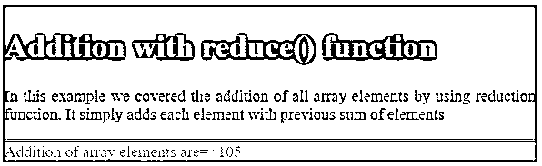
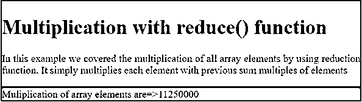
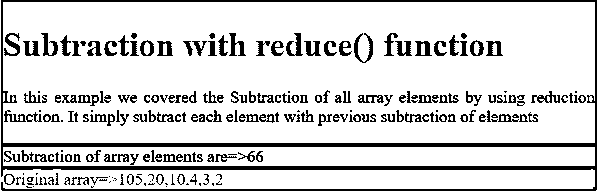

# reduce()函数 JavaScript

> 原文：<https://www.educba.com/reduce-function-javascript/>


## reduce()函数 JavaScript 简介

reduce()函数将数组值缩减为单个值。reduce()函数从不修改原始数组。reduce()函数从左到右操作数组值。reduce()函数的结果将存储在一个名为 accumulator 的变量中。如果假设数组不能包含任何值，那么 reduce()函数将不会被执行。

**实时应用:**当我们需要对数组值依次进行加、减、乘等常量运算时。然后使用 reduce()函数。

<small>网页开发、编程语言、软件测试&其他</small>

### JavaScript 中的 reduce()函数是如何工作的？

reduce()函数将数组值作为参数，并通过顺序访问数组元素来执行归约操作。仔细观察下面的语法

**语法:**

```
var arrayElements=[];
arrayElements.reduce( functionName(total, presentValue, presentIndex, actualArray), intialArrayValue);
```

**说明:** functionName(total，presentValue，presentIndex，actualArrayObject)

该函数包含 4 个参数，解释如下

*   **total:** 用于初始化值或用于指定[函数前一次返回值](https://www.educba.com/python-return-value/)。
*   **presentValue** :用于指定数组的当前值。
*   **presentIndex:** 用于指定数组的当前索引。
*   **actualArrayObject:** 用于传递数组对象。这是一个可选参数。
*   **initialArrayValue:** 用于将任何用户定义的初始值传递给函数。这是一个可选参数。

### JavaScript 逻辑

JavaScript 逻辑可以写在一个单独的文件中，我们可以将它包含在一个 HTML 页面中，也可以直接写在 HTML 页面中。

```
reduce() function working principle:
var array=[1,2,3,4];
arrayElements.reduce(getSum(total,array)
{
return total+array;
});
```

正如我们所讨论的，reduce 函数从左到右执行操作:

**1。最初总计=0**

*   array=1 来自数组元素
*   0+1=1;

**2。现在总计=1**

*   Array 下一个元素 array=2
*   1+2=3;

**3。现在总计=3**

*   数组下一个元素数组=3
*   3+3=6;

**4。现在最后总数=6**

*   数组下一个元素数组=4
*   6+4=10;

同上，它按照 reduce 函数定义的逻辑执行。

### 如何包含外部 JavaScript(。js)文件放在 HTML 页面里面？

我们可以包括外部的。js 文件中的 标签使用下面的语法。

**语法:**

```
<head>
<script type="text/javascript" src="path to javascript-file.js"></script>
</head>
```

### 如何包含或编写 JavaScript(。HTML 页面内部的逻辑？

我们可以使用下面的语法写在 标签内或者 内。

**语法:**

```
<head>
<script type="text/javascript">
//JavaScript Code
</script>
</head>
```

运筹学

```
<body>
<script type="text/javascript">
//JavaScript Code
</script>
</body>
```

### 实现 reduce()函数的示例 JavaScript

以下是要实施的示例:

#### 示例# 1–添加

**代码:**

```
<!DOCTYPE html>
<html>
<head>
<meta charset="ISO-8859-1">
<title>Reduce function</title>
<!-- JavaScript Logic within the HTML head tag -->
<script>
/* defining array elements */
var arrayElements = [ 5, 10, 15, 20, 25, 30 ];
//logic for addition of all numbers
function getAddition(total, number) {
return total + number;
}
</script>
<!-- CSS styles -->
<style type="text/css">
.addClass {
background: brown;
font-size: 20px;
border: 2px solid green;
text-align: justify;
}
h1 {
color: orange;
align-content: center;
}
body {
background: orange;
}
.sum {
background: green;
font-size: 20px;
border: 2px solid blue;
text-align: justify;
}
</style>
</head>
<body>
<div class="addClass">
<h1 class="h1">Addition with reduce() function</h1>
<p>In this example we covered the addition of all array elements
by using reduction function. It simply adds each element with
previous sum of elements</p>
</div>
<div class="sum">
<script>
/* calling getAddition function from reduce function and displaying sum*/
document.write("Addition of array elements are=>"
+ arrayElements.reduce(getAddition));
</script>
</div>
</body>
</html>
```

**输出:**




#### 示例# 2–使用乘法

**代码:**

```
<!DOCTYPE html>
<html>
<head>
<meta charset="ISO-8859-1">
<title>Reduce function</title>
<!-- CSS styles -->
<style type="text/css">
.content {
background: aqua;
font-size: 20px;
border: 2px solid red;
text-align: justify;
}
h1 {
color: green;
align-content: center;
}
.main {
background: lime;
font-size: 20px;
border: 2px solid red;
text-align: justify;
}
</style>
</head>
<body>
<div class="content">
<h1 class="h1">Multiplication with reduce() function</h1>
<p>In this example we covered the multiplication of all array
elements by using reduction function. It simply multiplies each
element with previous sum multiples of elements</p>
</div>
<div class="main">
<!-- including JavaScript file within body tag -->
<script type="text/javascript">
//JavaScript Logic
/* defining array elements */
var arrayElements = [ 5, 10, 15, 20, 25, 30 ];
// logic for multiplication of all numbers
function getMuliplication(total, number) {
return total*number;
}
/* calling getMltiplication function from reduce function and displaying sum */
document.write("Muliplication of array elements are=>"
+ arrayElements.reduce(getMuliplication));
</script>
</div>
</body>
</html>
```

**输出:**




#### 示例# 3–带除法

**代码:**

```
<!DOCTYPE html>
<html>
<head>
<meta charset="ISO-8859-1">
<title>Reduce function</title>
<!-- CSS styles -->
<style type="text/css">
.content {
background: lime;
font-size: 20px;
border: 2px solid blue;
text-align: justify;
}
h1 {
color: black;
align-content: center;
}
.main {
background: red;
font-size: 20px;
border: 2px solid blue;
text-align: justify;
}
</style>
</head>
<body>
<div class="content">
<h1 class="h1">Division with reduce() function</h1>
<p>In this example we covered the division of all array elements
by using reduction function. It simply divides each element with
previous division of elements</p>
</div>
<div class="main">
<!-- including JavaScript file within body tag -->
<script type="text/javascript">
//JavaScript Logic
/* defining array elements */
var arrayElements = [ 5000000000, 100000, 10000, 100, 10, 5 ];
// logic for division of all numbers
function getDivision(total, number) {
return total / number;
}
/* calling getDivision function from reduce function and displaying sum */
document.write("Division of array elements are=>"
+ arrayElements.reduce(getDivision));
</script>
</div>
</body>
</html>
```

**输出:**


#### 示例# 4–使用减法

**代码:**

```
<!DOCTYPE html>
<html>
<head>
<meta charset="ISO-8859-1">
<title>Reduce function</title>
<!-- including JavaScript file within body tag -->
<script type="text/javascript">
//JavaScript Logic
/* defining array elements */
var arrayElements = [ 105, 20, 10, 4, 3, 2 ];
// logic for subtraction of all numbers
function getSubtraction(total, number) {
return total - number;
}
</script>
<!-- CSS styles -->
<style type="text/css">
.content {
background: lightblue;
font-size: 20px;
border: 2px solid red;
text-align: justify;
}
h1 {
color: black;
align-content: center;
}
.main {
background: lime;
font-size: 20px;
border: 2px solid red;
text-align: justify;
}
.orginal {
background: olive;
font-size: 20px;
border: 2px solid red;
text-align: justify;
}
</style>
</head>
<body>
<div class="content">
<h1 class="h1">Subtraction with reduce() function</h1>
<p>In this example we covered the Subtraction of all array
elements by using reduction function. It simply subtract each element
with previous subtraction of elements</p>
</div>
<div class="main">
<script>
/* calling getSubtraction function from reduce function and displaying sum */
document.write("Subtraction of array elements are=>"
+ arrayElements.reduce(getSubtraction));
</script>
</div>
<div class="orginal">
<script>
document.write("Original array=>"+arrayElements);
</script>
</div>
</body>
</html>
```

**输出:**




**解释:**从输出可以看出 reduce()函数不能修改实际数组。我们可以在上面的输出中看到它。

### 结论

reduce()函数，用于通过对数组执行任何操作，将数组缩减为单个值。Reduce 函数不能改变原来的数组元素。

### 推荐文章

这是一个 reduce()函数 JavaScript 的指南。在这里，我们讨论语法 JavaScript 逻辑，包括，排除与例子，以实现适当的代码和例子。您也可以浏览我们的其他相关文章，了解更多信息——

1.  [JavaScript 中的 pop()](https://www.educba.com/pop-in-javascript/)
2.  [JavaScript indexOf()](https://www.educba.com/javascript-indexof/)
3.  [isNaN() JavaScript](https://www.educba.com/isnan-javascript/)
4.  [Javascript 原型](https://www.educba.com/javascript-prototype/)


