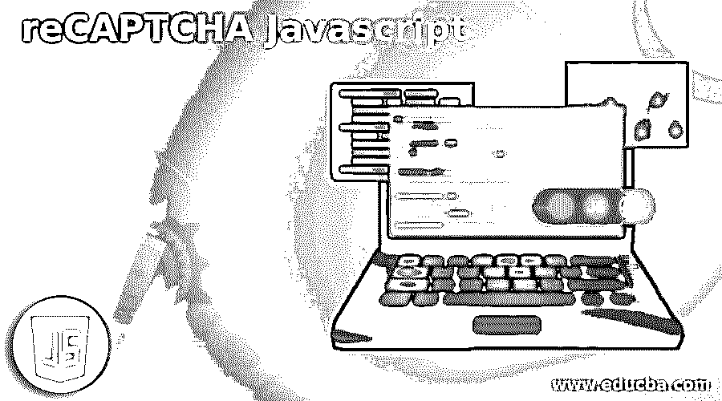
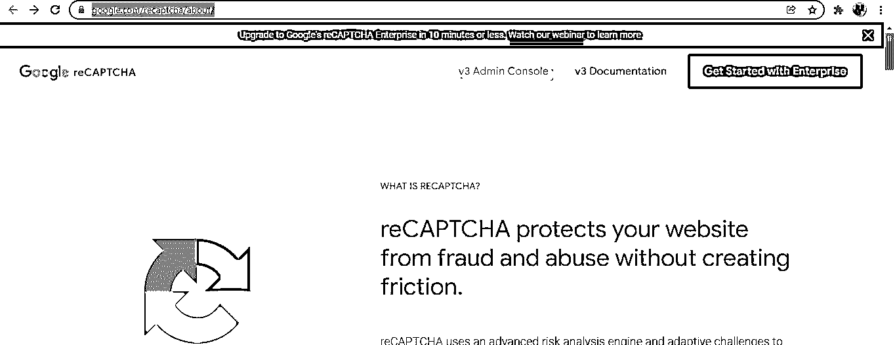
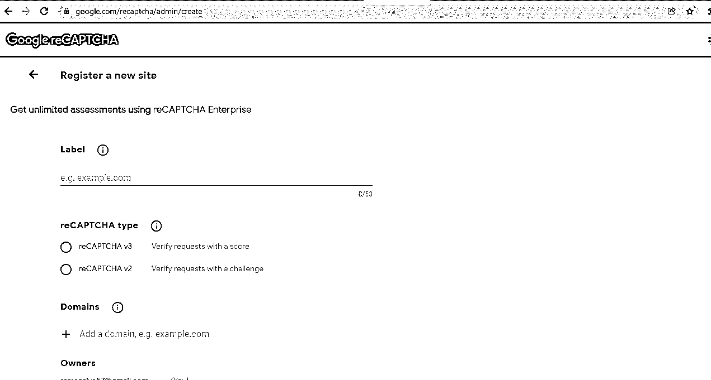
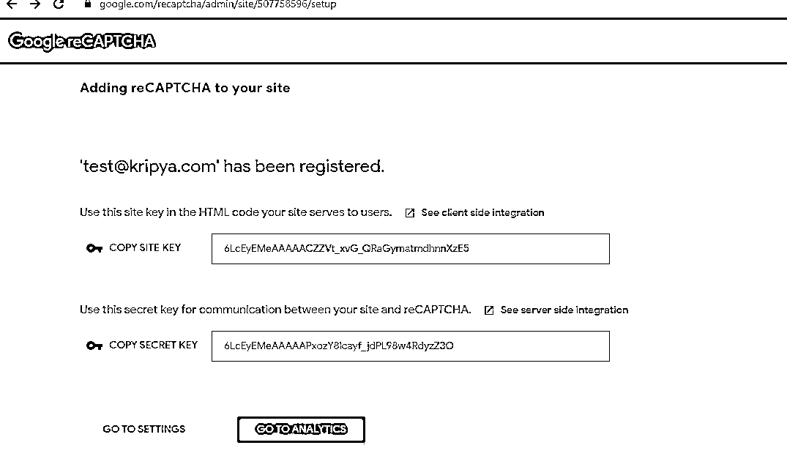
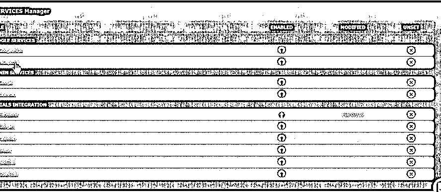
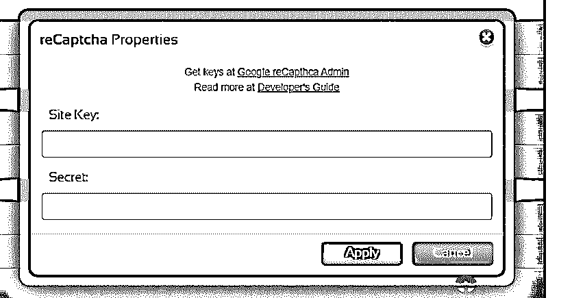
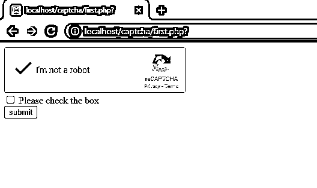
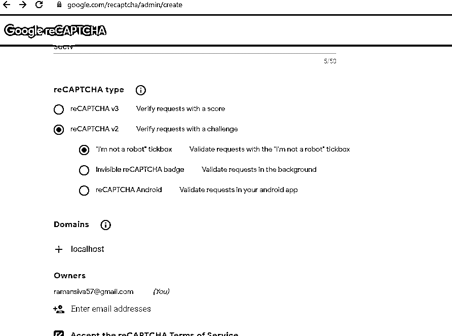
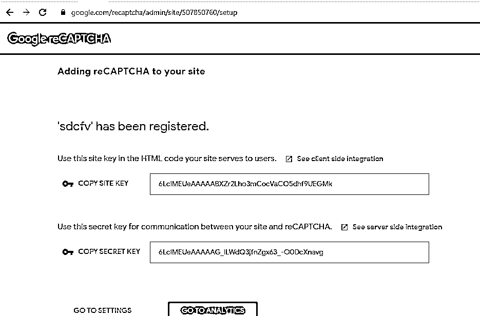

# reCAPTCHA Javascript

> 原文：<https://www.educba.com/recaptcha-javascript/>




## reCAPTCHA Javascript 简介

下面的文章提供了 reCAPTCHA Javascript 的概要。谷歌的 reCAPTCHA 是一个优秀的机器人识别工具，它来自谷歌对用户交互模式的分析，这些模式决定了用户是机器人还是实时人；这将很难模拟识别这些模式，并且在大多数情况下，验证码是成功阻止垃圾邮件的，如果验证码失败，指定的域将会抛出错误。

### 什么是 reCAPTCHA javascript？

reCAPTCHA 是从临时服务器或本地主机加载网页的一种类型，它将只坚持满足抛出错误的条件的指定域。验证码设置网页将暂时阻止域验证用户数据。否则，我们可以使用图标按下设置，并从用户登录更新它。对于 javascript 版本，我们在版本 3 中使用了 reCAPTCHA。API 将返回一个数据分数，指示 Google 是否接受该机器人，因此用户交互可能需要满足条件。reCAPTCHA 第 2 版有单独的 javascript jQuery 库，如果应用程序使用其他语言，如 html 等，它将接受用户验证。

<small>网页开发、编程语言、软件测试&其他</small>

### 如何使用 reCAPTCHA javascript？

一般来说，我们可以在 Morweb 网站上设置 reCAPTCHA，这是一件简单的事情，可以通过以下步骤来访问。

首先，我们可以为网站设置带有密钥对的 API，这可以防止恶意软件或病毒软件参与网站上的一些滥用行为。当 reCAPTCHA 采用一个先进的风险分析引擎，它适应的挑战，可以用在合法用户将能够登录到页面，它可以购买某些网页，并建立帐户，同时，伪造的用户将被禁止在一些限制。我们可以为第一步过程设置 API 密钥对，

https://www.google.com/reCAPTCHA/about/

转到我们选择的第一个网站管理控制台，




我们得到了如下的页面，




我们输入了新网站和应用程序网页注册所需的详细信息。我们可以在所需的文本框中输入网站 URL 然后，我们选择 reCAPTCHA 类型，如 v2 和 v3，用于具有挑战特定分数的必需验证请求。在 Domains 部分的帮助下，我们可以根据需求添加新的域；Owners 部分将根据依赖关系添加用户的电子邮件。最后，我们可以接受 reCAPTCHA 条款和条件；如果我们需要针对特定所有者的警报，我们可以选中所需选项的复选框。因此，我们可以获得




然后，我们可以通过使用服务选项转到应用程序的 Morweb 站点后端；我们可以输入 reCAPTCHA 选项，




请从 Google reCAPTCHA 中复制上述站点密钥和秘密密钥，并将其粘贴到 Morweb 字段中。




一旦我们输入站点密钥，它将验证密钥，并在控制台屏幕上显示它是否会验证成功验证的用户数据。

### reCAPTCHA javascript 代码示例

谷歌 reCAPTCHA 是最受欢迎的解决方案之一，用于防止垃圾邮件和机器人在基于网络的应用程序上填写表格。当我们进入 reCAPTCHA 时，系统要求用户解决对人类来说更简单的简单谜语。它将处理阻止机器人完成验证的困难。如果表单在用户端完成 reCAPTCHA 质询之前不应提交，则它将进入前端本身或后端的验证；这取决于要求。

**举例:**

```
<html>
<head>
<title>
Welcome To My Domain
<script src="https://code.jquery.com/jquery-2.2.4.min.js"></script>
<script src='https://www.google.com/reCAPTCHA/api.js' async defer></script>
</title>
</head>
<body>
<form action="?" method="POST">
<div class="form-group">
<div class="g-reCAPTCHA" data-sitekey="6LfONEUeAAAAALq-9_eXbJictuiilrMbaux6T4Fv">
</div>
</div>
<div class="form-group">
<div class="checkbox">
<label><input type="checkbox" id="check_rules" name="check_rules" required />
Please check the box
</label>
</div>
</div>
<div class="form-group">
<input type="submit" id="submit" name="submit" value="submit" class="btn-btn-success"/>
</div>
</form>
</body>
</html>
<script>
$(document).on('click','#submit,function()
{
var response =  greCAPTCHA.getResponse();
alert(response);
});
</script>
```

**样本输出:**




在上面的例子中，我们使用 Apache 服务器来托管网页，如 php、javascript、html 代码。这里我使用了 html 元素，如复选框、标签、文本框等。html 元素的默认类，如 btn-btn-success、g-reCAPTCHA 和 form-group，用于与表单相关的 html 元素。每个类都有标签元素和属性，用于使用复杂的 ui 执行客户端操作。此外，我们使用 jQuery 和 reCAPTCHA APIs(如 js CDN)来执行 web 操作。g-reCAPTCHA 是网页中启用的验证码特征的默认类别之一；数据站点密钥属性将用于站点密钥，这些密钥已经由用户使用 Google reCAPTCHA 或其他 CAPTCHA 网站创建。我使用 localhost 作为域名来创建 captcha 站点密钥。







### Google reCAPTCHA javascript

最后，它通过防止将垃圾记录插入数据库来节省服务器空间。并且它还通过防止从未被发送到收件箱或由用户维护的一些其他文件夹的垃圾评论来节省时间。因此，在单独的时间间隔内将不再有清理电子邮件收件箱的时间。当我们在网站表单中使用 Google reCAPTCHA 时，更有必要构建一个代码并验证 reCAPTCHA 响应。如果用户输入有效，则只有表单会继续。

### 结论

reCAPTCHA 是其中一个重要的特性，现在，它更适用于验证用户输入的数据。在谷歌分析交互模式工具的帮助下识别机器人，以确定用户是人还是机器，这是非常棒的。

### 推荐文章

这是一个关于 reCAPTCHA Javascript 的指南。这里我们讨论如何使用 reCAPTCHA javascript 以及示例和输出。您也可以阅读以下文章，了解更多信息——

1.  [JavaScript nan](https://www.educba.com/javascript-nan/)
2.  [JavaScript 转储对象](https://www.educba.com/javascript-dump-object/)
3.  [JavaScript 幻灯片演示](https://www.educba.com/slideshow-in-javascript/)
4.  [JavaScript 格式化程序](https://www.educba.com/javascript-formatter/)


