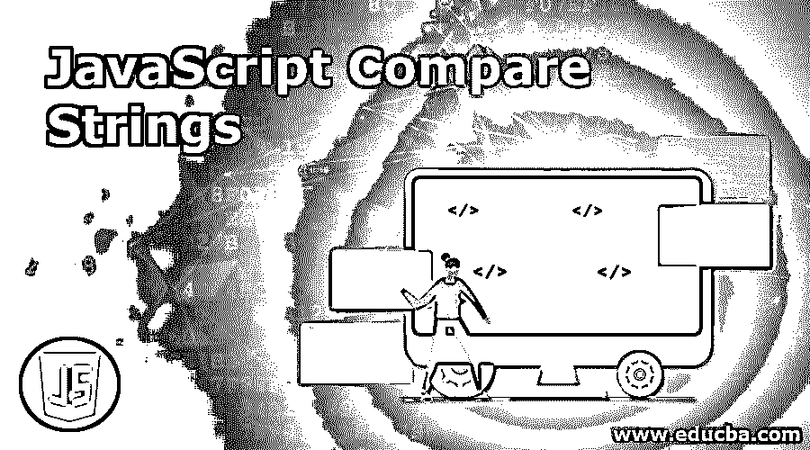
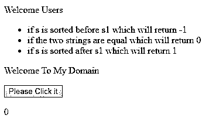
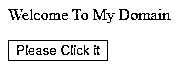
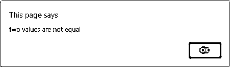
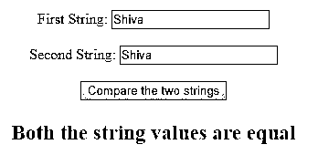

# JavaScript 比较字符串

> 原文：<https://www.educba.com/javascript-compare-strings/>




## JavaScript 比较字符串简介

Javascript 有默认的预定义方法来访问客户端的 web 用户数据，以执行一些操作，无论用户需要什么，无论用户不需要移动到客户端本身的后端技术中，他们的需求都会得到满足。因此，在脚本语言中，如果所使用的功能为 0，则使用一个名为 localeCompare()函数的预定义方法来比较两个字符串。如果两边的字符串值相等，则使用该方法。否则，如果该值为-1，则表示第一个字符串值在第二个字符串值之前排序，否则，该值应为 1。第二个值的排序顺序为在第一个字符串值之前。

**语法:**

<small>网页开发、编程语言、软件测试&其他</small>

我们使用 localeCompare()方法来比较 JavaScript 中的两组字符串值。它有一些用于客户端代码的基本格式。

```
<html>
<head>
<script>
function name()
{
----some javascript logic codes---
var s="";
var s1="";
var result=s.localeCompare(s1);
--some script codes---
}
</script>
</head>
<body>
</body>
</html>
```

以上代码是字符串比较方法的基本语法，如网页 HTML 中使用的 localeCompare()与脚本编程逻辑相结合。我们也可以在没有函数的情况下使用函数，但是我们需要

### JavaScript 如何比较字符串？

在 javascript 编程代码中，我们在开发网页的客户端脚本中使用了 n 种内置方法。javascript 有严格的和类型转换的比较， 我们在 javascript 中也使用了严格比较，严格比较是 javascript 的关键字，即===是用于比较两个操作数的运算符，这两个操作数是相同的数据类型，并且数据的内容(如字符串值)也是相同的匹配场景大多数情况下，我们使用==运算符在代码中比较两个值，该运算符也与前面的运算符相同，它与两个操作数的比较是在进行数据比较之前将类似的操作数转换为相同的数据类型。 它还与一些关系抽象进行比较抽象关键字也用于 javascript 中的比较技术，如< =符号或运算符也用于比较两个操作数首先将操作数转换为原始数据类型，然后将它们进行比较。

一般来说，字符串使用一些 Unicode 值，相对来说是按照标准的字典顺序排列的。当两个字符串具有长度相同的字符序列和相应位置相同的字符时，必须严格遵循相同的操作条件。下一个条件是两个数严格相等，有相同数目的值，我们使用 NaN，在某些情况下，对于字符串操作数，NaN 后面必须跟正负 0，它们必须彼此相等，如果有时字符串值与两个操作数进行比较，直到它们不必被认为是相同的类型，那么我们将在操作数中应用严格的比较。如果两个操作数都在对象中，那么 javascript 已经与内部引用进行了比较，当操作数引用内存位置中的相同实例时，内部引用是相等的。

如果两个操作数不相等，则条件为不相等运算符与操作数不一定是同一类型 javascript 会尝试将操作数转换为适当的类型，以便对两个操作数进行比较，这两个操作数必须是实例/对象，然后当操作数引用内存位置中的不同对象时，javascript 会与不相等的内部引用进行比较。如果我们总是使用恒等运算符，那么如果假设操作数严格处于相等的条件下，并且没有类型转换，那么它将返回 true。非标识操作符(！==)如果操作数不等于条件且不属于同一类型，则返回 true 条件。标准的等号运算符如==和！=它使用并遵循抽象等式比较算法来比较两个操作数。如果操作数的类型不同，它还会在进行比较之前将其转换为相同的类型。

### JavaScript 比较字符串的示例

下面是在 JavaScript 中比较字符串的不同例子。

#### 示例#1

**代码:**

```
<!DOCTYPE html>
<html>
<body>
<p>Welcome Users</p>
<ul>
<li> if s is sorted before s1 which will return -1</li>
<li>if the two strings are equal which will return 0 </li>
<li>if s is sorted after s1  which will return 1</li>
</ul>
<p>Welcome To My Domain</p>
<button onclick="sample()">Please Click it</button>
<p id="demo"></p>
<script>
function sample() {
var s = "siva";
var s1 = "siva";
var result = s.localeCompare(s1);
document.getElementById("demo").innerHTML = result;
}
</script>
</body>
</html>
```

**样本输出:**




#### 实施例 2

**代码:**

```
<!DOCTYPE html>
<html>
<body>
<p>Welcome To My Domain</p>
<button onclick="sample()">Please Click it</button>
<p id="demo"></p>
<script>
function sample() {
var s = "siva";
var s1 = "raman";
if(s==s1)
{
alert('two values are equal');
}
else
{
alert('two values are not equal');
}
}
</script>
</body>
</html>
```

**样本输出:**




点击按钮后，会出现以下输出。




#### 实施例 3

**代码:**

```
<!DOCTYPE html>
<html>
<body style="text-align:center;"
id="demo">
<h1 style="color:green;">
</h1> First String:
<input type="text"
id="t"
name="tn">
<br>
<br> Second String:
<input type="text"
id="t1"
name="tn1">
<br>
<br>
<button onclick="sample()">
Compare the two strings
</button>
<p id="sample"
style="color:red;
font-size: 23px;
font-weight: bold;">
</p>
<script>
var s = document.getElementById("t");
var s1 = document.getElementById("t1");
var result = document.getElementById("sample");
function sample() {
var x = s.value;
var y = s1.value;
var out = x.localeCompare(y);
var r = "";
if (out == -1) {
r = '"' + x + '" string value comes before "' + y + '"';
} else if (out == 0) {
r = 'Both the string values are equal';
} else {
r = '"' + x + '" string value comes after "' + y + '"';
}
result.innerHTML = r;
}
</script>
</body>
</html>
```

**样本输出:**




### 结论

我们将 var 声明为字符串数据类型的 javascript 必须使用比较与操作符进行比较，并返回一个布尔值，然后与一些条件操作符进行比较。

### 推荐文章

这是一个 JavaScript 比较字符串的指南。在这里，我们讨论 JavaScript 如何比较字符串，以及不同的例子和代码实现。您也可以浏览我们的其他相关文章，了解更多信息——

1.  [JavaScript 中的多态性](https://www.educba.com/polymorphism-in-javascript/)
2.  [JavaScript 解析字符串](https://www.educba.com/javascript-parse-string/)
3.  [JavaScript 字符串格式](https://www.educba.com/javascript-string-format/)
4.  [JavaScript 数组排序](https://www.educba.com/javascript-array-sort/)


