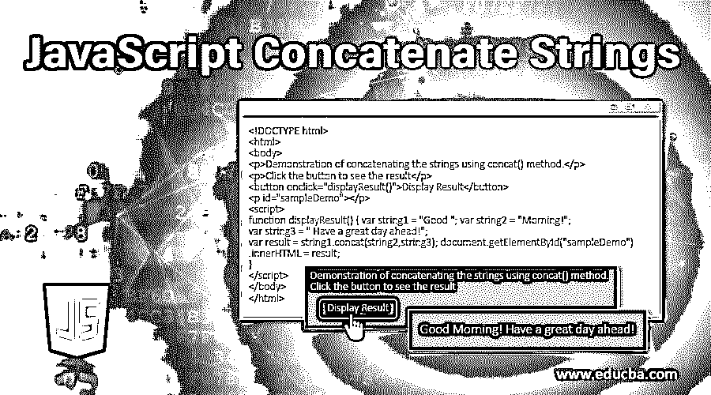
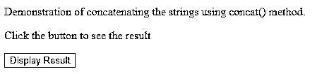
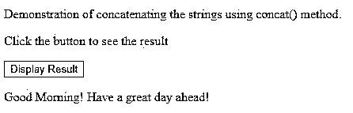
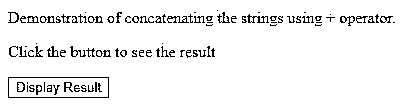
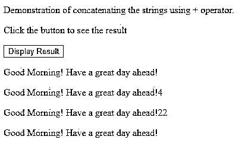
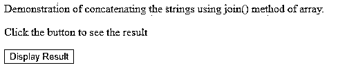
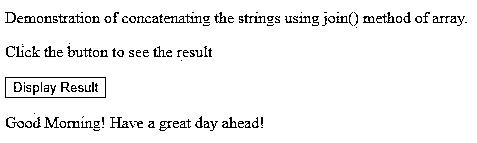

# JavaScript 连接字符串

> 原文：<https://www.educba.com/javascript-concatenate-strings/>




## JavaScript 连接字符串简介

在你学习的任何语言中，了解字符串如何工作以及字符串操作的内部机制是非常重要的。关键任务之一是理解字符串如何相互连接，以得到包含预期格式的组合字符串的结果字符串。许多语言都提供了用于字符串操作的类，比如 java 提供了 [StringBuilder 和 StringBuffer](https://www.educba.com/stringbuffer-vs-stringbuilder/) 类来优化字符串操作的工作负载，以提高内存和时间效率。我们可以通过使用不同的技术在 javascript 中连接字符串。我们将在这里讨论三种技术。第一个是 concat()方法，它是 String.prototype.concat()方法，有助于将不同数量的字符串组合到主字符串中，并在不影响原始字符串的情况下返回新的连接字符串。第二种方法是使用+运算符，第三种方法是将所有字符串参数放入一个数组中，最后使用数组的 join()方法来检索包含所有放入该数组中的连接元素的字符串。

### 字符串连接的语法

下面是使用 concat()方法连接字符串的语法。

<small>网页开发、编程语言、软件测试&其他</small>

```
var concatenatedString = string.concat(string2 [, ...stringN]);
```

****以上语法下面详细解释:****

*   ******字符串:**** 这是您希望其他字符串连接到的主字符串。这是连接所必需的。如果您只有要组合的字符串部分并从中获得单个字符串，您必须首先声明一个空白的字符串变量，此处将使用该变量来调用 concat()方法，然后将字符串部分作为它的**
***   ******string2[，…stringN]:**** 这是所有的可选参数，指定要将哪个字符串附加到主字符串。这里，一个参数是强制的。但是，您可以自由地指定和连接任意数量的字符串，并在 concat()方法中将它们作为参数传递。这里需要注意的是，如果传递的参数不是一个字符串，那么它首先被转换成一个字符串，然后连接到主字符串。*****   ******concatenated string:****这是 concat()方法的返回值，它是新创建的包含预期连接结果的字符串。******

 ****### JavaScript 连接字符串的示例

让我们通过一个例子，使用 string 原型的 concat()方法来理解 javascript 中的串联工作。

#### 示例 1–使用 concat()方法

**代码:**

```
<!DOCTYPE html>
<html>
<body>
<p>Demonstration of concatenating the strings using concat() method.</p>
<p>Click the button to see the result</p>
<button onclick="displayResult()">Display Result</button>
<p id="sampleDemo"></p>
<script>
function displayResult() { var string1 = "Good "; var string2 = "Morning!";
var string3 = " Have a great day ahead!";
var result = string1.concat(string2,string3); document.getElementById("sampleDemo").innerHTML = result;
}
</script>
</body>
</html>
```

****输出:****




单击“显示结果”按钮后，上述代码的输出如下:




正如我们在上面看到的，结果完全是一个返回的新字符串对象，原始字符串(即 string1、string2 和 string3)不受影响。

#### 示例 2–使用+运算符

+运算符在 javascript 中为字符串参数重载，也可用于连接字符串以获得所需的结果。与 concat()类似，如果对象不是字符串格式，这个操作也是从将对象转换为字符串格式开始的。我们将借助一个例子来研究它的用法和实现策略。

**代码:**

```
<!DOCTYPE html>
<html>
<body>
<p>Demonstration of concatenating the strings using + operator.</p>
<p>Click the button to see the result</p>
<button onclick="displayResult()">Display Result</button>
<p id="sampleDemo"></p>
<p id="sampleDemo2"></p>
<p id="sampleDemo3"></p>
<p id="sampleDemo4"></p>
<script>
function displayResult() { var string1 = "Good "; var string2 = "Morning!";
var string3 = " Have a great day ahead!";
var result = string1 + string2 + string3; document.getElementById("sampleDemo").innerHTML = result;
var result3 = string1 + string2 + string3 + 2 * 2 ; document.getElementById("sampleDemo2").innerHTML = result3;
var result4 = string1 + string2 + string3 + 2 + 2 ; document.getElementById("sampleDemo3").innerHTML = result4;
string1 += string2; string1 += string3;
document.getElementById("sampleDemo4").innerHTML = string1;
}
</script>
</body>
</html>
```

****输出:****




单击“显示结果”按钮后，上述代码的输出如下:




从上面的例子中可以看出,+运算符将 2 和 2 视为一个单独的字符串并输出 22，而在*的情况下，它将两个 2 相乘并显示 4。这里要注意的另一点是+=是一个简写赋值操作符，它在这里转换 string1 值。

string1 += string2 代表 string1 = string1 + string2

#### 示例 3–使用数组的 join()方法

在这个方法中，我们首先将所有想要连接的字符串放入一个数组中，最后使用数组的 join()方法组合结果并检索连接的字符串。让我们借助一个例子来理解它的工作原理。

**代码:**

```
<!DOCTYPE html>
<html>
<body>
<p>Demonstration of concatenating the strings using join() method of array.</p>
<p>Click the button to see the result</p>
<button onclick="displayResult()">Display Result</button>
<p id="sampleDemo"></p>
<script>
function displayResult() { var string1 = "Good "; var string2 = "Morning!";
var string3 = " Have a great day ahead!"; var array = [];
array.push(string1); array.push(string2); array.push(string3);
var result = array.join(""); document.getElementById("sampleDemo").innerHTML = result;
}
</script>
</body>
</html>
```

****输出:****




单击“显示结果”按钮后，上述代码的输出如下:




这样，我们可以使用这三种方法中的任何一种来连接 javascript 中的字符串。如果要连接的字符串数量较少，则可以使用它们中的任何一个，因为当字符串数量较少时，它们都具有或多或少相同的时间和空间复杂度。但是，在连接大量字符串时，我们必须小心，应该优先选择+运算符，因为它更高效、更快。

### 推荐文章

这是一个 JavaScript 连接字符串的指南。在这里，我们讨论 javascript concatenate string 的介绍和语法，并给出示例和代码实现。您也可以阅读以下文章，了解更多信息——

1.  [JavaScript 中合并数组的各种方法](https://www.educba.com/javascript-merge-arrays/)
2.  [JavaScript 中的 parseFloat 示例](https://www.educba.com/parsefloat-in-javascript/)
3.  [JavaScript 中最常用的 5 种队列方法](https://www.educba.com/queue-in-javascript/)
4.  [JavaScript 字符串长度](https://www.educba.com/javascript-string-length/)


****