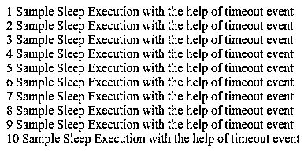
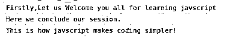
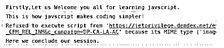

# JavaScript 睡眠

> 原文：<https://www.educba.com/javascript-sleep/>


## Javascript 睡眠简介

许多编程语言都提供了让特定线程休眠或暂停一段时间的功能。它们甚至为某些任务、方法或功能的执行提供这种功能。Javascript 没有提供任何这样的 sleep 方法来延迟执行。但是我们可以在外部编写代码，用 JavaScript 获得这样的功能。JavaScript 的行为是异步的。因此，它承诺处理这种异步行为。根据具体情况，我们可以拒绝和解决要发送的承诺。除此之外，还有 async/await 函数，事实证明它们有助于在 javascript 中实现 sleep 类型的功能。

### 如何用 JavaScript 实现睡眠功能？

为了实现和理解 JavaScript 中的睡眠概念，理解 JavaScript 代码如何执行是非常重要的。因此，我们将首先通过与另一种同步语言的比较来了解 JavaScript 的执行模型。Ruby 就是这样一种同步执行的语言，但是当多线程出现时，ruby 有时会表现得不同步。

<small>网页开发、编程语言、软件测试&其他</small>

**考虑 Ruby 代码:**

```
require 'net/http' require 'json'
sampleUrl = 'https://api.github.com/issues' sampleUri = URI(sampleUrl)
sampleResponse = JSON.parse(Net::HTTP.get(sampleUri)) puts sampleResponse['message']
puts "Hey!Let us have a look on message."
```

**输出:**


其中“Not Found”是存储在上述 github url 的 issues 部分中的消息字符串。

**JavaScript 中的例子**

**代码:**

```
<!DOCTYPE html>
<html>
<body>
<script> fetch('https://api.github.com/issues')
.then(sampleResponse => sampleResponse.json())
.then(sampleJson => console.log(sampleJson.message)); console.log("Hello!");
</script>
</body>
</html>
```

**输出:**


正如我们在 ruby 中看到的，首先从 URL 获取数据，然后显示消息属性值“Not Found ”,之后显示静态消息“嘿！让我们看一看消息。”在 JavaScript 的情况下，首先发送获取 URL 数据的请求，JavaScript 不等待响应，而是执行第二条语句，在控制台上显示“Hello ”,当发送请求的响应到达时，它显示消息值“Not Found”。请参考 URL https://api.github.com/issues 以获取要显示的数据。在这里，我们可以观察 JavaScript 的异步行为，因为它在执行时不等待任何东西，而是继续工作。

**JavaScript 睡眠函数的语法:**

```
sleep(delayTime in milliseconds).then(() => {
//code to be executed
})
```

我们可以使用 sleep 以及 await 和 async 功能来获得执行之间的延迟或暂停。

**使用相同的语法。**

```
const myDelayedFunction = async () => { await sleep(delayTime in milliseconds)
//code to be executed
}
myDelayedFunction()
```

await 函数有助于等待或暂停异步函数中的执行，以便在异步函数执行之前检索承诺，无论它是被解决还是被拒绝。上述语法只是一个参考，说明我们如何通过在代码中编写这样的函数来定义和实现睡眠功能。实际的睡眠实现可以通过使用 javascript 中的超时事件来实现。

### JavaScript 睡眠的例子

下面给出了 JavaScript 睡眠的例子:

#### 示例#1

**代码:**

```
<!DOCTYPE html>
<html>
<body>
<script>
function mySleepFunction(delayTime) {
return new Promise(resolve => setTimeout(resolve, delayTime));
}
async function myDelayedFunction() { document.write('Javascript Sleep Functionality Execution'); for (let counter = 1; counter <11 ; counter++) {
await mySleepFunction(5000);
document.write( counter +" "+"Sample Sleep Execution with the help of timeout event" + " "
+ "</br>");
}
}
myDelayedFunction()
</script>
</body>
</html>
```

上面的代码解释了如何在 javascript 中实现类似睡眠的用法。这里，mySleepFunction 是一个以毫秒为单位获取 delayTime 并返回 promise 的方法，借助于 javascript 中的 setTimeout 计时器事件，该承诺在 5000 毫秒后得到解决。如果您想要重复执行某个事件，也可以使用 setInterval 事件来代替 setTimeout。这里，我已经重复调用了 mySleepFunction，但其中的 setTimeout 事件在被调用后只返回一次 promise。每隔 5000 毫秒，即 5 秒钟，将显示消息“借助超时事件执行睡眠示例”以及计数器值。这将做 10 次，因为循环将迭代 10 次。

**输出:**





每隔五秒钟，输出中就会添加一条消息。

#### 实施例 2

使用 setTimeout 可以轻松实现睡眠功能，但也有必要考虑 setTimeOut 的异步行为。

**代码:**

```
<!DOCTYPE html>
<html>
<body>
<script>
console.log("Firstly,Let us Welcome you all for learning javscript");
setTimeout(() => { console.log("This is how javscript makes coding simpler!"); }, 2000); console.log("Here we conclude our session.");
</script>
</body>
</html>
```

**输出:**




从上面的输出可以看出，结束语句显示在放入 setTimeout 事件的语句之前。

#### 实施例 3

我们甚至可以使用 then callback 来代替 async 和 await，但是这使得代码看起来有点笨拙。

**代码:**

```
<!DOCTYPE html>
<html>
<body>
<script>
function sleep(milliseconds) {
return new Promise(resolvePromise => setTimeout(resolvePromise, milliseconds));
}
console.log("Firstly,Let us Welcome you all for learning javscript."); sleep(1000)
.then(() => { console.log("This is how javscript makes coding simpler!"); })
.then(() => { sleep(1000)
.then(() => { console.log("Here we conclude our session."); })
});
</script>
</body>
</html>
```

**输出:**




### 推荐文章

这是 JavaScript 睡眠指南。这里我们讨论一下简介，例子，以及如何用 JavaScript 实现睡眠功能？您也可以看看以下文章，了解更多信息–

1.  [JavaScript 设置超时](https://www.educba.com/javascript-settimeout/)
2.  [JavaScript 中的气泡排序](https://www.educba.com/bubble-sort-in-javascript/)
3.  [JavaScript 滚动到顶部](https://www.educba.com/javascript-scroll-to-top/)
4.  [JavaScript 睡眠功能](https://www.educba.com/javascript-sleep-function/)


