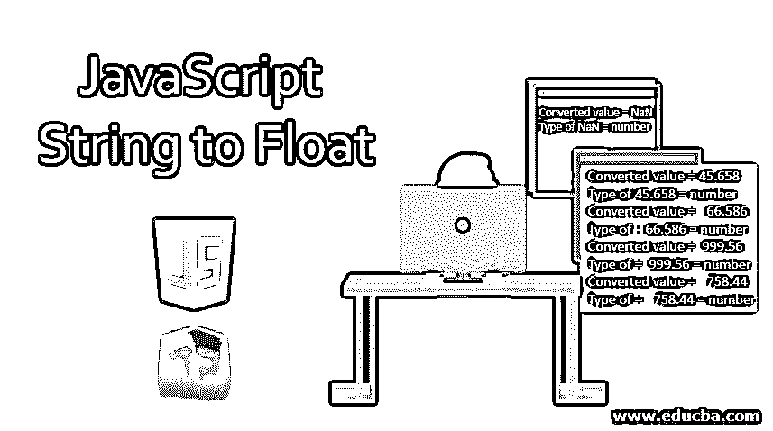
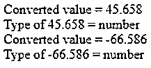
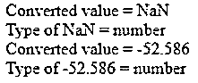
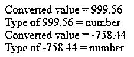
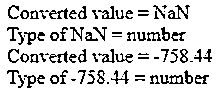
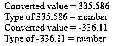
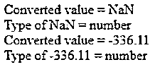

# 要浮动的 JavaScript 字符串

> 原文：<https://www.educba.com/javascript-string-to-float/>




## Javascript 字符串浮动简介

如果包含浮点数的字符串要执行数学运算，通常使用字符串到浮点数的转换。当您获取文本字段或文本字段数据时，您必须接收以字符串形式输入的数据。假设数据是浮点型的，我们想转换成字符串型的，或者数据是字符串型的，我们想转换成浮点型的，那么我们有两种方法。在这个主题中，我们将学习 JavaScript 字符串浮动。

### 如何在 JS 中用各种方法把 string 转换成 float？

将字符串转换为浮点有两种方法，如下所示

<small>网页开发、编程语言、软件测试&其他</small>

1.  类型转换
2.  语法分析浮点

所以现在我们将逐一查看这两种方法

#### 方法 1

这个方法使用 JavaScript 类型转换函数将 string 类型转换为 float 类型。

##### 示例#1

**代码:**

```
<script>
// Javascript script to convert the string value to float Value
// Function to convert the string to float value
function convert_to_float(b) {
// Type conversion of string to float
var floatValue = +(b);
// Return float value
return floatValue;
}
//Driver code
var q = "45.658";
// Call function
q = convert_to_float(q);
// Print result
document.write("Converted value = " +
q + "</br> Type of " + q + " = "
+typeof q + "<br>");
var q = "-66.586";
// Call function
q = convert_to_float(q);
// Print result
document.write("Converted value = " +
q + "</br> Type of " + q + " = "
+typeof q + "<br>");
</script>
```

**输出:**




##### 实施例 2

**代码:**

```
<script>
// Javascript script to convert the string value to float Value
// Function to convert the string to float value
function convert_to_float(b) {
// Type conversion of string to float
var floatValue = +(b);
// Return float value
return floatValue;
}
//Driver code
var q = "abc.658";
// Call function
q = convert_to_float(q);
// Print result
document.write("Converted value = " + q + "</br> Type of " + q + " = " +typeof q + "<br>");
var q = "-52.586";
// Call function
q = convert_to_float(q);
// Print result
document.write("Converted value = " +
q + "</br> Type of " + q + " = "
+typeof q + "<br>");
</script>
```

**输出:**




#### 方法 2

**通过使用 parseFloat()方法:**

我们使用 JavaScript 中的内嵌函数 parseFloat 方法来接受字符串并将其转换为浮点数。如果字符串中没有数值，或者如果第一个字符串字符不是数字，则字符串返回 NaN 值，即不是数字。

##### 示例#1

**代码:**

```
<script>
// Javascript script to convert the string to float value
// Function to convert the string value to float value
function convert_to_float(b) {
// Using parseFloat() method
var floatValue = parseFloat(b);
// Return float value
return floatValue;
}
//Driver code
var q = "999.56";
// Call function
q = convert_to_float(q);
// Print result
document.write("Converted value = " +
q + "</br> Type of " + q + " = "
+typeof q + "<br>");
var q = "-758.44";
// Call function
q = convert_to_float(q);
// Print result
document.write("Converted value = " +
q + "</br> Type of " + q + " = "
+typeof q + "<br>");
</script>
```

**输出:**




##### 实施例 2

在这个例子中，你会看到，如果我们不输入值，那么输出是怎么来的。

**代码:**

```
<script>
// Javascript script to convert the string to float value
// Function to convert the string value to float value
function convert_to_float(b) {
// Using parseFloat() method
var floatValue = parseFloat(b);
// Return float value
return floatValue;
}
//Driver code
var q = "ab.bc";
// Call function
q = convert_to_float(q);
// Print result
document.write("Converted value = " +
q + "</br> Type of " + q + " = "
+typeof q + "<br>");
var q = "-758.44";
// Call function
q = convert_to_float(q);
// Print result
document.write("Converted value = " +
q + "</br> Type of " + q + " = "
+typeof q + "<br>");
</script>
```

**输出:**




##### 实施例 3

在本例中，我们将看到特殊情况:

在法国浮点数中，数字是用逗号而不是点来书写的。

**代码:**

```
<script>
// Javascript script to convert the string to float value
// Function to convert  the string to float value
function convert_to_float(d) {
// Using parseFloat() method and using replace() method  to replace ', ' with '.' because in French float number is written in ','
var floatValue = parseFloat(d.replace(/, /, '.'));
// Return float value
return floatValue;
}
//Driver code
var q = "335, 586";
// Call function
q = convert_to_float(q);
// Print result
document.write("Converted value = " +
q + "</br> Type of " + q + " = "
+typeof q + "<br>");
var q = "-336, 11";
// Call function
q = convert_to_float(q);
// Print result
document.write("Converted value = " +
q + "</br> Type of " + q + " = "
+typeof q + "<br>");
</script>
```

**输出:**




##### 实施例 4

**代码:**

```
<script>
// Javascript script to convert the string to float value
// Function to convert  the string to float value
function convert_to_float(d) {
// Using parseFloat() method and using replace() method  to replace ', ' with '.' because in French float number is written in ','
var floatValue = parseFloat(d.replace(/, /, '.'));
// Return float value
return floatValue;
}
//Driver code
var q = "abc, mno";
// Call function
q = convert_to_float(q);
// Print result
document.write("Converted value = " +
q + "</br> Type of " + q + " = "
+typeof q + "<br>");
var q = "-336, 11";
// Call function
q = convert_to_float(q);
// Print result
document.write("Converted value = " +
q + "</br> Type of " + q + " = "
+typeof q + "<br>");
</script>
```

**输出:**




### 推荐文章

这是一个 JavaScript 字符串浮动指南。在这里，我们讨论基本概念，如何使用各种方法将 JS 中的 string 转换成 float，并给出一些例子。您也可以看看以下文章，了解更多信息–

1.  [Javascript innerHTML](https://www.educba.com/javascript-innerhtml/)
2.  [JavaScript 中的队列](https://www.educba.com/queue-in-javascript/)
3.  [JavaScript 合并数组](https://www.educba.com/javascript-merge-arrays/)
4.  [在 JavaScript 中设置](https://www.educba.com/set-in-javascript/)


