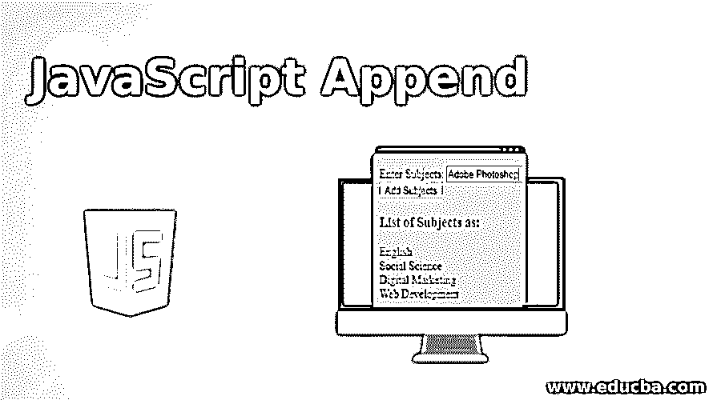
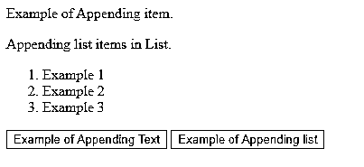
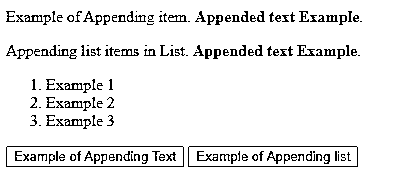
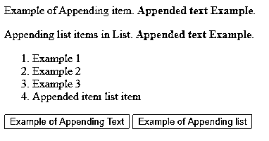
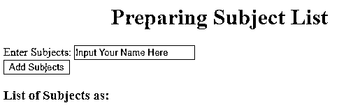
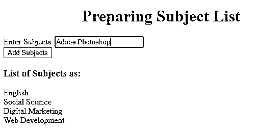
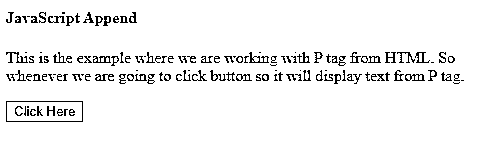
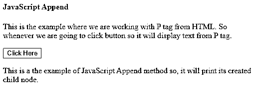

# JavaScript 追加

> 原文：<https://www.educba.com/javascript-append/>




## JavaScript Append 简介

JavaScript Append 是一种有用的方法，用于在特定选定元素的位置末尾插入所需的内容。Append()方法有助于借助 HTML、jQuery 和 DOM 创建内容。可以根据匹配的元素在给定元素的末尾指定参数来插入内容。这种方法有助于用户避免在实际的 HTML 代码中进行硬编码。因此，可以使用 JavaScript Append()在元素末尾直接添加所需的代码。jQuery 函数有助于添加附加函数或内容，如 HTML 字符串、DOM 元素、jQuery 对象或文本节点等。

**语法:**

<small>网页开发、编程语言、软件测试&其他</small>

*   现在将看到通过使用文档对象模型(DOM)技术，使用 JavaScript 代码将元素附加到 div 元素中的语法。因此，使用它，我们可以在 HTML 代码中创建具有一些 id 的空的,在这种情况下，id 将有助于获取,因此它将操作这个 div 的内部文本。
*   JavaScript Append 方法的语法如下:

```
document. getElementById("div_name").innerText +=  "data" ;
```

*   我们也可以使用 jQuery，通过使用以下语法将内容追加到所选元素的末尾:

```
$(selector).append(content , function(index.html))
```

*   上述语法内容是语法中必需的参数，用于插入 HTML 标签，可能的值有 HTML 元素、jQuery 对象、DOM 元素等。此处包含的函数是被视为可选术语的函数(index，html ),它将包含一个返回要插入的内容的函数。在这里，这两个值定义了不同的含义，比如 index 用于返回元素的位置，而 html 返回其所选元素的当前 HTML。

### JavaScript Append 在 HTML 中是如何工作的？

*   如前所述，我们已经看到 Append()方法用于在元素列表的末尾添加元素，现在我们将看到它实际上是如何与它的类型一起工作来做到这一点的。
*   JavaScript 中有两种方法可以将 HTML 代码添加到 div 中。让我们来详细看看这两者:

#### 1.使用 innerHTML 属性

这是第一种类型，通过它我们可以使用 innerHTML 属性添加元素，所以在处理时，我们首先必须选择我们实际上想要添加代码的元素。稍后，在 innerHTML 上将这段代码作为字符串和+=操作符一起添加到封闭代码格式中。使用 innerHTML 的语法如下:

```
element.innerHTML += "HTML code"
```

或者也可以用作:

```
element.innerHTML = element.innerHTML + "HTML Code"
```

#### 2.使用 insertAdjacentHTML()方法

如果我们想将 HTML 代码追加到 div 中，那么我们将使用 insertAdjacentHTML()方法，因此在这个过程中，您必须选择 div 中的一个元素来插入代码。因此，可以通过使用以下两个参数来完成该过程:

*   这个位置将定义我们实际想要添加代码的地方。这些是像 afterbegin，beforebegin，afterend，beforeend 这样的值。

*   还要考虑要将引号插入到封闭格式中的 HTML 代码。

**语法:**

```
elementInsideDiv.insertAdjacentHTML('afterbegin');
```

*   在 append()方法的帮助下，我们可以做的另一件有趣的事情是处理 appendChild()方法，这样它可以从列表中追加一个节点作为节点的最后一个子节点。因此，我们将借助以下示例详细了解如何在 JavaScript 中使用 appendChild()方法:
*   假设我们要在列表的末尾添加内容，那么它将看起来像:

```
var child = document.createElement("li");
var demo = document.createTextNode("Example");
child.appendChild(demo);
document.getElementById("childdemo").appendChild(child);
```

### JavaScript 附加示例

以下是 javascript append 的示例:

#### 示例#1

在这个例子中，我们创建了一个简单的点击按钮的代码，它将在点击按钮时显示最后添加到列表中的元素，如下所示:

**代码:**

```
<!DOCTYPE html>
<html>
<head>
<script src="https://ajax.googleapis.com/ajax/libs/jquery/3.4.1/jquery.min.js"></script>
<script>
$(document).ready(function(){
$("#btnfortext").click(function(){
$("p").append(" <strong>Appended text Example</strong>.");
});
$("#btnforlist").click(function(){
$("ol").append("<li>Appended item list item</li>");
});
});
</script>
</head>
<body>
<p>Example of Appending item.</p>
<p>Appending list items in List.</p>
<ol>
<li>Example 1</li>
<li>Example 2</li>
<li>Example 3</li>
</ol>
<button id="btnfortext">Example of Appending Text</button>
<button id="btnforlist">Example of Appending list</button>
</body>
</html>
```

**输出:**




点击追加文本按钮的例子后




点击追加列表按钮的例子后




#### 实施例 2

在本例中，我们将创建主题列表，其中将通过 JavaScript Append 方法显示最后插入的项目，代码如下:

**代码:**

```
<!DOCTYPE html>
<html>
<head>
<title> JavaScript Append </title>
<meta name="viewport" content="width=device-width, initial-scale=1">
</head>
<body>
<div class="container">
<h1 style="text-align : center;">Preparing Subject List </h1>
<form>
<div class="form-group">
<label for="">Enter Subjects:</label>
<input id="subjectname" class="form-control" type="text" placeholder="Input Your Name Here">
</div>
<div class="form-group text-center">
<button id="my_button"class="btn btn-outline-success btn-lg"
type="button">
Add Subjects
</button>
</div>
</form>
<h3>List of Subjects as:</h3>
<div id="listDemo"></div>
</div>
<script>
function append_to_div(div_name, data){
document.getElementById(div_name).innerText += data;
}
document.getElementById("my_button")
.addEventListener('click', function() {
var user_name = document.getElementById("subjectname");
var value = user_name.value.trim();
if(!value)
alert("Please enter subject name!");
else
append_to_div("listDemo", value+"\n");
user_name.value = "";
});
</script>
</body>
</html>
```

**输出:**




添加主题后




#### 实施例 3

这是我们使用 JavaScript appendChild()方法处理代码演示的例子。代码如下所示:

**代码:**

```
<!DOCTYPE html>
<html>
<body>
<h4>JavaScript Append </h4>
<p>This is the example where we are working with P tag from HTML. So whenever we are going to click button so it will display text from P tag.</p>
<button onclick="myFunction()">Click Here</button>
<script>
function myFunction() {
var demo = document.createElement("P");
var txt = document.createTextNode("This is a the example of JavaScript Append method so, it will  print its created child node.");
demo.appendChild(txt);
document.body.appendChild(demo);
}
</script>
</body>
</html>
```

**输出:**




点击按钮后，将显示附加了标签

的子节点作为输出，如下所示:




### 结论

从以上所有细节中，我们知道了 JavaScript Append()方法用于在所选列表的末尾位置添加元素。这对 HTML 元素、jQuery 和 DOM 等各个方面都很有帮助。也可以使用 jQuery 代码将元素添加到代码中。为了附加的目的，我们也可以附加一个 Child()。

### 推荐文章

这是一个 JavaScript 附加指南。在这里，我们还将讨论 javascript append 如何在 HTML 中工作，以及不同的示例和代码实现。您也可以看看以下文章，了解更多信息–

1.  [JavaScript 中的继承](https://www.educba.com/inheritance-in-javascript/)
2.  [JavaScript 键盘事件](https://www.educba.com/javascript-keyboard-events/)
3.  [JavaScript 光标](https://www.educba.com/javascript-cursor/)
4.  [JavaScript 消息框](https://www.educba.com/javascript-message-box/)


