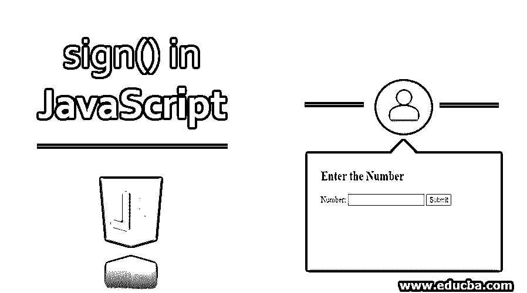
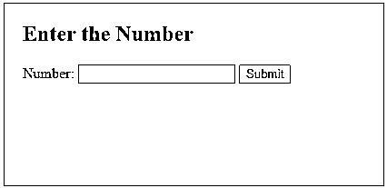
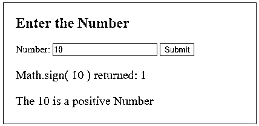
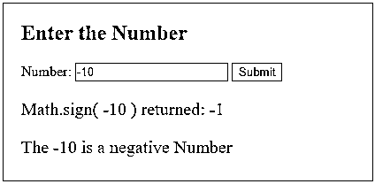
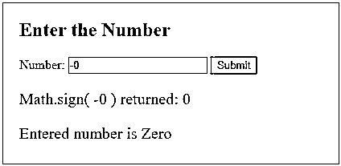
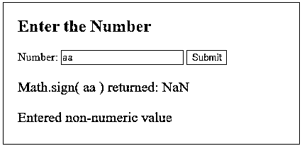

# JavaScript 中的符号()

> 原文：<https://www.educba.com/sign-in-javascript/>




## **JavaScript 中的符号介绍()**

 **当用户在网页上输入数字时，通常需要检查数字是正数还是负数或者其他什么。JavaScript 内置了 sign()函数，可以用来在运行时识别数字的符号。它使得在客户端解析数据和知道数字的符号变得容易。sign 函数是 Math 类下的一个静态方法；因此，可以使用它的名字 Math.sign()直接调用它。在本文中，我们将看到 sign()函数的语法、工作原理和示例。

**语法:**

<small>网页开发、编程语言、软件测试&其他</small>

如上所述，可以直接调用 sign()函数，首先使用类名调用它，然后使用函数名，如下所示:

```
Math.sign(number)
```

该函数只将输入作为数字，并返回表示数字符号的值。对于传递给该函数的非数值，它将返回 NaN。它根据传递给函数的不同数量的值返回多种类型的值。

下面让我们看看它是如何传递函数的:

*   –如果传递的是正数，即大于 0，它将返回 1。
*   –如果传递的是负数，即小于 0，它将返回-1。
*   –如果传递了正值或负值 0，它将返回 0。
*   –如果传递了非数字值(如字符串),它将返回 NaN。

### JavaScript 中的符号()示例

以下是 JavaScript 中 sign()的一些示例:

#### 示例 1–正值

**代码**:

```
<!DOCTYPE html>
<html>
<head>
<title>
sign() function in JavaScript
</title>
<style>
.results {
border : green 1px solid;
background-color : aliceblue;
text-align : left;
padding-left : 20px;
height : 200px;
width : 95%;
}
.resultText {
font-size : 20px;
font-style : normal;
color : blue;
}
</style>
</head>
<body>
<div class = "results">
<h2> Enter the Number </h2>
Number: <input type = "number" name = "number" id = "number" required>
<button type = "button" onclick = "checkForSign()" > Submit </button>
<div class = "resultText">
<p id = "signResult"> </p>
<p id = "result"> </p>
</div>
</div>
</div>
<script type = "text/javascript">
function checkForSign() {
num = document.getElementById("number").value;
if(num == '') {
document.getElementById("result").style.color = "red";
document.getElementById("result").innerHTML = "Please Enter a Valid Number ";
return;
}
var signResult = Math.sign( num );
document.getElementById("result").innerHTML = '';
document.getElementById("signResult").innerHTML = "Math.sign( " + num + " ) returned: " + signResult;
if(signResult == 1) {
document.getElementById("result").style.color = "blue";
document.getElementById("result").innerHTML = "The " + num + " is a positive Number";
}
}
</script>
</body>
</html>
```

我们有函数 checkForSign，它将对输入的数字应用 Math.sign()函数并显示其结果。

**输出:**




当您输入号码并提交按钮时，




#### 示例 2–负值

**代码**:

```
<!DOCTYPE html>
<html>
<head>
<title>
sign() function in JavaScript
</title>
<style>
.results {
border : green 1px solid;
background-color : aliceblue;
text-align : left;
padding-left : 20px;
height : 200px;
width : 95%;
}
.resultText {
font-size : 20px;
font-style : normal;
color : blue;
}
</style>
</head>
<body>
<div class = "results">
<h2> Enter the Number </h2>
Number: <input type = "number" name = "number" id = "number" required>
<button type = "button" onclick = "checkForSign()" > Submit </button>
<div class = "resultText">
<p id = "signResult"> </p>
<p id = "result"> </p>
</div>
</div>
</div>
<script type = "text/javascript">
function checkForSign() {
num = document.getElementById("number").value;
if(num == '') {
document.getElementById("result").style.color = "red";
document.getElementById("result").innerHTML = "Please Enter a Valid Number ";
return;
}
var signResult = Math.sign( num );
document.getElementById("result").innerHTML = ' ';
document.getElementById("signResult").innerHTML = "Math.sign( " + num + " ) returned: " + signResult;
if(signResult == 1) {
document.getElementById("result").style.color = "blue";
document.getElementById("result").innerHTML = "The " + num + " is a positive Number";
} else if(signResult == -1) {
document.getElementById("result").style.color = "blue";
document.getElementById("result").innerHTML = "The " + num + " is a negative Number";
}
}
</script>
</body>
</html>
```

**输出:**




#### 示例 3–零值

**代码:**

```
<!DOCTYPE html>
<html>
<head>
<title>
sign() function in JavaScript
</title>
<style>
.results {
border : green 1px solid;
background-color : aliceblue;
text-align : left;
padding-left : 20px;
height : 200px;
width : 95%;
}
.resultText {
font-size : 20px;
font-style : normal;
color : blue;
}
</style>
</head>
<body>
<div class = "results">
<h2> Enter the Number </h2>
Number: <input type = "number" name = "number" id = "number" required>
<button type = "button" onclick = "checkForSign()" > Submit </button>
<div class = "resultText">
<p id = "signResult"> </p>
<p id = "result"> </p>
</div>
</div>
</div>
<script type = "text/javascript">
function checkForSign() {
num = document.getElementById("number").value;
if(num == '') {
document.getElementById("result").style.color = "red";
document.getElementById("result").innerHTML = "Please Enter a Valid Number ";
return;
}
var signResult = Math.sign( num );
document.getElementById("result").innerHTML = '';
document.getElementById("signResult").innerHTML = "Math.sign( " + num + " ) returned: " + signResult;
if(signResult == 1) {
document.getElementById("result").style.color = "blue";
document.getElementById("result").innerHTML = "The " + num + " is a positive Number";
} else if(signResult == -1) {
document.getElementById("result").style.color = "blue";
document.getElementById("result").innerHTML = "The " + num + " is a negative Number";
} else if( signResult == 0) {
document.getElementById("result").style.color = "blue";
document.getElementById("result").innerHTML = "Entered number is Zero";
}
}
</script>
</body>
</html>
```

**输出:**

对于正零，


对于负零，




#### 示例 4–非数字值

输入框的类型更改为 type = "text "。

**代码**:

```
<!DOCTYPE html>
<html>
<head>
<title>
sign() function in JavaScript
</title>
<style>
.results {
border : green 1px solid;
background-color : aliceblue;
text-align : left;
padding-left : 20px;
height : 200px;
width : 95%;
}
.resultText {
font-size : 20px;
font-style : normal;
color : blue;
}
</style>
</head>
<body>
<div class = "results">
<h2> Enter the Number </h2>
Number: <input type = "text" name = "number" id = "number" required>
<button type = "button" onclick = "checkForSign()" > Submit </button>
<div class = "resultText">
<p id = "signResult"> </p>
<p id = "result"> </p>
</div>
</div>
</div>
<script type = "text/javascript">
function checkForSign() {
num = document.getElementById("number").value;
if(num == '') {
document.getElementById("result").style.color = "red";
document.getElementById("result").innerHTML = "Please Enter a Valid Number ";
return;
}
var signResult = Math.sign( num );
document.getElementById("result").innerHTML = '';
document.getElementById("signResult").innerHTML = "Math.sign( " + num + " ) returned: " + signResult;
if(signResult == 1) {
document.getElementById("result").style.color = "blue";
document.getElementById("result").innerHTML = "The " + num + " is a positive Number";
} else if(signResult == -1) {
document.getElementById("result").style.color = "blue";
document.getElementById("result").innerHTML = "The " + num + " is a negative Number";
} else if( signResult == 0) {
document.getElementById("result").style.color = "blue";
document.getElementById("result").innerHTML = "Entered number is Zero";
} else {
document.getElementById("result").style.color = "red";
document.getElementById("result").innerHTML = "Entered non-numeric value";
}
}
</script>
</body>
</html>
```

**输出:**




### 结论

因此，我们已经看到了 JavaScript 中的 sign()函数。它是在 Math 类中声明的，可以用它的类名直接调用。该函数根据表示符号的值返回 1，-1 或 0。当传递非数值时，它返回 NaN。

### 推荐文章

这是 JavaScript 中 sign()的指南。这里我们讨论 JavaScript 中 sign()的基本概念、语法和主要示例，以及代码实现。你也可以看看下面的文章来了解更多-

1.  [JavaScript 拆分字符串](https://www.educba.com/javascript-split-string/)
2.  [Javascript concat 方法](https://www.educba.com/javascript-merge-arrays/)
3.  [JavaScript 字符串长度](https://www.educba.com/javascript-string-length/)
4.  [JavaScript 字符串替换](https://www.educba.com/javascript-string-replace/)


**