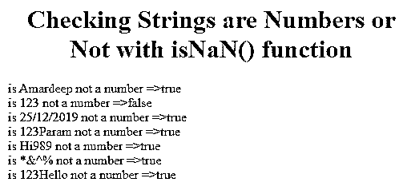
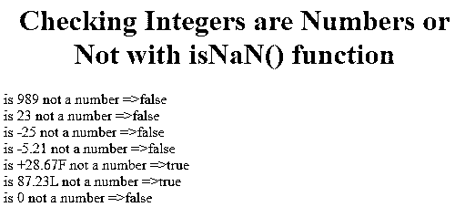
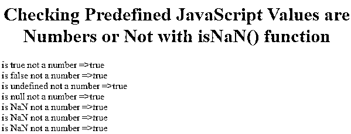

# isNaN() JavaScript

> 原文：<https://www.educba.com/isnan-javascript/>


## isNaN() JavaScript 简介

在本文中，我们将了解 isNaN() JavaScript。我们将尝试逐字拆分函数 isNaN()并分析函数的含义。is 和 NaN 都是两个独立的单词。NaN 缩写不是一个数字。现在，如果我们在任何单词前加入助动词，给出一个正确的问题。这里 isNaN 也表示检查给定值是否为数字。isNaN()检查传递给它的值是真还是假。

### JavaScript 中 isNaN()函数是如何工作的？

*   isNaN()函数总是检查值是数字还是非数字。
*   isNaN()返回布尔值作为输出。
*   返回的布尔值为真或假。
*   如果给定值是字符串，则返回 true，如果给定值是数字，则返回 false。

**语法:**

<small>网页开发、编程语言、软件测试&其他</small>

```
isNaN(value);
```

**值:**传递所需值，检查是否为数字。

**举例:**有一种情况，如果我们要对数字进行加减运算。假设我们得到的数字来自第 3 <sup>第 3</sup>方客户。我们是直接加上还是减去那些值？不，因为我们不知道那些值是什么，是数字还是字符串。所以，我们首先通过使用 isNaN()函数来检查它是否是一个数字。如果数字是字符串形式，那么我们只需解析数字。稍后我们会加减。

### 在 isNaN() JavaScript 中实现的示例

以下是在 isNaN() JavaScript 中实现的示例:

#### 示例#1

检查传递的字符串是否为数字

**代码:**

```
<!DOCTYPE html>
<html>
<body>
<font color="blue">
<h1 align="center">Checking Strings are Numbers or Not with isNaN() function</h1>
</font>
<script>
function checkStringsNumberOrNot()
{
var a="Amardeep";
var b="123";
var c='25/12/2019';
var d="123Param";
var e="Hi989";
var f="*&^%";
var g=123+"Hello";
document.write("is "+a+" not a number =>"+isNaN(a)+"<br>");
document.write("is "+b+" not a number =>"+isNaN(b)+"<br>");
document.write("is "+c+" not a number =>"+isNaN(c)+"<br>");
document.write("is "+d+" not a number =>"+isNaN(d)+"<br>");
document.write("is "+e+" not a number =>"+isNaN(e)+"<br>");
document.write("is "+f+" not a number =>"+isNaN(f)+"<br>");
document.write("is "+g+" not a number =>"+isNaN(g));
}
checkStringsNumberOrNot();
</script>
</body>
</html>
</body>
</html>
```

**输出:**




**对上面代码的解释:** Amardeep 不是一个数字，所以函数返回 true。123 是一个数字，因此该函数返回 false。25/12/2019 不是数字，而是日期，因此函数返回 true。123Param 不是数字，因此函数返回 true。Hi989 不是数字，因此该函数返回 true。8 & ^%不是一个数字，所以函数返回 true。123Hello 不是一个数字，因此该函数返回 true。(123+" String"=String so 变成 123Hello)。

#### 实施例 2

检查传递的整数是否为数字

**代码:**

```
<!DOCTYPE html>
<html>
<body>
<font color="blue">
<h1 align="center">Checking Integers are Numbers or Not with isNaN() function</h1>
</font>
<script>
function checkIntegersNumberOrNot()
{
var a="989";
var b=23;
var c=-25;
var d=-5.21;
var e='+28.67F';
var f="87.23L";
var g='0';
document.write("is "+a+" not a number =>"+isNaN(a)+"<br>");
document.write("is "+b+" not a number =>"+isNaN(b)+"<br>");
document.write("is "+c+" not a number =>"+isNaN(c)+"<br>");
document.write("is "+d+" not a number =>"+isNaN(d)+"<br>");
document.write("is "+e+" not a number =>"+isNaN(e)+"<br>");
document.write("is "+f+" not a number =>"+isNaN(f)+"<br>");
document.write("is "+g+" not a number =>"+isNaN(g));
}
checkIntegersNumberOrNot();
</script>
</body>
</html>
```

**输出:**




**对上面代码的解释:** 989 是一个数字，所以函数返回 false。23 是一个数字，所以函数返回 false。-25 是一个数字，因此该函数返回 false。-5.21 是一个数字，因此该函数返回 false。+28.67F 不是一个数字，因此该函数返回 true。23L 不是一个数字，因此该函数返回 true。0 是一个数字，所以函数返回

**Note:** Whereas in Java suffix F and L indicates float and long numbers respectively but JavaScript doesn’t.

#### 实施例 3

检查传递的预定义 JavaScript 值是否为数字

**代码:**

```
<!DOCTYPE html>
<html>
<body>
<font color="blue">
<h1 align="center"> Checking Predefined JavaScript Values are Numbers or Not with isNaN() function</h1>
</font>
<script>
function checkPredefinedValuesNumberOrNot()
{
var a="true";
var b="false";
var c="undefined";
var d="null";
var e=0/0;
var f=NaN;
var g="NaN";
document.write("is "+a+" not a number =>"+isNaN(a)+"<br>");
document.write("is "+b+" not a number =>"+isNaN(b)+"<br>");
document.write("is "+c+" not a number =>"+isNaN(c)+"<br>");
document.write("is "+d+" not a number =>"+isNaN(d)+"<br>");
document.write("is "+e+" not a number =>"+isNaN(e)+"<br>");
document.write("is "+f+" not a number =>"+isNaN(f)+"<br>");
document.write("is "+g+" not a number =>"+isNaN(g));
}
checkPredefinedValuesNumberOrNot();
</script>
</body>
</html>
```

**输出:**




**对上面代码的解释:** true 不是一个数字，所以函数返回 true。false 不是数字，因此函数返回 true。undefined 不是数字，因此函数返回 true。null 不是数字，因此该函数返回 true。NaN(0/0)不是一个数字，因此该函数返回 true。不带引号的 NaN 不是数字，因此该函数返回 true。带引号的 NaN 不是数字，因此该函数返回 true。

#### 实施例 4

Number.isNaN()

它的支票传递值是 NaN，类型是 number。它是 isNaN()直接使用函数的更新版本。它还根据提供给它的值返回 true 或 false。

**代码:**

```
<!DOCTYPE html>
<html>
<body>
<font color="blue">
<h1 align="center">Check with Number.isNaN() whether values are Number or Not</h1>
</font>
<script>
function checkValuesNumberOrNot()
{
var a=10;
var b="false";
var c=0/0;
var d=-21.7;
var e=Number.NaN
document.write("is "+a+" not a number =>"+Number.isNaN(a)+"<br>");
document.write("is "+b+" not a number =>"+Number.isNaN(b)+"<br>");
document.write("is "+c+" not a number =>"+Number.isNaN(c)+"<br>");
document.write("is "+d+" not a number =>"+Number.isNaN(d)+"<br>");
document.write("is "+e+" not a number =>"+Number.isNaN(e));
}
checkValuesNumberOrNot();
</script>
</body>
</html>
```

**输出:**


**对上面代码的解释:** 10 是一个数字，所以函数返回 false。false 是一个数字，因此函数返回 false。NaN (0/0)不是一个数字，因此该函数返回 true。-21.7 是一个数字，因此该函数返回 false。南(号。NaN)不是数字，因此该函数返回 true。

**注:**

*   Number.isNaN()将 false 和 true 输出返回为 false，只是因为在这里它将 false 视为 0，将 true 视为 1。
*   函数 isNaN 总是检查函数中的值是否是数字，不管它是在单引号、双引号中还是没有引号。

### 结论

isNaN()函数用于判断给定值是数字还是非数字。如果给定值是一个数字，则返回 false，否则返回 true。

### 推荐文章

这是一个 isNaN() JavaScript 的指南。这里我们讨论一个简介，isNaN() JavaScript 如何工作以及实现的例子。您也可以浏览我们的其他相关文章，了解更多信息——

1.  [JavaScript 中的 Cookies】](https://www.educba.com/cookies-in-javascript/)
2.  [JavaScript 未定义](https://www.educba.com/javascript-undefined/)
3.  [JavaScript 字符串替换](https://www.educba.com/javascript-string-replace/)
4.  [JavaScript 刷新页面](https://www.educba.com/javascript-refresh-page/)


