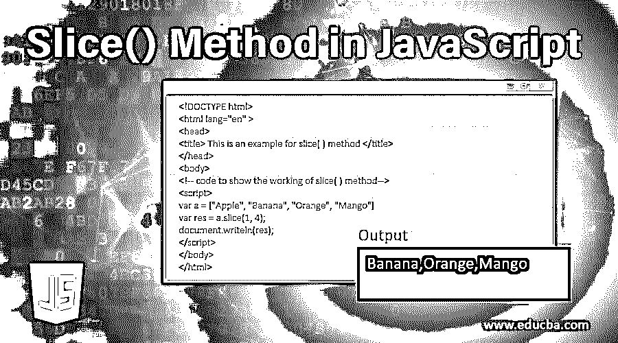
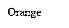
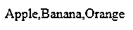

# JavaScript 中的 Slice()方法

> 原文：<https://www.educba.com/slice-method-in-javascript/>




## JavaScript 中 Slice()方法介绍

javascript 中的 Slice()方法用于子集化或提取数组元素并返回。Sice()方法是 javascript 中的内置方法。JavaScript 中的 Slice()方法从数组中提取元素，并将其作为输出返回，但它不更新或更改数组，数组保持与以前相同。

**Javascript 中 Slice()方法的语法:**

<small>网页开发、编程语言、软件测试&其他</small>

```
array.slice(start,end)
```

该方法从数组中提取元素，并将其作为输出返回。

**参数**

**start–**start 参数是一个可选参数，用于指定开始提取元素的起始索引。如果我们没有为这个参数提供一个值，那么这个函数将把 0 作为默认值。

**end–**end 参数是可选参数，用于指定要提取的元素的结束索引。注意，结束索引值被排除意味着结束值将是结束-1 值。如果我们没有为这个参数提供一个值，那么这个函数将数组的长度作为默认值，如果结束值大于数组长度，那么结束值将作为数组的长度。

### JavaScript 中 Slice()方法的示例

接下来，我们将编写 HTML 代码，通过下面的示例更清楚地理解 slice()方法，slice()方法用于绕过起始索引 2 和结束索引 3，从数组 a 中提取单个元素。

#### 示例#1

**代码:**

```
<!DOCTYPE html>
<html lang= "en" >
<head>
<title> This is an example for slice( ) method </title>
</head>
<body>
<!-- code to show the working of slice( ) method -->
<script>
var a = ["Apple", "Banana", "Orange", "Mango"]
var res = a.slice(2, 3);
document.writeln(res);
</script>
</body>
</html>
```

**输出:**




在上面的代码中，slice()方法使用了，并为起始索引 2 和结束索引 3 传递了参数值，因此 slice()方法对给定的数组 a 进行切片，或者从索引 2 到索引 2 提取给定数组的元素(结束值不包括在内)。因此，在索引为 2 的数组 an 中，它存储元素“Orange ”,因此 slice 方法的返回值是“Orange ”,如输出所示。

在下一个示例代码中，我们将重写 slice()方法的上述代码，以从给定的数组中提取多个元素。

#### 实施例 2

**代码:**

```
<!DOCTYPE html>
<html lang="en" >
<head>
<title> This is an example for slice( ) method </title>
</head>
<body>
<!-- code to show the working of slice( ) method -->
<script>
var a = ["Apple", "Banana", "Orange", "Mango"]
var res = a.slice(1, 4);
document.writeln(res);
</script>
</body>
</html>
```

**输出:**


在上面的代码中，传递给 slice()方法的参数是针对起始索引为 1 和结束索引为 4 的，因此 slice()方法对给定的数组 a 进行切片，或者从索引 1 到索引 3 提取给定数组的元素(结束值不包括在内)。因此，在数组 an 中，索引 1 处存储元素“Banana”，索引 2 处存储元素“Orange”，索引 3 处存储元素“Mango”，因此 slice 方法的返回值是“Apple，Orange，Mango”，如输出所示。

在下一个示例代码中，我们将重写 slice()方法的上述代码，以便根据负索引从给定数组中提取多个元素。

#### 实施例 3

**代码:**

```
<!DOCTYPE html>
<html lang="en" >
<head>
<title> This is an example for slice( ) method </title>
</head>
<body>
<!-- code to show the working of slice( ) method -->
<script>
var a = ["Apple", "Banana", "Orange", "Mango"]
var res = a.slice(-4, -1);
document.writeln(res);
</script>
</body>
</html>
```

**输出:**




在上面的代码中，传递给 slice()方法的参数是，对于开始索引为-4，结束索引为-1，因此 slice()方法对给定数组 a 进行切片，或者从索引 4 到索引 1 提取给定数组的元素(结束值除外)，以相反的顺序，最后一个元素存储在索引 1，最后一个元素存储在索引 2，依此类推。因此，在数组 an 中，索引 4 存储元素“Apple”，索引 3 存储元素“Banana”，索引 2 存储元素“Orange”，因此 slice 方法的返回值是“Apple，Banana，Orange”，如输出所示。

我们将为 slice()方法重写上述代码，以提取给定数组的所有元素。

#### 实施例 4

**代码:**

```
<!DOCTYPE html>
<html lang= "en" >
<head>
<title> This is an example for slice( ) method </title>
</head>
<body>
<!-- code to show the working of slice( ) method -->
<script>
var a = ["Apple", "Banana", "Orange", "Mango"]
var res = a.slice( );
document.writeln(res);
</script>
</body>
</html>
```

上述代码的输出是-


在上面的代码中，没有参数传递给 slice()方法，因此开始索引和结束索引分别采用默认值 0 和数组长度 4。所以给定数组的元素是从索引 0 到 4 提取的(最终值是 excluding)。

### 结论

要提取 javascript 中的数组元素，可以像我们在示例中看到的那样使用 slice()方法。slice()方法接受两个参数，即开始索引和结束索引，这两个参数都是可选的，因此默认值分别为 0 和给定数组的长度。

### 推荐文章

这是 JavaScript 中 Slice()方法的指南。这里我们讨论 slice()方法提取单个元素的例子。您也可以看看以下文章，了解更多信息–

1.  [JavaScript 字符串长度](https://www.educba.com/javascript-string-length/)
2.  [JavaScript 中的 Cookies】](https://www.educba.com/cookies-in-javascript/)
3.  [JavaScript 自定义事件](https://www.educba.com/javascript-custom-events/)
4.  [JavaScript 刷新页面](https://www.educba.com/javascript-refresh-page/)


