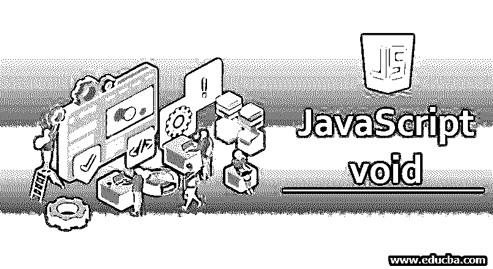
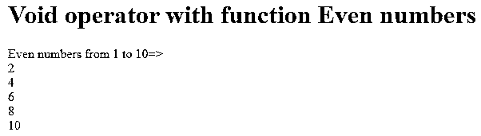
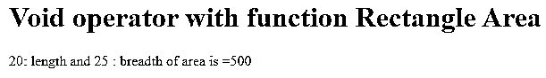
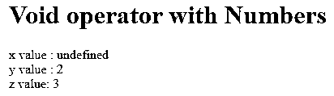
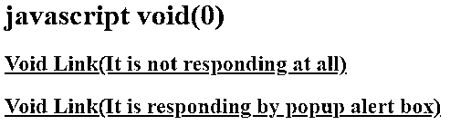
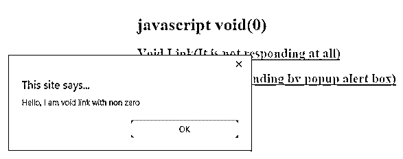

# Javascript void

> 原文：<https://www.educba.com/javascript-void/>




## Javascript void 简介

Void 的意思是完全空了**。**在 JavaScript 中，void 是一个操作符，当函数不返回任何东西时使用。这意味着无效结果是未定义的。在 Java 中，如果我们不指定任何返回类型，那么函数或方法就会自动失效。但是，JavaScript 不是类型检查语言。所以，函数总是会返回一些东西。在某些情况下我们不需要返回任何东西，所以我们必须在函数前面指定 void 操作符。

**实时示例:**克服副作用在网页中插入任何表达式时，我们可能使用了 JavaScript:void(0)。

<small>网页开发、编程语言、软件测试&其他</small>

### JavaScript 中 Void 运算符是如何工作的？

JavaScript 中不返回函数总是与 void 操作符一起工作。

**语法:**

```
void function functionName()
{
//code
}
```

**以上语法内部实现:**

```
function functionName()
{
return undefined;
}
```

而不刷新和页面间不可移动链接只需使用 void 操作符。这总是与链接一起使用。

**语法:**

```
<a href="JavaScript:void(0);"/>
```

### 例子

下面举几个例子

#### 示例 1–带函数的 Void 运算符(不带参数)

**代码:**

```
<!DOCTYPE html>
<html>
<head>
<title>Void</title>
</head>
<body>
<font color="green">
<h1>Void operator with function Even numbers</h1>
</font>
<script>
void function getEvenNumbers()
{
document.write("Even numbers from 1 to 10=><br>");
for(let i=0;i<=10;i++)
{
if(i%2==0&&i!=0)
document.write(i+"<br>")
}
}();
</script>
</body>
</html>
```

**输出:**




**说明:**

正如我们在上面看到的，函数没有任何机会返回任何东西，因为它是一个空函数。

#### 示例 2–带函数的 Void 运算符(带参数)

**代码:**

```
<!DOCTYPE html>
<html>
<head>
<title>Void</title>
</head>
<body>
<font color="green">
<h1>Void operator with function Rectangle Area</h1>
</font>
<script>
void function getAreaOfRectangle(length,breadth)
{
var area=length*breadth;
document.write(length+": length and "+ breadth+" : breadth of area is ="+area);
}(20,25);
</script>
</body>
</html>
```

**输出:**




**说明:**

正如我们在上面的代码中看到的，由于 void 操作符，即使传递参数也不会返回任何内容。

#### 示例 3–带数字的 Void 运算符

**代码:**

```
<!DOCTYPE html>
<html>
<head>
<title>Void</title>
</head>
<body>
<font color="green">
<h1>Void operator with Numbers</h1>
</font>
<script>
function getNumbers(x,y,z)
{
x=void(y,z);
document.write("x value : "+x+"<br> y value : "+y+"<br> z value: "+z);
}
getNumbers(1,2,3);
</script>
</body>
</html>
```

**输出:**




**解释**

*   正如我们所见，y 和 z 的值没有改变，因为 y 和 z 的合力不为空**。**
*   然而，x 具有 void 运算符与 y 和 z 的结果，因此，x 的结果将变得不确定。
*   证明了空结式总是[未定义的原值](https://www.educba.com/javascript-undefined/)。

#### 示例 4–JavaScript:void(0)

**代码:**

```
<!DOCTYPE html>
<html>
<head>
<title>Void</title>
</head>
<body>
<font color="green">
<h1>javascript void(0)</h1>
</font>
<h2>
<a href="javascript:void(0);">
Void Link(It is not responding at all)
</a>
</h2>
<h2>
<a href="javascript:void(alert('Hello, I am void link with non zero'));">
Void Link(It is responding by popup alert box)
</a>
</h2>
</body>
</html>
```

**按下任何链接前的输出:**




**按下第二个链接后的输出:**




**解释**

*   当我们按下 JavaScript:void(0)link(1<sup>ST</sup>link)时，它根本不起作用，因为它返回 void(0)
*   当我们按下 JavaScript:void(alert())link(2<sup>和</sup> link) **，**时，它会打开一个警告弹出框，显示一些消息。
*   它得出结论 void(0)不打开任何链接。

### 结论

当函数不返回任何内容时使用的 void 操作符，无论何时想要返回未定义的原始值和 javascript:void(0)定义的不可用链接。

### 推荐文章

这是一个 Javascript void 的指南。这里我们分别讨论它是如何工作的和几个例子。您也可以看看以下文章，了解更多信息–

1.  [在 JavaScript 中设置](https://www.educba.com/set-in-javascript/)
2.  [JavaScript 事件](https://www.educba.com/javascript-events/)
3.  [JavaScript 静态方法](https://www.educba.com/javascript-static-method/)
4.  [JavaScript 闭包](https://www.educba.com/javascript-closure/)


