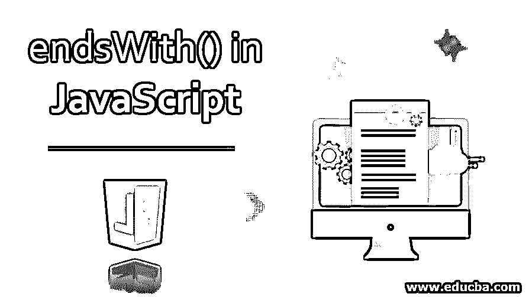
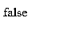
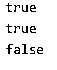
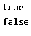

# JavaScript 中的 endsWith()

> 原文：<https://www.educba.com/endswith-in-javascript/>




## JavaScript 中的 endsWith()简介

在 JavaScript 中，endsWith()是一个字符串方法，用于确定一个字符串是否以指定字符串的字符结尾。该方法返回布尔值，即真或假。如果字符串以给定的字符或子字符串结尾，则返回 true，否则返回 false。此方法区分大小写。

在 JavaScript 中，endsWith()方法的语法是:

<small>网页开发、编程语言、软件测试&其他</small>

```
string.endsWith(substringvalue, length);
```

运筹学

```
string.endsWith(substringvalue);
```

这里，endsWith()方法接受两个属性或参数。

**参数:**

*   **string:** 这是一个 string 对象。
*   **substringvalue:** 它是要在给定字符串末尾搜索的字符集。这是一个强制属性。可以是单个字符，也可以是多个字符或多个单词。
*   **length:** 您可以指定想要搜索的字符串的长度。这是一个可选属性。如果设置了 length 属性值，则它搜索字符串直到给定的长度值，否则，该方法认为是默认的字符串长度值。例如，如果长度属性值设置为 6。这意味着只搜索或测试字符串的前六个字符。

**Note: **In the above Syntax, the substringvalue attribute is mandatory, while length Attribute will be Optional. Like endsWith() method, if we verify a given string begins with the characters of a specified string, then we use the startsWith() method. This method is case sensitive. The endsWith() method is not supported in IE Browser (IE 11 & earlier versions).

### JavaScript 中的 endsWith()示例

下面是 JavaScript 中的 endsWith()示例:

#### 示例# 1–没有长度属性

**代码:**

```
<!DOCTYPE html>
<html>
<body>
<script>
var str = "EDUCBA JavaScript Article";
var n = str. endsWith("Article");
document. write(n);
</script>
</body>
</html>
```

**输出:**


在上面的例子中，我们使用了 endsWith()方法来检查给定的字符串是否以 substring value“Article”结尾。因此，该方法返回 true。

#### 示例# 2–带长度属性

**代码:**

```
<!DOCTYPE html>
<html>
<body>
<script>
var str = "EDUCBA JavaScript Article";
var n = str. endsWith("Java",11);
document. write(n);
</script>
</body>
</html>
```

**输出:**


在上面的例子中，长度参数的值设置为 11，即检查给定字符串中的前 11 个字符。所以如果在给定长度的字符串末尾找到子字符串 value "Java"。因此，该方法返回 true。

#### **示例 3–区分大小写**

**代码:**

```
<!DOCTYPE html>
<html>
<body>
<script>
var str = "EDUCBA JavaScript Article";
var n = str. endsWith("article");
document. write(n);
</script>
</body>
</html>
```

**输出:**




在上面的示例中，它提供了错误的输出，因为 endsWith()方法执行区分大小写的搜索，在给定字符串“EDUCBA JavaScript Article”的末尾找到了子字符串值“Article ”,但没有找到“Article”。因此，该方法返回 false。

#### 示例 4–浏览器控制台上的结果

**代码:**

```
var str = "EDUCBA JavaScript Article";
console.log(str.endsWith("Article"));
console.log(str.endsWith("Java",11));
console.log(str.endsWith("article"));
```

**输出*:*T3】**


在上面的例子中，我们使用了带有 log 方法的控制台类。通过使用这个类，我们执行了给定的方法，并在浏览器控制台上显示所有的结果。测试给定字符串是否以子字符串值“Article”结尾的 endsWith()方法。因此，该方法返回 True。

长度属性的值设置为 11，即检查给定字符串中的前 11 个字符。所以如果在给定长度的字符串末尾找到子字符串 value "Java"。因此，该方法返回 True。由于 endsWith()方法执行区分大小写的测试，在给定字符串“EDUCBA JavaScript Article”的末尾找到了 substring value“Article ”,但没有找到“Article”。因此，该方法返回 False。

#### 示例 5–单个字符

**代码:**

```
var str = "EDUCBA JavaScript Article";
console.log(str.endsWith("e"));
console.log(str.endsWith("e"));
console.log(str.endsWith("f"));
```

**输出:**




在上面的例子中，我们使用了 endsWith()方法来检查给定的字符串是否以单个字符的子字符串值结尾。因此，该方法在第一和第二种情况下返回 true，在第三种情况下返回 false。

#### 示例# 6–多个字符

**代码:**

```
var str = "EDUCBA JavaScript Article";
console.log(str.endsWith("cle"));
console.log(str.endsWith("cee"));
```

**输出:**




在上面的例子中，我们使用了 endsWith()方法来检查给定的字符串是否以多个单词的子字符串值结尾。因此，该方法在第一种情况下返回 true，在第二种情况下返回 false。

### 结论

在本文中，我们特别讨论了 JavaScript string ends with()方法，该方法测试给定字符串结尾的子字符串值，并返回布尔值，即 true 或 false。类似地，可以用( )方法验证 JavaScript 字符串 startsWith，该方法测试或验证以给定字符串开头的子字符串值，并返回一个布尔值。所以，有很多方法与字符串相关，比如 startsWith()、replace()、replace()、substr()等等。

### 推荐文章

这是 JavaScript 中的 endsWith()指南。这里我们讨论 JavaScript 中 endsWith()的语法和参数，以及示例和代码实现。你也可以看看下面的文章来了解更多-

1.  [Javascript concat 方法](https://www.educba.com/javascript-merge-arrays/)
2.  [JavaScript 字符串长度](https://www.educba.com/javascript-string-length/)
3.  [JavaScript 拆分字符串](https://www.educba.com/javascript-split-string/)
4.  [JavaScript 比较字符串](https://www.educba.com/javascript-compare-strings/)


