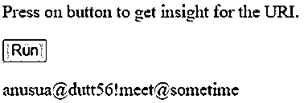
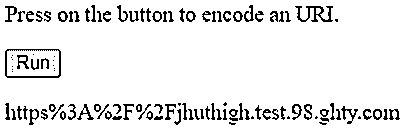
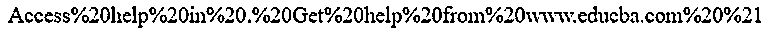
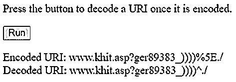

# JavaScript encodeURI()

> 原文：<https://www.educba.com/javascript-encodeuri/>


## JavaScript encodeURI()的定义

JavaScript URI()函数是 JavaScript 中的一个函数，它用于对任何 URI(统一资源标识符)进行编码，该用一个、两个或三个转义序列来替换字符的某个实例，该转义序列表示用 URI 函数编码的字符的 TF-8 模式，该函数包括特殊的 URI 字符，其中一些保留字符表示字符中的一组异常，例如；, /?:@ & = + $后跟另一组字符异常，即带有字母、十进制数字的非转义字符，–_。!~ *()和分数代表#。

**语法:**

<small>网页开发、编程语言、软件测试&其他</small>

```
encodeURI(uri)
```

语法流是这样的，编码 URI 函数一被调用就被用于 URI 的编码，并被传递以参数 URI，该参数 uri 被要求表示这个特定的 URI 需要被编码。

### JavaScript 中 encodeURI()函数是如何工作的？

EncodeURI()函数是 JavaScript 中的一个函数，用于对任何 URI 进行编码，可以用一组字符替换某个字符实例，但有某些例外。我们来看看 JavaScript 中 encodeURI()函数的工作流程:

*   URI 中出现的每个字符实例都被用于用转义字符序列对字符进行编码，转义字符序列包括保留字符、非转义字符和分数。
*   encodeURI 的语法流包括参数 URI，该参数 uri 用于表示它所指向的 uri，以使 URI 的流流线化并相应地被定制。
*   一旦为 uri 和 URI 声明了一个 encodeURI(uri)函数，就非常需要为涉及 decodeURI()函数的解码声明 URI。
*   就浏览器支持而言，包含参数的 encodeURI(uri)函数具有相当灵活的兼容性。
*   每当调用 encodeURI 函数时，都会有一个返回类型，该函数以表示编码 URI 的字符串形式返回值。
*   而且，任何基于 URI 的组件无论是 encodeURI 还是任何包含 URI 组件的函数都使用 encodeURIComponent()。
*   encodeURI(uri)和 encodeURIComponent(uri)在某种程度上相互关联，两者都根据需要使用函数。
*   JavaScript 的复杂度是恒定的，因为它不做太多的操作和改变，而是它只是返回字符串作为返回类型，这导致了时间复杂度是恒定的。
*   当选择编码 URI()函数时，有时会在函数分析方面产生误解，因为它有时会与编码 URI()函数和转义()函数混淆，因为这两个函数几乎以相同的方式工作，也旨在编码一组字符串，仅包括生成可移植字符串的函数，并且可以在网络中以任何方式传输到支持这些具有 ASCII 值的特殊字符的计算机中的任何其他网络。
*   但是在所有这些函数之间存在一些共同的功能，从编码 URI()到编码 URIComponent()函数，在某种程度上，这些函数使用字符，但字符除外，这些字符可以是保留字符、非转义字符和分数。
*   虽然可以说工作流程与其他函数相同，但 JavaScript encodingURI()和 encodingURI()组件仍然存在一些差异。
*   参数 uri 对于包括 encodeURI()函数在内的所有编码功能都是通用的，并且起着非常关键的作用，因为它是用于操作和获取编码字符串的返回值的唯一组件或参数。它指向需要使用 encodeURI()函数或与之相关的相同函数进行编码的 URI 模式。

### JavaScript encodeURI()的示例

下面是一些例子:

#### 示例#1

这个程序演示了 JavaScript encodeURI()函数，该函数用于对单击按钮时作为输入给出的字符串进行编码，如输出所示。

**代码:**

```
<!DOCTYPE html>
<html>
<body>
<p>Press on button to get insight for the URI.</p>
<button onclick="Func_p()">Run</button>
<p id="demo_o"></p>
<script>
function Func_p() {
varur_i = "anusua@dutt56!meet@sometime";
var res_9 = encodeURI(ur_i);
document.getElementById("demo_o").innerHTML = res_9;
}
</script>
</body>
</html>
```

**输出:**




#### 实施例 2

这个程序演示了与 JavaScript encodeURI()函数和 JavaScript encodeURIComponent()函数进行比较时存在的细微差别。

**代码:**

```
<!DOCTYPE html>
<html>
<body>
<p>Press on the button to encode an URI.</p>
<button onclick="Func_k()">Run</button>
<p id="demo_8"></p>
<script>
function Func_k() {
varur_i = "https://jhuthigh.test.98.ghty.com";
varr_l = encodeURIComponent(ur_i);
document.getElementById("demo_8").innerHTML = r_l;
}
</script>
</body>
</html>
```

**输出:**




#### 实施例 3

这个程序演示了 JavaScript encode URI()和 JavaScript escape()函数之间的明显区别，如输出所示。

**代码:**

```
<!DOCTYPE html>
<html>
<body>
<script>
document.write(escape("Access help in . Get help from www.educba.com !"));
</script>
</body>
</html>
```

**输出:**




#### 实施例 4

这个程序演示了解码 URI 公司的功能，以编码 URI 函数和两者之间的功能差异，如输出所示。

**代码:**

```
<!DOCTYPE html>
<html>
<body>
<p>Press the button to decode a URI once it is encoded.</p>
<button onclick="Func_g()">Run</button>
<p id="demo_7"></p>
<script>
function Func_g() {
varur_i = "www.khit.asp?ger89383_))))^./";
varen_c = encodeURI(ur_i);
varde_c = decodeURI(en_c);
var res_0 = "Encoded URI: " + en_c + "<br>" + "Decoded URI: " + de_c;
document.getElementById("demo_7").innerHTML = res_0;
}
</script>
</body>
</html>
```

**输出**:




**Note**: The main aim of all these programs demonstrated is to encode the string just like encodeURI() function of JavaScript with some mere differences in functionality calling and encoding pattern otherwise the functionality or behavior is almost the same.

### 优势

每个功能都有一些相关的优点，encodeURI 功能也是如此，如下所示:

*   它为程序员提供了轻松简单地编码 URI 的能力，因为 encode URI()函数有助于将整个字符集实例编码为一个字符串，返回值为。
*   它提供了很多浏览器兼容的不同版本的编码 URI()函数。

### 结论

与对字符序列进行编码的其他函数不同，encodeURI()函数在函数的帮助下很容易对 URI 进行编码，然后向用户提供最终输出，这有助于使字符读取的整体方法变得简单，并易于用户实现。此外，目前的其他方法是非常兼容的，并以类似的方式进行编码 URI 仅仅和非常少的变化。

### 推荐文章

这是 JavaScript encodeURI()的指南。这里我们也讨论一下 encodeuri()函数在 javascript 中的定义和工作原理？以及示例及其代码实现。您也可以看看以下文章，了解更多信息–

1.  [JavaScript 中的错误](https://www.educba.com/errors-in-javascript/)
2.  [JavaScript 刷新页面](https://www.educba.com/javascript-refresh-page/)
3.  [JavaScript 字符串替换](https://www.educba.com/javascript-string-replace/)


