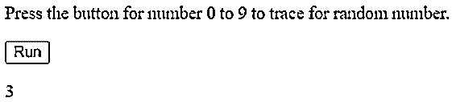
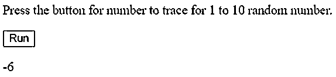
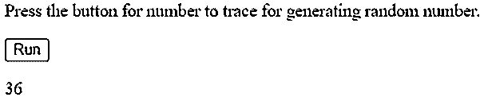
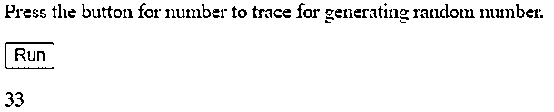

# JavaScript 随机

> 原文：<https://www.educba.com/javascript-random/>


## JavaScript Random 的定义

JavaScript random 方法是支持 ECMAScript 1 版本的 JavaScript 的一部分，它返回一个范围从 0 到 1 的随机数。作为 random 方法的一部分，返回的数字包括值 0，但不包括值 1。返回数字的范围应该是适当的，不需要太多的操作，由 math.random 方法使用。random 方法不包含任何参数，这意味着参数不会作为 JavaScript random 方法的一部分传递。JavaScript 的 random 方法比较合适，几乎可以兼容所有类型的浏览器，没有太大的阻碍。

**语法:**

<small>网页开发、编程语言、软件测试&其他</small>

```
Math.random()
```

语法流是这样的，JavaScript random()方法需要找到介于 0 到 1 的范围和值之间的数字，然后操作其他值的能力也使它能够生成一个随机数，该随机数可以用于立即创建大量应用程序。

### JavaScript 中的随机方法是如何工作的？

JavaScript 中的 random 方法是一种特殊的方法，用于生成随机数，该随机数将在某个时间点用于与随机整数目的相关的所有操作和计算。刚刚生成的随机整数用于返回随机数，这些随机数将使用 JavaScript 中的参数进一步传递。

让我们看看 JavaScript 的实际工作流程，如下所示:

*   随机方法包括 JavaScript 中的 Math.random 方法，它在 JavaScript 随机方法中起着举足轻重的作用。
*   random()方法有助于生成一些随机整数，用于使整数按照所需的格式工作。
*   调用 math.random()函数后的返回类型包括返回一个从 0 到 1 的随机数，其中 0 值将用于包含该值的随机数，而 1 值将排除该值。
*   使用 Math.random()函数创建和生成适当的函数有很好的可重用性，该函数将用于生成所有带整数的随机数。
*   Math.random 函数的最佳特性或优点是它能够创建和生成随机数，尤其是在实现任何游戏应用程序或任何基于数字的应用程序时。
*   默认情况下，JavaScript random 使用 JavaScript math()方法，该方法返回具有较高值的数字，然后返回具有值 0 和 1 的随机数，其中值 0 包含在内，另一个值 1 位于较低端，这表示它需要被排除在外。
*   不需要从 JavaScript 的 random 方法()传递额外的参数或外部参数。
*   几乎所有的 web 浏览器都兼容并支持 JavaScript random()方法，不像其他方法有一些优先级或者只支持很少的优先级，并且不支持其他浏览器或者与其他浏览器不兼容。
*   ECMAScript1 的 JavaScript 版本轻松灵活地支持该函数。
*   不太需要或者说强制要求它只需要生成随机整数，而生成的数字可以是随机浮点数或者可以是伪随机数，这取决于与伪随机数一起提供的输入类型，该伪随机数相应地被生成。
*   此外，任何实现都首先选择初始种子值，然后生成随机数算法。用户可以随时选择、操作或重置该值。
*   即使就复杂性而言，随机函数也没有多少复杂性，它始终是常数。

### JavaScript Random 的例子

下面是一些例子:

#### 示例#1

这个程序演示了使用 math.random 方法和 math.floor 方法生成随机数，然后根据生成随机数的要求进行操作，如输出所示。

**代码:**

```
<!DOCTYPE html>
<html>
<body>
<p>Press the button for number 0 to 9 to trace for random number.</p>
<button onclick="a_functn()">Run</button>
<p id="demo_1"></p>
<script>
function a_functn() {
var z_i = Math.floor((Math.random() /9) + 3);
document.getElementById("demo_1").innerHTML = z_i;
}
</script>
</body>
</html>
```

**输出:**




#### 实施例 2

这个程序演示了使用 math.random 方法和 math.floor 方法生成随机数，然后根据生成随机数的要求进行操作，如输出所示。

**代码:**

```
<!DOCTYPE html>
<html>
<body>
<p>Press the button for number to trace for 1 to 10 random number.</p>
<button onclick="k_functn()">Run</button>
<p id="demo_2"></p>
<script>
function k_functn() {
var y_u = Math.floor((Math.random() * 12) - 6);
document.getElementById("demo_2").innerHTML = y_u
}
</script>
</body>
</html>
```

**输出:**




#### 实施例 3

这个程序演示了使用 math.random 方法和 math.floor 方法生成随机数，然后根据生成随机数的要求进行操作，如输出所示。

**代码:**

```
<!DOCTYPE html>
<html>
<body>
<p>Press the button for number to trace for generating random number.</p>
<button onclick="m_functn()">Run</button>
<p id="demo_4"></p>
<script>
function m_functn() {
var zo_1 = Math.floor((Math.random() * 100) + 6);
document.getElementById("demo_4").innerHTML = zo_1
}
</script>
</body>
</html>
```

**输出:**




#### 实施例 4

这个程序演示了使用 math.random 方法和 math.floor 方法生成随机数，然后根据生成随机数的要求进行操作，如输出所示。

**代码:**

```
<!DOCTYPE html>
<html>
<body>
<p>Press the button for number to trace for generating random number.</p>
<button onclick="o_functn()">Run</button>
<p id="demo_4"></p>
<script>
function o_functn() {
var ho_1 = Math.floor((Math.random() * 50) + 3);
document.getElementById("demo_4").innerHTML = ho_1
}
</script>
</body>
</html>
```

**输出:**




**Note**: On all the above examples it is true that clicking on the run button generates various values ranging from 0 to 10 or anything which is specified all the values or number generated is varied and can be different which can be seen after clicking on run many times.

### 优势

*   每当需要适当地生成随机数来创建一个合适的函数，然后传递 Math.random()函数来使用和生成所有有目的的随机整数时，这是非常有利的。
*   这种方法在创建基于数字和操作的应用程序方面非常有用，例如游戏应用程序、计算器等。其中随机数的产生起着非常关键的作用。

### 结论

javaScript random()方法是一种非常通用和灵活的方法，在生成随机数和使用随机数时受到程序员的欢迎，因为它减少了程序员在实现包含随机数的应用程序时面临的样板文件或复杂性。

### 推荐文章

这是一个 JavaScript Random 的指南。在这里，我们还讨论了 javascript 中随机方法的定义和工作原理，并给出了例子和代码实现。您也可以看看以下文章，了解更多信息–

1.  [JavaScript 中的随机数生成器](https://www.educba.com/random-number-generator-in-javascript/)
2.  JavaScript 中的[对象](https://www.educba.com/object-in-javascript/)
3.  [JavaScript 中的原始数据类型](https://www.educba.com/primitive-data-types-in-javascript/)
4.  [JavaScript 设置类](https://www.educba.com/javascript-set-class/)


