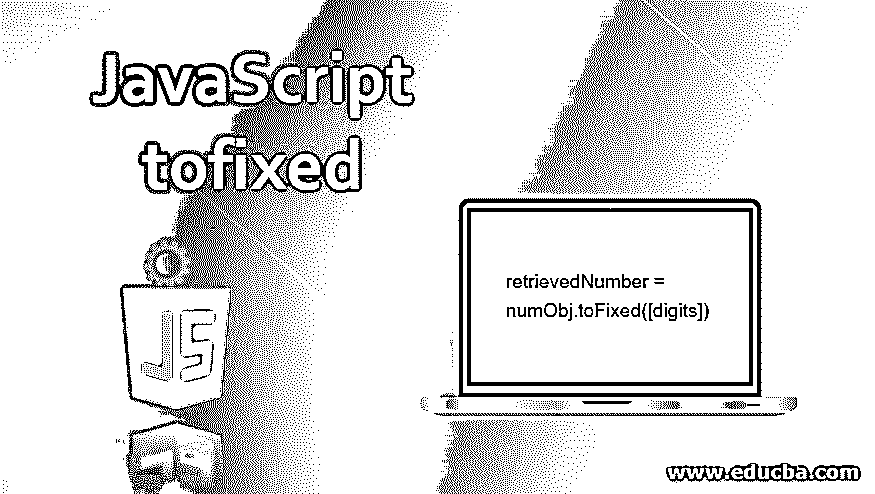
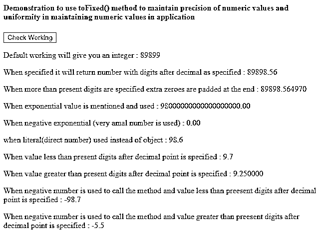
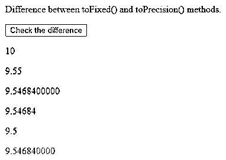

# JavaScript tofixed

> 原文：<https://www.educba.com/javascript-tofixed/>




## JavaScript tofixed 简介

我们经常感到有必要限制浮点数或大小数的小数位数。例如，当我们显示数量、价格、重量等时。在处理数值时，为了保持应用程序的一致性，我们需要保持特定数值的精度。在 javascript 中，当我们处理数字时，我们被提供了一个名为 toFixed()的方法，它只用于数值和对象。toFixed()方法帮助我们指定在表示数字对象的值时希望保留的位数。

在本文中，我们将研究如何使用 javascript 的 toFixed()方法，根据我们的需要，在特定精度内保持十进制数值表示的一致性。让我们首先研究一下这个方法的语法。

<small>网页开发、编程语言、软件测试&其他</small>

### JavaScript tofixed 语法

下面是提到的语法:

```
retrievedNumber = numObj.toFixed([digits])
```

#### 1.数字

它表示在显示和操作数字对象时，小数点后要保留的位数。它可以是 0 到 20 之间的任何值。如果没有提到，那么默认情况下，它被认为是零，结果数字对象将是一个整数。

#### 2.检索号码

这个方法的返回值是传递的数字对象的字符串表示形式，遵循定点表示法。

#### 3.例外

toFixed()方法可能会抛出两个异常，即范围错误和类型错误。当我们用来调用 toFixed()方法的 number 对象太大或太小时，就会导致范围错误。而当使用的数字对象不是数字格式(如字母数字串或某些符号值或特殊字符)时，就会出现类型错误。

ToFixed()方法通常返回传递的数字对象的字符串表示形式，其中包含以非指数格式作为参数传递给它的相同位数。如有必要，将对结果值进行舍入，如有必要，将填充额外的零，以返回具有特定位数的数字。当用于调用 toFixed()方法的 numeric 对象的绝对值超过 1e+21 时，那么 javascript 自动调用 Number.prototype.toString()方法，将最终的字符串转换成指数格式。

### 如何在 JavaScript 中使用 tofixed？

让我们借助一个例子来看看如何使用 toFixed()方法。

**代码:**

```
<!DOCTYPE html>
<html>
<body>
<h4>Demonstration to use toFixed() method to maintain precision of numeric values and uniformity in maintaining numeric values in application </h4>
<button onclick="toFixedWorking()">Check Working</button>
<p id="demo1"></p>
<p id="demo2"></p>
<p id="demo3"></p>
<p id="demo4"></p>
<p id="demo5"></p>
<p id="demo6"></p>
<p id="demo7"></p>
<p id="demo8"></p>
<p id="demo9"></p>
<p id="demo10"></p>
<script>
function toFixedWorking() { let numObj = 89898.56497
let result1 = numObj.toFixed()
document.getElementById("demo1").innerHTML = "Default working will give you an integer : "
+ result1;
let result2 = numObj.toFixed(2)
document.getElementById("demo2").innerHTML = "When specified it will return number with digits after decimal as specified : " + result2;
let result3 = numObj.toFixed(6)
document.getElementById("demo3").innerHTML = "When more than present digits are specified extra zeroes are padded at the end : " + result3;
let result4 = (0.98e+20).toFixed(2)
document.getElementById("demo4").innerHTML = "When exponential value is mentioned and used : " + result4;
let result5 = (2.21e-10).toFixed(2)
document.getElementById("demo5").innerHTML = "When negative exponential (very amal number is used) : " + result5;
let result6 = 98.6.toFixed(1)
document.getElementById("demo6").innerHTML = "when literal(direct number) used instead of object : " + result6;
let result7 = 9.65.toFixed(1)
document.getElementById("demo7").innerHTML = "When value less than present digits after decimal point is specified : " + result7;
let result8 = 9.25.toFixed(6)
document.getElementById("demo8").innerHTML = "When value greater than present digits after decimal point is specified : " + result8;
let result9 = -98.652.toFixed(1)
document.getElementById("demo9").innerHTML = "When negative number is used to call the method and value less than preesent digits after decimal point is specified : " + result9;
let result10 = (-5.5).toFixed(1)
document.getElementById("demo10").innerHTML = "When negative number is used to call the method and value greater than preesent digits after decimal point is specified : " +result10;
}
</script>
</body>
</html>
```

单击“检查工作”按钮后，上述代码的输出如下




有时，当我们使用浮点数时，我们会得到意想不到的结果，因为所有的浮点数不能总是以二进制形式表示，这会导致不正确的结果。例如，这会返回 false，0.5 + 0.3 = 0.8。

从上面我们转换 2.21e-10 的例子可以看出)。toFixed(2)则结果为 0.0 值。

### toFixed()和 toPrecision()方法之间的区别

toFixed()方法在不使用任何参数的情况下返回表示小数点前数字的整数值，而 toPrecision()方法在不指定参数的情况下返回具有相当大十进制值的数字的值。当我们指定的参数值小于数字中的位数时，toFixed()方法返回参数中指定的小数点后的位数，而 toPrecision()方法返回参数中指定的整数。这意味着，对于 toFixed()方法，参数的位数从小数点后开始计数，而对于 toPrecision()方法，从小数点前的第一个数字开始计数。当指定的参数大于小数点后的位数时，我们必须在填充时添加额外的零，这种情况也会发生。

**代码:**

```
<!DOCTYPE html>
<html>
<body>
<p>Difference between toFixed() and toPrecision() methods.</p>
<button onclick="myFunction()">Check the difference</button>
<p id="demo1"></p>
<p id="demo2"></p>
<p id="demo3"></p>
<p id="demo4"></p>
<p id="demo5"></p>
<p id="demo6"></p>
<script>
function myFunction() {
var sampleNumber = 9.54684;
var defaultVal = sampleNumber.toFixed(); document.getElementById("demo1").innerHTML = defaultVal;
var fixedVal = sampleNumber.toFixed(2); document.getElementById("demo2").innerHTML = fixedVal;
var fixedValGreater = sampleNumber.toFixed(10); document.getElementById("demo3").innerHTML = fixedValGreater;
var defaultVal1 = sampleNumber.toPrecision(); document.getElementById("demo4").innerHTML = defaultVal1;
var fixedVal1 = sampleNumber.toPrecision(2); document.getElementById("demo5").innerHTML = fixedVal1;
var fixedValGreater1 = sampleNumber.toPrecision(10); document.getElementById("demo6").innerHTML = fixedValGreater1;
}
</script>
</body>
</html>
```

单击“检查差异”按钮后，上述示例的输出如下




### 推荐文章

这是一个 JavaScript tofixed 的指南。这里我们讨论 JavaScript tofixed 的语法以及 tofixed()和 toPrecision()方法之间的区别。您也可以看看以下文章，了解更多信息–

1.  [reduce()函数 JavaScript](https://www.educba.com/reduce-function-javascript/)
2.  [JavaScript 数组串联](https://www.educba.com/javascript-array-concat/)
3.  [三元运算符 JavaScript](https://www.educba.com/ternary-operator-javascript/)
4.  [要浮动的 JavaScript 字符串](https://www.educba.com/javascript-string-to-float/)


