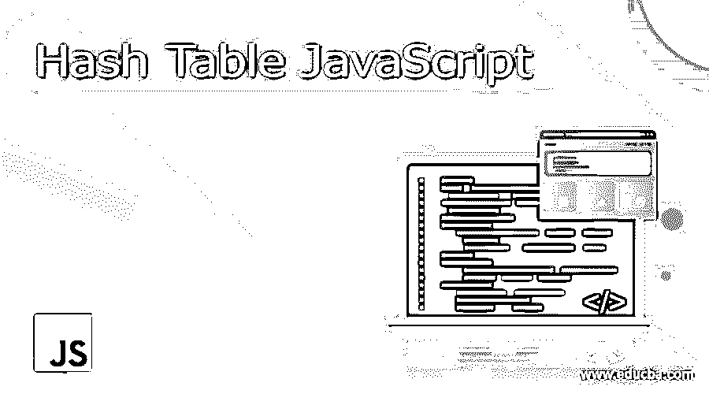
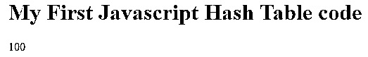

# 哈希表 JavaScript

> 原文：<https://www.educba.com/hash-table-javascript/>




## 哈希表 JavaScript 的定义

哈希表是一种基本上将键映射到值的数据结构。它以关联的方式存储数据。在哈希表中，关联键的每个值都存储在一个特定的索引中，这个索引是通过一些算术运算生成的。这种数据结构使得插入、删除和搜索操作非常有效，不管数据有多大。它使用数组作为存储介质，并使用哈希函数来生成索引。散列函数将密钥作为输入，并产生存储相应值的索引。

**语法:**

<small>网页开发、编程语言、软件测试&其他</small>

如上所述，哈希表使用哈希函数，该函数获取关键字并产生索引，关键字的特定值将存储在这些索引处。哈希函数可以通过多种方式实现。这取决于程序员使用的特定算法。

为了用 Javascript 创建哈希表，需要 hash 类、Hash 函数和实现键/值对的方法。下面给出的是 Javascript 中哈希表的基本语法:

**类哈希表:**

```
class HashTab{
constructor() {
this.size= 0;
this.items = {};
}
}
```

**哈希函数:**

```
function hashfunc(key)
{
return key% this.size; // this function can be anything
}
```

**实现键/值对的函数:**

```
add(key, value)
{
const index = this.hashfunc();
// function to add the key / value pairs
//logic to handle some condition of collisions
if (some condition)
{
this.items[index];
}
this.items[index][key]= value;
}
```

### Javascript 中的哈希表是如何工作的？

让我们详细了解一下 JavaScript 中哈希表的工作原理:

1.首要任务是使用实现某些算法的散列函数来转换索引/散列中的键值。这些索引将存储各个键的值。索引的值取决于哈希函数的实现。并非所有的哈希函数都是相同的。

例如，我们使用以下机制计算程序中的哈希值:

```
function hash func(key)
{
return key%9;
}
```

对于(键，值)对，哈希值为:

```
1\. (20,9) = 2
2\. (65,9) = 2
3\. (1,9) = 1
4\. (7,9) = 7
```

2.如果在特定索引处没有存储值(数组中的位置为空)，则存储相应键的值，并增加哈希表的大小。

3.但是如果存在冲突，即两个或更多个(键，值)对具有相同的散列值，如上述情况所示，其中(20，9)和(65，9)具有相同的散列 2，程序员使用冲突机制来处理这种情况。

已经定义了许多冲突解决算法，如线性探测、独立链接等。选择其中任何一个或者开发特定的一个，都取决于需求和程序员的选择。

### 例子

下面给出的是实现哈希表的 Javascript 代码，用于存储大学学生成绩的(键，值)对。实现搜索功能来搜索给定学生的分数。如果找不到该学生，它将返回“null”。

```
<!DOCTYPE html>
<html>
<body>
<h1>My First Javascript Hash Table code</h1>
<script>
//Hash Table class having the constructor defining all the variables
class HashTab {
constructor() {
this.len = 0;
this.size = 0;
//array ‘items’ to store the 'values' of the respective keys at the calculated indices
this.items = {};
}
//Hash Function implementing logic to calculate indices with the key passed
hashFunction(key) {
return key.toString().length % 9;
}
//Add function to n store the (key, values) according to the collision mechanism
addingValues(key, value) {
const hash_val = this.hashFunction(key);
if (!this.items.hasOwnProperty(hash_val)) {
this.items[hash_val] = {};
}
//check if the calculated index position is empty or not for collision resolution
if (!this.items[hash_val].hasOwnProperty(key)) {
this.len++;
}
this.items[hash_val][key] = value;
}
//Search function to search the value of the ‘key’ provided
searching(key) {
const hash_val = this.hashFunction(key);
if (this.items.hasOwnProperty(hash_val) && this.items[hash_val].hasOwnProperty(key)) {
return this.items[hash_val][key];
} else {
return null;
}
}
}
//creating the object ‘htab’ of the type hash table
const htab = new HashTab();
//adding marks of students to the hash table htab
htab.addingValues("Yashika", "300");
htab.addingValues("Gourank", "100");
htab.addingValues("Shipra", "250");
htab.addingValues("Shra", "270");
//searching the 'value' of the key 'Gourank'
document.write(htab.searching("Gourank"));
</script>
</body>
</html>
```

**输出:**




**说明:**

如上面在 Javascript 中的散列表的工作中所讨论的，在代码中遵循相同的步骤，即创建名为‘HashTab’的散列表的类，定义了变量和数组‘item’。

接下来，创建名为“hash function()”的散列函数，以便使用“key.toString()计算散列值。长度% 9 '(对于 Gourank，哈希值为 7)。

然后通过传递键和值来创建“addingValues()”函数。首先，获取哈希值并检查它是否已经存在，如果不存在，我们将把它存储在对象存储中。然后对散列进行第二次检查，如果它没有保存键，我们将存储(键，值)对并增加表的大小。

一旦哈希表的实现完成，搜索函数‘searching’就被实现来查找所提供的键值。它再次计算哈希值，并检查哈希值和该哈希值所需的密钥是否存在。如果找到，它将返回给定的键值，否则将返回' null '。

创建类“HashTab”“htab”的对象，并使用函数“adddingValues”通过传递(键，值)对来传递值。然后使用该键执行搜索。

### 结论

上面的描述清楚地解释了什么是哈希表，以及它在 Javascript 中是如何工作的。基本上，哈希表只不过是关联数组的实现。尽管许多编程语言支持关联数组，但 Javascript 不支持。在 Javascript 中，数组只使用编号索引，因此为了存储(键，值)对，在哈希函数的帮助下使用哈希表。

### 推荐文章

这是一个散列表 JavaScript 的指南。在这里，我们讨论定义，语法，哈希表在 Javascript 中的工作，以及示例和代码实现。您也可以看看以下文章，了解更多信息–

1.  [JavaScript 表单](https://www.educba.com/javascript-modulo/)
2.  [JavaScript 列表](https://www.educba.com/javascript-list/)
3.  [JavaScript MD5](https://www.educba.com/javascript-md5/)
4.  [JavaScript 获取 API](https://www.educba.com/javascript-fetch-api/)


