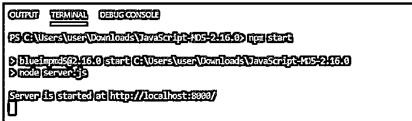
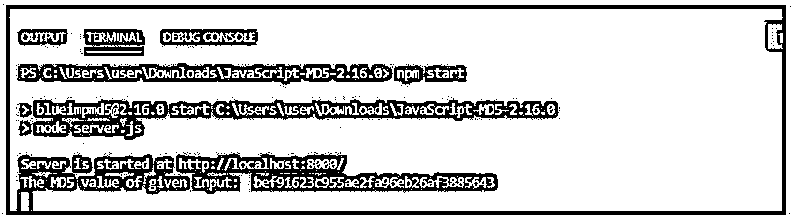
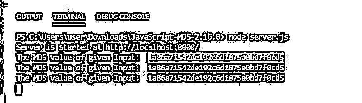
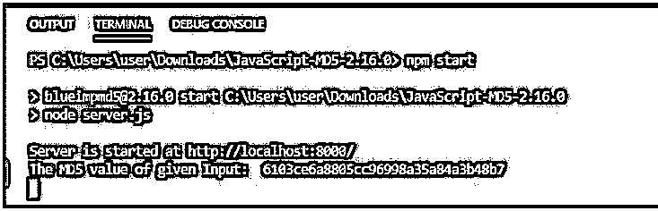

# JavaScript MD5

> 原文：<https://www.educba.com/javascript-md5/>


## JavaScript MD5 简介

JavaScript MD5 是一个实现 MD5 散列函数的库，用于计算任何文件的校验和。MD5 库正在使用 JavaScript 构建，可能在客户端或服务器端检查存档的数据。MD5 也称为消息摘要算法，用作哈希函数，产生 128 位哈希值。MD5 最初被设计用作加密散列函数，但从长远来看，它存在漏洞。

**语法:**

<small>网页开发、编程语言、软件测试&其他</small>

要安装 MD5 库 Blueimp-md5。

MD 是标准的单向函数，允许将输入数据映射到固定输出。所有 MD5 实现将从输入数据串产生 128 位散列值，表示为 32 位十六进制数。

**举例:**

```
sample => 38539843fe90jt289021ut54879230
var sampleHash = md5("sampleString");
```

### 装置

这里我们有两种类型的安装，客户端和服务器端安装需要完成。

#### 1.客户端安装

在 HTML 代码中包含简化的 MD5 JavaScript。

**代码:**

```
<script src="https://cdn.educba.com/md5.min.js"></script>
```

接下来，需要使用字符串作为参数调用 MD5 方法来计算十六进制编码的 MD5 散列字符串。

#### 2.服务器端安装

使用 NPM(节点包管理器)安装 blueimp-md5 包。

```
npm install blueimp-md5
```

需要有一个. Js 文件与下面提到的代码。

**代码:**

```
require("http").createServer(function (req, res) {
var md5   = require("blueimp-md5"),
url   = require("url"),
query = url.parse(req.url).query;
res.writeHead(200, {"Content-Type": "text/plain"});
// Computation and printing MD5 hash value
res.end(md5(query));
console.log(md("value"));
}).listen(8000, "localhost");
console.log("Server running at http://localhost:8000/");
```

在浏览器中点击 URL，我们可以看到哈希值:http://localhost:8000。

### JavaScript MD5 示例

我们将使用 md5.js 文件，该文件包含使用 blueimp-md5 库的逻辑要求。我们正在 NodeJs 中实现。这里我们将附上代码的 zip 文件夹。使用 npm install 安装所需的依赖项，并遵循上述步骤。

请解压缩并使用 Visual Studio 代码来运行应用程序。

**代码:**

**在 package.json 中**

```
{
"name": "blueimpmd5",
"version": "2.16.0",
"title": "JavaScript MD5",
"description": "JavaScript MD5 implementation. Compatible with server-side environments like Node.js, module loaders like RequireJS, Browserify or webpack and all web browsers.",
"keywords": [
"javascript",
"md5"
],
"homepage": "https://github.com/blueimp/JavaScript-MD5",
"author": {
"name": "Sebastian Tschan",
"url": "https://blueimp.net"
},
"contributors": [
{
"name": "Paul Johnston",
"url": "http://pajhome.org.uk/crypt/md5"
}
],
"repository": {
"type": "git",
"url": "git://github.com/blueimp/JavaScript-MD5.git"
},
"license": "MIT",
"devDependencies": {
"chai": "4",
"eslint": "7",
"eslint-config-blueimp": "2",
"eslint-config-prettier": "6",
"eslint-plugin-jsdoc": "25",
"eslint-plugin-prettier": "3",
"mocha": "7",
"prettier": "2",
"uglify-js": "3"
},
"eslintConfig": {
"extends": [
"blueimp",
"plugin:jsdoc/recommended",
"plugin:prettier/recommended"
],
"env": {
"browser": true,
"node": true
}
},
"eslintIgnore": [
"js/*.min.js",
"test/vendor"
],
"prettier": {
"arrowParens": "avoid",
"proseWrap": "always",
"semi": false,
"singleQuote": true,
"trailingComma": "none"
},
"scripts": {
"lint": "eslint .",
"unit": "mocha",
"test": "npm run lint && npm run unit",
"build": "cd js && uglifyjs md5.js -c -m -o md5.min.js --source-map url=md5.min.js.map",
"preversion": "npm test",
"version": "npm run build && git add -A js",
"postversion": "git push --tags origin master master:gh-pages && npm publish"
},
"files": [
"js/*.js",
"js/*.js.map"
],
"main": "js/md5.js",
"dependencies": {
"blueimp-md5": "^2.16.0"
}
}
```

这些都是 MD5 JavaScript 代码运行所需的依赖项。

**在 server.js 中**

```
require('http')
.createServer(function (req, res) {
//MD5 module is being extracted here
var md5 = require('./js/md5'),
// Use the below line of code if you have installed using NPM
// var md5 = require("blueimp-md5"),
url = require('url'),
query = url.parse(req.url).query
res.writeHead(200, { 'Content-Type': 'text/plain' })
// Calculate and print the MD5 hash of the url query:
// res.end(md5(query))
console.log("The MD5 value of given Input: ", md5('educba'));
})
.listen(8000, 'localhost')
console.log('Server is started at http://localhost:8000/')
```

**输出:**




在这里你可以看到服务器已经启动了 http://localhost:8000/，用 URL 点击浏览器，就可以得到输入数据的 MD5 值。

**输出:**




所以输入数据‘educba’的 MD5 值为 bef 91623 c 955 AE 2 fa 96 EB 26 af 3885643。

让我们将输入值更改为“401641”。

所以给定输入的 MD5 值是 1a 86 a 71542 de 192 C6 d 1875 a 0 BD 7 f 0 CD 5。

**输出:**




让我们将 console.log()代码行更改为:

**代码:**

```
console.log("The MD5 value of given Input: ", md5('Hi, this is JavaScript MD5 application'));
```

**输出:**




MD5 的重要性在于提高任何网站的安全性，哈希值被编码为不知道应用程序后端要使用的确切值。服务器对随机值进行 MD5 散列，它可以是一个密码，必须进行编码才能存储在后端数据库中。数据库被黑客攻击，用户可以通过它找到密码。因此，使用 MD5，这些个人数据可以进行安全编码。

### 结论

我们以“JavaScript MD5”作为文章的结论，尽管 MD5 现在被认为是不安全的，因为不太安全。出现了更安全的函数，如 SHA2 或 SHA3，而不是 MD5。我们已经看到了 MD5 是如何通过安装在 package.json 中的 MD5 库包实现的，因为我们使用的是 NodeJs。更好的安全选项之一是使用散列函数的 Crypto.js JavaScript 实现。

### 推荐文章

这是一个 JavaScript MD5 的指南。这里我们分别讨论 JavaScript MD5 的介绍、安装和示例。您也可以看看以下文章，了解更多信息–

1.  [JavaScript object.is()](https://www.educba.com/javascript-object-is/)
2.  [JavaScript 动画](https://www.educba.com/javascript-animation/)
3.  [JavaScript 数组包含](https://www.educba.com/javascript-array-contain/)
4.  [JavaScript elseIf](https://www.educba.com/javascript-elseif/)


