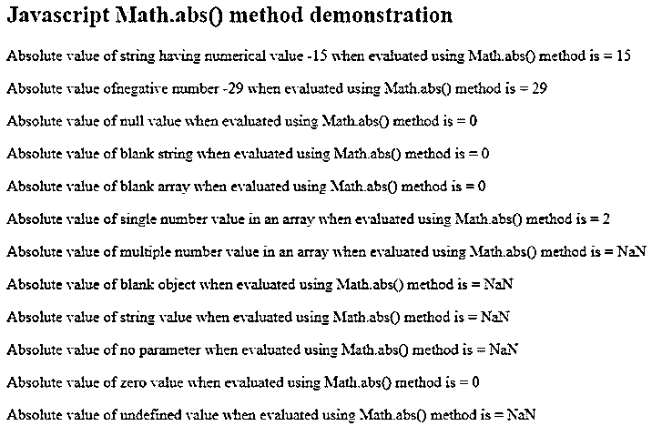

# JavaScript 绝对值

> 原文：<https://www.educba.com/javascript-absolute-value/>


## JavaScript 绝对值简介

Javascript absolute 是 Javascript 中 Math 对象的方法，它帮助我们检索数字的绝对值。无论传递的数字是正数还是负数，Math.abs()函数总是返回不带负号的等价数值。这意味着不管我们传递的是正数还是负数，它总是返回等价的正数。当 0(零)数被传递给 Math.abs()函数时，它将返回零值本身。Math.abs()方法是从 Javascript 版本的 ECMAScript 1 版本引入并开始使用的。在这篇文章中，我们将学习 Math.absolute 函数，它的语法，用法，工作原理，以及一些相关的例子。

**语法:**

<small>网页开发、编程语言、软件测试&其他</small>

```
Math.abs(numericalValue);
```

Javascript 绝对函数的语法定义如下:

数学是 Javascript 中存在的对象，其中定义了多个函数和属性来帮助执行各种数学运算。abs 是数学对象中的一个函数，它是静态方法。因此，无论何时，当你想使用 abs()函数时，你都需要在 abs()方法前用。如 math . ABS()；

*   **numericalValue** :要取绝对值的任意数字。
*   **ReturnValue** :作为参数传递给 abs()函数的任意 numericalValue 的绝对值。

### JavaScript 绝对值的工作和使用

Math 是 javascript 中的对象，而不是构造函数，而 abs()是它的静态方法之一。因此，我们总是使用 Math.abs()方法来使用 absolute 方法。每当使用具有两个或更多元素的数组或空对象时，或者如果将非数字字符串作为参数提供给 Math.abs()方法，或者甚至如果将空变量或未定义的变量作为参数提供给 abs()方法，则绝对函数的返回值是 Nan，它代表非数字值。

如果我们将空数组或空字符串甚至空值作为参数传递给 Math.abs()方法，它将返回零(0)值作为输出。在将非零正值或负值作为参数传递的所有其他情况下，Math.abs()函数将返回等效的正数值。

### JavaScript 绝对值示例

让我们考虑一个示例，该示例将涵盖所有可能类型的参数值，您可以在下面的示例中将这些参数值作为参数传递给 Math.abs()方法:

**代码:**

```
<!DOCTYPE html>
<html>
<body>
<h2>JavascriptMath.abs() method demonstration</h2>
<p id="demo1"></p>
<p id="demo2"></p>
<p id="demo3"></p>
<p id="demo4"></p>
<p id="demo5"></p>
<p id="demo6"></p>
<p id="demo7"></p>
<p id="demo8"></p>
<p id="demo9"></p>
<p id="demo10"></p>
<p id="demo11"></p>
<p id="demo12"></p>
<script>
// Any negative or positive number in the string format
document.getElementById("demo1").innerHTML = "Absolute value of string having numerical value -15 when evaluated using Math.abs() method is = "+ Math.abs('-15');
// Any negative number
document.getElementById("demo2").innerHTML = "Absolute value ofnegative number -29 when evaluated using Math.abs() method is = "+ Math.abs(-29);
// null value
document.getElementById("demo3").innerHTML = "Absolute value of null value when evaluated using Math.abs() method is = "+ Math.abs(null);
// blank string
document.getElementById("demo4").innerHTML = "Absolute value of blank string when evaluated using Math.abs() method is = "+ Math.abs('');
// blank array
document.getElementById("demo5").innerHTML = "Absolute value of blank array when evaluated using Math.abs() method is = "+ Math.abs([]);
//Array containing single numerical value in it
document.getElementById("demo6").innerHTML = "Absolute value of single number value in an array when evaluated using Math.abs() method is = "+ Math.abs([2]);
//Array containing Multiple Numbers in it as elements
document.getElementById("demo7").innerHTML = "Absolute value of multiple number value in an array when evaluated using Math.abs() method is = "+ Math.abs([12,23]);
// Blank Object
document.getElementById("demo8").innerHTML = "Absolute value of blank object when evaluated using Math.abs() method is = "+ Math.abs({});
// Any string value
document.getElementById("demo9").innerHTML = "Absolute value of string value when evaluated using Math.abs() method is = "+ Math.abs('string');
// With no parameter value
document.getElementById("demo10").innerHTML = "Absolute value of no parameter when evaluated using Math.abs() method is = "+ Math.abs();
// With 0 (zero) as the parameter value
document.getElementById("demo11").innerHTML = "Absolute value of zero value when evaluated using Math.abs() method is = "+ Math.max(0);
// With undefined value
document.getElementById("demo12").innerHTML = "Absolute value of undefined value when evaluated using Math.abs() method is = "+ Math.max(undefined);
</script>
</body>
</html>
```

**输出:**




**说明:**从上面的输出我们可以观察到，所有的正/负数值都返回其等价的正值作为绝对值。在零的情况下，null 或空白字符串或空白数组作为 Math.abs()方法的参数将返回零值(0)作为输出。而如果传递的参数是一个数组，有多个数字作为元素，空对象，或者字符串值不能推导为数值，或者参数未定义或留空，那么它将返回非数值的 NaN。

### 结论

javascript 中使用 Math.abs()方法获取传递的整数值的绝对值。我们在使用它的时候需要小心，因为有时使用了不合适的值，如数组、字符串、对象等，那么它可能会导致不合适的输出。我们总是需要像在 Math.abs()方法中一样，通过使用 Math 关键字 success 来调用 abs()函数。此外，在您的环境中使用 Math.abs()函数时，我们需要考虑浏览器兼容性和对它的支持。这个方法是在 Javascript 版本的 ECMAScript 1 版本中引入的，以供使用。

### 推荐文章

这是一个 JavaScript 绝对值的指南。这里我们讨论 javascript 绝对值的介绍、工作和使用，以及一个例子和它的代码实现。您也可以看看以下文章，了解更多信息–

1.  [JavaScript onfocus](https://www.educba.com/javascript-onfocus/)
2.  [JavaScript z-index](https://www.educba.com/javascript-z-index/)
3.  [JavaScript Minify](https://www.educba.com/javascript-minify/)
4.  [JavaScript 随机](https://www.educba.com/javascript-random/)


