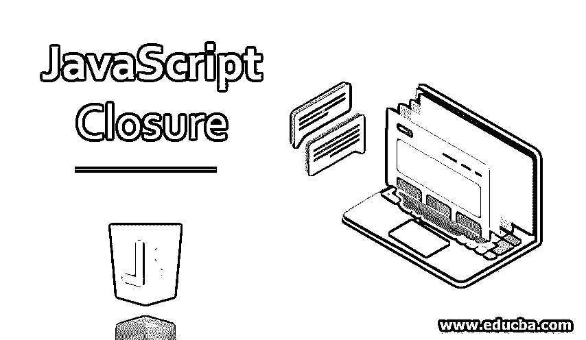
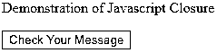
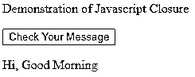
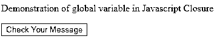
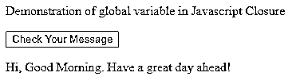
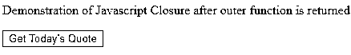
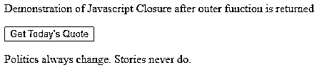
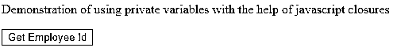
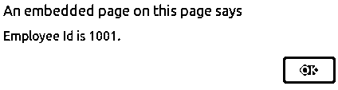
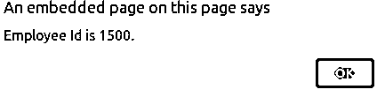

# JavaScript 闭包

> 原文：<https://www.educba.com/javascript-closure/>




## JavaScript 闭包简介

在 javascript [编程语言中，我们有一个很棒且最常用的函数，名为](https://www.educba.com/what-is-a-programming-language/) closures。通过使用闭包，内部函数可以访问其主体内部外部函数的变量和参数。这打开了大量的可能性和好处，在这方面可以使用。为了理解闭包，需要知道 javascript 中[变量的范围。Javascript 闭包只在函数嵌套的时候才会出现。](https://www.educba.com/variables-in-javascript/)

闭包函数可以访问三个作用域链，即它的作用域、外部函数的作用域和全局变量的作用域。这意味着闭包函数可以访问在它的闭花括号{…}中定义的变量和参数，外部函数的变量和参数以及声明的全局变量。

<small>网页开发、编程语言、软件测试&其他</small>

### 实现 JavaScript 闭包的示例

让我们借助一个例子来看看这是如何实现的。

#### 示例#1

**代码:**

```
<!DOCTYPE html>
<html>
<body>
<p>Demonstration of Javascript Closure</p>
<button type="button" onclick="testClosure()">Check Your Message</button>
<p id="sampleDemoOfClosure"></p>
<script>
function displayMessage (param1, param2) { var outerVariable = "Hi, ";
function prepareGreetings () {
return outerVariable + param1 + " " + param2;
}
return prepareGreetings ();
}
function testClosure() {
var message = displayMessage ("Good", "Morning"); document.getElementById("sampleDemoOfClosure").innerHTML = message;
}
</script>
</body>
</html>
```

**输出:**




点击“检查您的消息”按钮后的输出如下。




在上面的代码中，prepareGreetings 方法可以访问 displayMessage 方法的变量 outerVariable 和 displayMessage 函数的参数，即其作用域中的 param1 和 param2。这里，displayMessage 是外部方法，prepareGreetings 是内部方法。

#### 实施例 2

可以使用 var、let 或 const 在所有函数之外定义全局变量，但是，任何没有使用 var、let 或 const 定义的变量在 javascript 中都是全局变量，可以出现在函数内部或外部，并且可以在整个窗口范围内访问。不像局部变量有其函数或块执行的生命周期，全局变量有一个生命周期，直到页面被丢弃或窗口被关闭或我们导航到其他页面。让我们借助一个例子来验证这一点。这里我们将修改上面的程序，添加一个全局字符串，并在内部函数中访问它。

**代码:**

```
<!DOCTYPE html>
<html>
<body>
<p>Demonstration of global variable in Javascript Closure</p>
<button type="button" onclick="testClosure()">Check Your Message</button>
<p id="sampleDemoOfClosure"></p>
<script>
var greeting="Have a great day ahead!"; function displayMessage (param1, param2) { var outerVariable = "Hi, ";
function prepareGreetings () {
return outerVariable + param1 + " " + param2+". "+greeting;
}
return prepareGreetings ();
}
function testClosure() {
var message = displayMessage ("Good", "Morning"); document.getElementById("sampleDemoOfClosure").innerHTML = message;
}
</script>
</body>
</html>
```

**输出:**




点击按钮后的输出如下，




#### 实施例 3

javascript 中的闭包或内部函数可以访问其外部函数的作用域链，即使在外部函数被返回之后。

让我们借助一个例子来看一看。

**代码:**

```
<!DOCTYPE html>
<html>
<body>
<p>Demonstration of Javascript Closure after outer function is returned</p>
<button type="button" onclick="testClosure()">Get Today's Quote</button>
<p id="sampleDemoOfClosure"></p>
<script>
function getQuote (storiesStatement) {
var politicsStatement = "Politics always change.";
function prepareQuote (realityStatement) {
return politicsStatement + storiesStatement + " " + realityStatement;
}
return prepareQuote;
}
function testClosure() {
var todaysQuote = getQuote (" Stories"); var message = todaysQuote (" never do.");
document.getElementById("sampleDemoOfClosure").innerHTML = message;
}
</script>
</body>
</html>
```

**输出:**




点击“获取今日报价”按钮后的输出是:




可以看到，getQuote 函数是在 todaysQuote 变量中收集值(内部函数)时返回的外部函数。之后，使用收集的变量 todaysQuote 调用闭包方法(即内部方法 prepare quote ), todays quote 返回包含外部函数的参数和变量的引用。

#### 实施例 4

闭包不存储外部变量的值，而是存储它们的引用。因此，外部变量甚至可以在闭包被调用之前被改变。这有助于我们使用 javascript 中的私有变量。

我们将看到一个借助闭包演示私有变量用法的例子。

**代码:**

```
<!DOCTYPE html>
<html>
<body>
<p>Demonstration of using private variables with the help of javascript closures</p>
<button type="button" onclick="testClosure()">Get Employee Id</button>
<p id="sampleDemoOfClosure"></p>
<script>
function employeeId () { var employeeId = 1001;
return {
getEmployeeID: function () { alert("Employee Id is "+employeeId+".");
},
setEmployeeID: function (currentId) { employeeId = currentId;
}
}
}
function testClosure() {
var employeeNo1 = employeeId (); employeeNo1.getEmployeeID(); employeeNo1.setEmployeeID(1500); employeeNo1.getEmployeeID();
}
</script>
</body>
</html>
```

**输出:**




单击“获取员工 Id”按钮后，上述代码的输出给出了两个警告，如下所示:







内部函数 getEmployeeID()和 setEmployeeID()帮助检索当前值并将其分配给雇员 ID 字段。首先，employeeId 用 1001 值初始化，因此在检索值时第一个警报给出消息“雇员 Id 是 1001”。当使用值 1500 调用内部方法闭包 setEmployeeId 时，外部函数范围的 EmployeeId 变量被更改，因此第二个警报返回“雇员 Id 是 1500”消息。

##### 闭包有时会导致错误

由于闭包可以访问其声明位置的外部函数的更新值，这可能会导致意外的行为，尤其是在使用 for 循环时。这些错误的发生是因为闭包可以访问变量的引用，而不是它们的值。然而，我们可以通过使用立即调用的函数表达式(IIFE)来避免这种错误的发生。使用直接调用的函数表达式来只传递变量或参数的值，而不是它的引用，这解决了使用带闭包的循环时的问题。

### 结论

这样，我们可以使用 javascript 闭包来实现数据隐藏、抽象和私有变量，从而实现封装。Javascript 闭包为我们提供了外部函数变量可访问性的巨大优势，因此可以被广泛使用。但是，在循环(如 for 循环)中使用它们时需要小心，以避免引用访问，并通过使用立即调用的函数表达式和闭包来启用值访问。

### 推荐文章

这是一个 JavaScript 闭包的指南。在这里，我们讨论 JavaScript 闭包的介绍和顶级示例以及代码实现。你也可以看看下面的文章来了解更多-

1.  [Javascript concat 方法](https://www.educba.com/javascript-merge-arrays/)
2.  [JavaScript 中的算术运算符](https://www.educba.com/arithmetic-operators-in-javascript/)
3.  [JavaScript 中的控制语句](https://www.educba.com/control-statement-in-javascript/)
4.  [JavaScript 设置类](https://www.educba.com/javascript-set-class/)


