# JavaScript 调试

> 原文：<https://www.educba.com/javascript-debugging/>

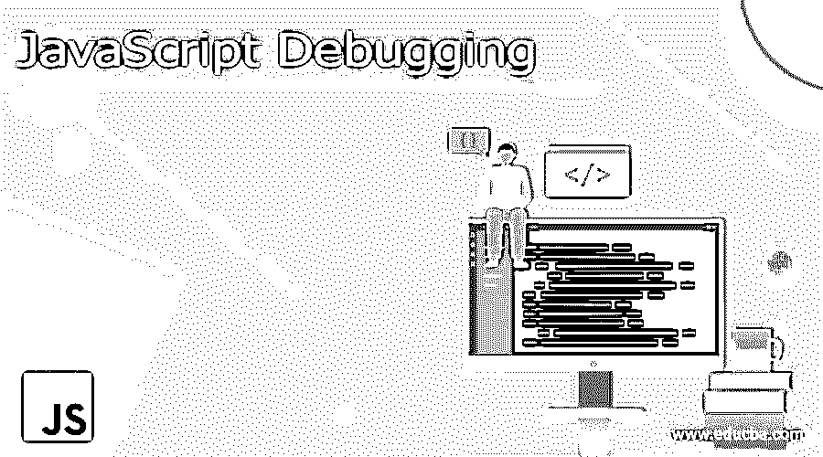


## JavaScript 调试简介

用任何工具或关键字一步步找出每个项目中的编码错误，就是所谓的调试。当我们编写任何新的编程语言代码时，都有可能遇到错误。这些错误可能属于语法错误或逻辑错误。很难找出错误出在哪里，因为我们可能有数十万行代码。直接看代码很容易算出 10 万行的误差吗？没有权利。因此，为了解决这种情况，我们在 JavaScript 中有一个特性调试。

### JavaScript 中的调试是如何工作的？

在 JavaScript 中，可以通过两种方式进行调试:

<small>网页开发、编程语言、软件测试&其他</small>

#### 1.调试器关键字

*   debugger 关键字用于 Firefox、Chrome、Opera、Bingo、Internet Explorer、Microsoft Edge 等浏览器。
*   根据功能问题，在该函数中保留 debugger 关键字并调试代码。
*   运行代码时，在执行整个代码之前，JavaScript 编译器会在 debugger 关键字处暂停执行。
*   暂停代码后，我们可以从那里一步一步地分析代码，找出实际的错误。

**Note**: To open the console in browsers like Firefox, Chrome, Opera, Bingo, Internet Explorer, Microsoft Edge, etc. then press F12 or right-click on the page and click on inspect menu item then go to the console tab.

**错误检查控制台标签**

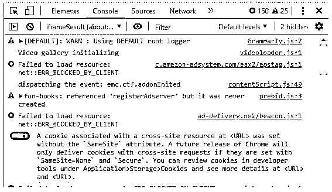


**语法:**

```
var variableName=value;
debugger; //declaring debugger keyword
for(let i=0;i<=10;i++) // some logic
{
//application code
}
```

**调试器模式:**

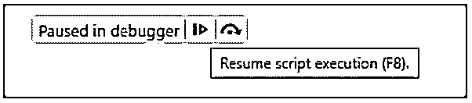


*   在我们的应用程序中使用 debugger 关键字后，按 F12 按钮并执行代码，然后我们得到如上图所示的调试器模式。
*   在调试器中暂停右侧蓝色按钮用于恢复(再次启动进程)代码。快捷键是 F8。

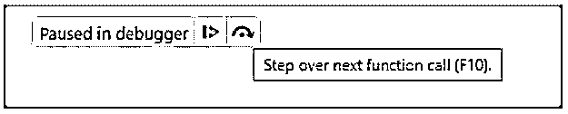


*   蓝色按钮的右侧是一个黑色按钮。它用于逐行移动光标，以找出错误或错误。快捷键是

#### 2.IDE 断点

*   在 eclipse、Net Beans 和 Visual Studio 等 ide 中使用断点来代替调试器关键字。
*   根据错误预测功能，我们应该保留断点。
*   断点使代码只在断点之间运行，而不是一次运行所有的应用程序，它通过忽略非错误行来节省时间。
*   借助 IDE 的断点，我们可以分析应用程序中的错误。

**eclipse IDE 中的断点:**

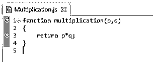


*   在上面的图像行中，1 和 3 有断点。

### Javascript 调试示例

下面是 JavaScript 调试的例子:

#### 示例#1

使用 debuggerCode 的 Armstrong 数。

**代码:**

```
<!DOCTYPE html>
<html>
<body>
<font color="red"><h1 align="center">Armstrong Number with Debugger</h1></font>
<script>
function armstrongNumberOrNot() {
document.write("Armstrong numbers between 100 to 500 are =><br>");
for (var p = 1; p < 10; ++p) {
for (var q = 0; q < 10; ++q) {
for (var r = 0; r< 10; ++r) {
debugger; //declaring debugger
var armstrongPower = (Math.pow(p, 3) + Math.pow(q, 3) + Math.pow(r, 3));//armstrong logic
var adding = (p * 100 + q * 10 + r);//adding the numbers for sum
if (armstrongPower == adding) {
document.write(armstrongPower+"<br>");
console.log(armstrongPower);
}
}
}
}
}
armstrongNumberOrNot();
</script>
</body>
</html>
```

**输出:**

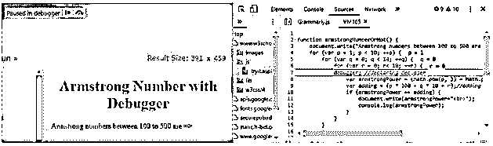


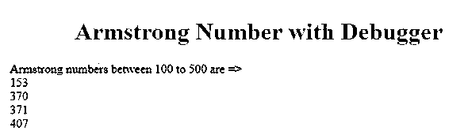


**说明:**

当我们按下 F12 并运行代码时，代码将进入如上所述的调试器模式。

#### 实施例 2

使用调试器调试素数。

**代码:**

```
<!DOCTYPE html>
<html>
<body>
<font color="brown"><h1 align="center">Prime Number with Debugger</h1></font>
<script>
function primeNumberOrNot() {
var number=7, temp = true;
for(var p = 2; p <= number - 1; p++)
if (number % p == 0) { //check prime or not
temp = false;
break;
}
//checking the number is prime or not
if (temp == true)
document.write(number + " is  PRIME number");
else
document.write(number + " is NOT PRIME number");
}
primeNumberOrNot();
</script>
</body>
</html>
```

**输出:**

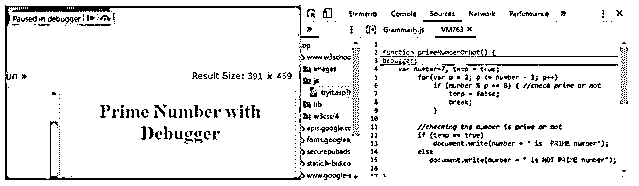


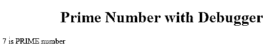


**说明:**

当我们按下 F12 并运行代码时，代码将进入如上所述的调试器模式。

#### 实施例 3

斐波那契数列通过使用调试器。

**代码:**

```
<!DOCTYPE html>
<html>
<body>
<font color="orange"><h1 align="center">Fibonacci Series with Debugger</h1></font>
<script>
var fibonacciNumbers = function (number)
{
if (number===1)
{
return [0, 1];
}
else
{
var series = fibonacciNumbers(number - 1);
debugger;
series.push(series[series.length - 1] + series[series.length - 2]);
return series;
}
};
var fibSeries=fibonacciNumbers(8);
document.write("Fibonacci series=>")
document.write(fibSeries);
</script>
</body>
</html>
```

**输出:**

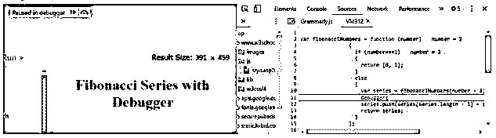


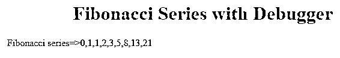


**说明:**

当我们按下 F12 并运行代码时，代码将进入如上所述的调试器模式。

#### 实施例 4

使用调试器反转字符串。

**代码:**

```
<!DOCTYPE html>
<html>
<body>
<font color="violet"><h1 align="center">Reverse String with Debugger</h1></font>
<script>
function reverseString(stringValue){
var reverse = "";
for(var p = stringValue.length - 1; p >= 0; p--)
{
debugger;
reverse=reverse+ stringValue.charAt(p);
}
return reverse;
}
var myString="Amardeep";
var reverseString=reverseString(myString);
document.write("Reverse of "+myString+" is "+reverseString);
</script>
</body>
</html>
```

**输出:**

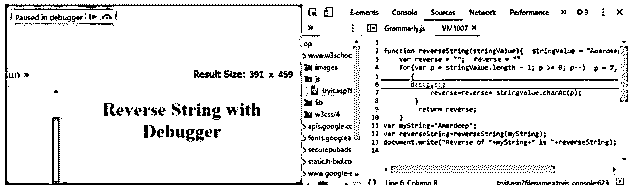


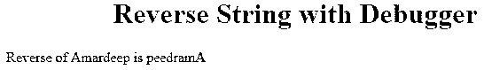


**说明:**

当我们按下 F12 并运行代码时，代码将进入如上所述的调试器模式。

### 结论

JavaScript 中的调试可以通过使用 debugger 关键字来完成。调试器用于通过将 Debugger 关键字保持在特定点来调试必要的代码。

### 推荐文章

这是 JavaScript 调试指南。这里我们讨论一下引言，JavaScript 中调试是如何工作的？还有例子。您也可以看看以下文章，了解更多信息–

1.  [JavaScript 关键字](https://www.educba.com/javascript-keywords/)
2.  [JavaScript 编译器](https://www.educba.com/javascript-compilers/)
3.  [Java 和 JavaScript](https://www.educba.com/java-and-javascript/)
4.  [反应原生架构](https://www.educba.com/react-native-architecture/)


