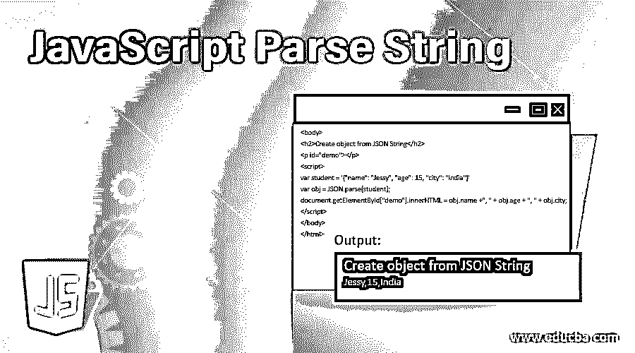
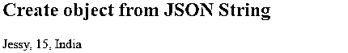
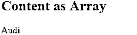
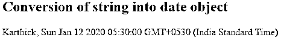
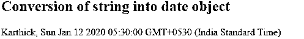
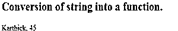

# JavaScript 解析字符串

> 原文：<https://www.educba.com/javascript-parse-string/>




## JavaScript 解析字符串简介

让我们看看解析，这意味着分析一组指令并将其转换为运行时环境可以理解和运行的格式。浏览器分析由一系列标记组成的文本以确定其结构，解析进一步基于标记构建数据结构。这些标记包括开始和结束标记、属性名和值，它们构成了文档树。这种 javascript 解析是在编译时或调用方法时完成的。

**语法:**

<small>网页开发、编程语言、软件测试&其他</small>

```
var variable_name = '{"variable1":"value", "variable2":”value”, "variable3":"value",…….}'
var object_name = JSON.parse(variable_name);
```

### JavaScript 如何解析字符串？

以下是解释:

**代码:**

```
<body>
<h2>Create object from JSON String</h2>
<p id="demo"></p>
<script>
var student = '{"name": "Jessy", "age": 15, "city": "India"}'
var obj = JSON.parse(student);
document.getElementById("demo").innerHTML = obj.name +", " + obj.age + ", " + obj.city;
</script>
</body>
</html>
```

**输出:**




**解释**:这里的 student 是一个包含学生数据的变量，使用 JSON 解析时，学生数据被赋给变量 obj，通过这个变量我们可以调用 obj 变量来显示数据。

### 实现 JavaScript 解析字符串的示例

使用 JSON.parse 对 JSON 派生的数组，方法返回 javascript 数组而不是对象。让我们考虑由汽车模型组成的 JSON 数组，我们将把内容作为数组传递给 JSON 对象。Json_demo_array.txt 是由汽车模型数据组成的内容文件。

[ “Ford”, “BMW”, “Audi”, “Fiat” ]

#### 示例#1

在检查 HttpRequest 的状态代码时，我们解析 JSON 并尝试显示数组的一个元素。我们使用 GET 方法从 json_demo_array.txt 文件中获取数据，在该文件中我们有要显示的内容。

**代码:**

```
<html>
<body>
<h2>Content as Array</h2>
<p id="demo"></p>
<script>
var xmlhttp = new XMLHttpRequest();
xmlhttp.onreadystatechange = function()
{
if(this.readyState == 4 &&this.status == 200)
{
var myArr = JSON.parse(this.responseText);
document.getElementById("demo").innerHTML = myArr[2];
}
};
xmlhttp.open("GET", "Json_demo_array.txt", true);
xmlhttp.send();
</script>
</body>
</html>
```

**输出:**




**解释:**在使用 JSON 解析日期时，有一些例外情况。我们需要把日期写成一个字符串，然后可以转换成一个日期对象

#### 实施例 2

**代码:**

```
<!DOCTYPE html>
<html>
<body>
<h2>Conversion of string into date object</h2>
<p id="demo"></p>
<script>
var text = '{"name" : "Karthick", "birth": "2020-01-12", "city": "Canada"}';
var obj = JSON.parse(text);
obj.birth = new Date(obj.birth);
document.getElementById("demo").innerHTML = obj.name + ", " + obj.birth;
</script>
```

**输出:**




**解释:**这里的‘var obj = new Date(obj . birth)’是指创建 Date 对象，并将 JSON 文本传递给 new 对象。

#### 实施例 3

参数 Json.parse()函数调用 reviver，它在返回值之前检查每个属性。现在让我们看看如何使用 reviver 函数

**代码:**

```
<html>
<body>
<h2>Conversion of string into date object</h2>
<p id="demo"></p>
<script>
var text = '{"name": "Karthick", "birth": "2020-01-12", "city": "Canada"}';
var obj = JSON.parse(text, function(key, value) {
if(key == "birth") {
return new Date(value);
} else {
return value;
}
} );
document.getElementById("demo").innerHTML = obj.name + ", " + obj.birth;
</script>
</body>
</html>
```

**输出:**




**解释:**在这里，我们将出生值作为(key，value)对与文本一起传递给 JSON。

#### 实施例 4

我们也不能把函数解析成 JSON，我们需要把它写成一个字符串，然后转换回函数。

**代码:**

```
<!DOCTYPE html>
<html>
<body>
<h2>Conversion of string into a function.</h2>
<p id= "demo"></p>
<script>
var text = '{"name": "Karthick", "age": "function() {return 45;}", "city": "Canada"};
var obj = JSON.parse(text);
obj.age = eval("(" + obj.age + ")");
document.getElementById("demo").innerHTML = obj.name + ", " + obj.age();
</script>
</body>
</html>
```

**输出:**




让我们看看这个解析器的结构。解析器由两部分组成:标记器和解析器。一些解析器不依赖于 Lexer，Lexer 被称为扫描器解析器。tokenizer/ lexer 和 parser 相继工作，即 tokenizer 扫描输入并产生匹配的标记，而 parser 反过来扫描标记并产生解析结果。

### 字符串原语和字符串对象

Javascript 在字符串原语、不可变数据类型和字符串对象之间有所不同。让我们看看如何初始化新字符串原语，

```
const stringPrimitive = "How are you?";
```

使用字符串对象初始化:

```
cosntstringObject = new String("How are you?");
```

*   为了确定运算符的值类型，我们使用“type of”。例如，typeofstringPrimitive 将字符串作为输出返回。在字符串对象的情况下，typeofstringObject 返回对象作为输出。
*   编程中的解析:java 中的解析，其中方法接受输入字符串，返回其他数据类型，以分割文件或其他可以存储或操作的输入数据。
*   可以使用 parseInt()函数解析一个整数，让我们考虑“756 ”,它被认为是一个字符值为 7，5，6 的字符串。Lexer 将该字符串转换为整数 756。考虑日期格式“yyyy-MM-dd”

```
SimpleDateFormat format = newSimpleDateFormat("yyyy-MM-dd");
Date date = format.parse("2020-06-02");
```

*   Yyyy 是年，–是一个文字，MM 是月，–另一个文字，dd 是日。Java 将数据串解析成预定义的部分，并识别解析函数输出数据对象以存储和操作数据串的部分。
*   像解析十六进制数或浮点数这样的小结构在整个语言中都有定义，但 java 仅限于整数、日期和浮点数。使用这些解析函数是因为用户输入大多是字符串形式，在转换成 java 日期类型之前，用户需要对其进行解析。当用户处理普通文本时会出现一个例外，在这种情况下，我们需要让文本保持原样，并使用字符串函数进行操作。

### 结论

在软件世界中，代码有语法，编程语言由形式语法定义，取一行代码，将其分成数据元素和数据操作符，即将源代码翻译成可执行代码。

由于 javascript 灵活且容错，并且语法解析器能够理解用户的需求，所以用户可以在声明前抛出变量。在全局环境中，用户甚至可以在不声明的情况下使用变量。字符串连接也可以用于整数，也可以将对象与原语进行比较，调用函数并且不传递任何参数。解析器还可以处理分号的自动插入。当一个函数被调用时，分号；在 return 语句后插入，结果返回 undefined。

### 推荐文章

这是一个 JavaScript 解析字符串的指南。在这里，我们讨论介绍，它是如何工作的，并举例说明如何实现正确的代码和输出。您也可以浏览我们的其他相关文章，了解更多信息——

1.  [JavaScript 中的指针](https://www.educba.com/pointers-in-javascript/)
2.  [JavaScript 字符串编号](https://www.educba.com/javascript-string-to-number/)
3.  [JavaScript 字符串格式](https://www.educba.com/javascript-string-format/)
4.  [JavaScript 字符串长度](https://www.educba.com/javascript-string-length/)


