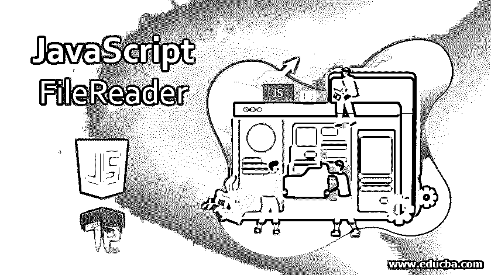
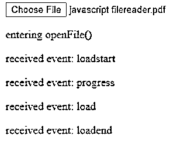
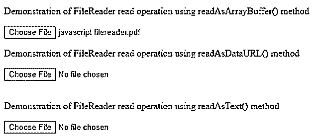
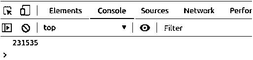
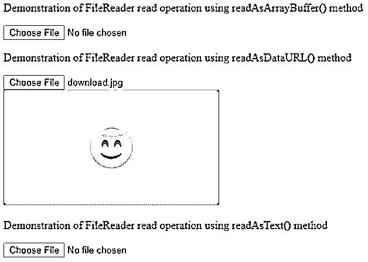
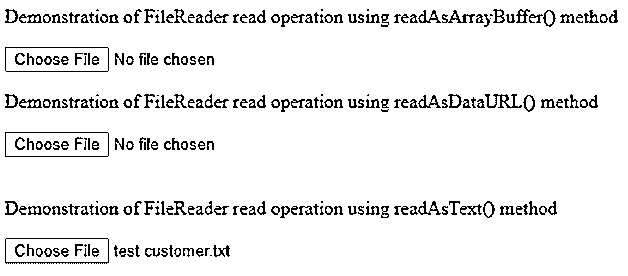

# JavaScript 文件阅读器

> 原文：<https://www.educba.com/javascript-filereader/>




## JavaScript 文件阅读器简介

在任何软件系统中，文件处理和文件操作都是非常重要的。文件读取是从用户的主机或远程系统的文件中读取内容或数据。在 web 应用程序中，我们有一个 FileReader 对象，它允许我们从用户的计算机或系统的文件或任何其他原始数据缓冲区中读取内容。在此期间，FileReader 使用要从中读取数据的文件或 Blob 对象。在本主题中，我们将学习 JavaScript Filereader，因为我们可以通过三种可能的方式获取文件对象

*   当使用<input>元素获取包含所选文件的文件列表对象时
*   使用拖放操作的数据传输对象
*   htmlcanvaselemont 的 mogetasfile _)API

重要的是要知道，我们只能以安全的方式从用户或远程系统中读取内容。我们永远无法使用 FileReader 通过文件的路径名来读取文件。如果跨域文件读取涉及使用 Javascript 中的路径名读取文件，我们将不得不使用 Ajax 在服务器端按照 CORS(跨源资源共享)权限读取文件。

<small>网页开发、编程语言、软件测试&其他</small>

**语法**

构造函数 FileReader()返回一个新构造的 FileReader 对象。

### FileReader 属性

FileReader 对象具有一些属性，这些属性告知该对象的状态或内容。所有这些都是只读属性，不能重新分配，只能检索。

**Error-**如果在读取文件时出现任何错误，则从 FileReader.error 属性返回 DOMException 对象。

**ready state**–该属性(FileReader.readyState)帮助我们确定 FileReader 对象的当前状态，该状态可以是 0、1 或 2，它们指定了下面提到的特定状态。

*   EMPTY–0–数据根本不加载，直到
*   加载–1–数据加载开始
*   DONE–2–数据读取操作成功

**Result–**filereader . Result 返回文件的内容，只有在成功完成文件读取后才能使用。返回数据的格式取决于读取操作的方法。

### 事件处理程序

下面是提到的事件处理程序

*   **FileReader . onabort**–每当读操作被强制中止时，我们就会得到 FileReader 对象的 on abort 事件，我们可以用它来处理中止事件。
*   **FileReader . onerror**–如果使用 FileReader 对象从文件中读取数据时出现错误，则会触发一个 on error 事件，该事件可用于处理和执行错误发生时的操作。
*   **file reader . onload**–当读取操作成功完成时，会触发 onload 事件，该事件可进一步用于处理 load 事件。
*   **filereader . onloadstart**–当读取操作开始时，我们得到该事件。
*   **filereader . onloadend**–当读取操作成功完成时，触发 onloadend 事件。
*   **filereader . onprogress**–当读取操作正在进行，并且正在从 Blob 内容中读取数据时，触发 on progress 事件。

我们可以使用 addEventListener 方法监听所有上述事件，因为 FileReader 本身是从 EventTarget 继承的。

**例子**

让我们看一个例子，看看它是如何工作的

**代码:**

```
<!DOCTYPE html>
<body>
<input type='file' onchange='openFileOperation(event)'>
<p id = "sample1" ></p>
<p id = "sample2" ></p>
<p id = "sample3" ></p>
<p id = "sample4" ></p>
<p id = "sample5" ></p>
<script>
var openFileOperation = function(event) { document.getElementById("sample1").innerHTML = 'entering openFile()'
var input = event.target;
var reader = new FileReader();
reader.onloadstart = function(event) { document.getElementById("sample2").innerHTML = 'received event: ' + event.type;
};
reader.onprogress = function(event) {
document.getElementById("sample3").innerHTML = 'received event: ' + event.type;
};
reader.onload = function(event) {
document.getElementById("sample4").innerHTML = 'received event: ' + event.type;
};
reader.onloadend = function(event) { document.getElementById("sample5").innerHTML = 'received event: ' + event.type;
};
reader.readAsDataURL(input.files[0]);
};
</script>
</body>
</html>
```

**输出:**


选择文件后，输出如下




### JavaScript 文件读取器的方法

学习 javaScript 文件阅读器的方法

*   **FileReader.abort():** 该方法中止或停止读取操作，并使 readyState 值为 DONE。
*   **filereader . readasarraybuffer():**它的 returns result 属性包含 ArrayBuffer 对象，一旦完成，该对象包含从开始读取的 Blob 中读取的所有内容。
*   **filereader . readasbinarystring():**它返回包含字符串的结果属性，该字符串包含从文件中读取内容的原始二进制数据，并且以 Blob 格式指定要读取的对象。
*   **filereader . readasdataurl():**它开始对 Blob 内容进行读取操作，并返回包含数据的结果属性，该数据是使用 URL 表示的文件数据。
*   **FileReader.readAsText():** 它从 Blob 文本开始读取操作，并返回包含具有文件内容的文本字符串的结果属性。我们还可以提到一个可选的编码名。

**例子**

让我们借助一个例子来研究上述所有方法对文件的读取。

**代码:**

```
<!DOCTYPE html>
<html>
<body>
<p>Demonstration of FileReader read operation using readAsArrayBuffer() method</p>
<input type='file' onchange='openFileReadAsArrayBuffer(event)'>
<p>Demonstration of FileReader read operation using readAsDataURL() method</p>
<input type='file' accept='image/*' onchange='openFileReadAsDataURL(event)'><br>

<p>Demonstration of FileReader read operation using readAsText() method</p>
<input type='file' accept='text/plain' onchange='openFileReadAsText(event)'><br>
<p id="demo"></p>
<script>
var openFileReadAsArrayBuffer = function(event) { var input = event.target;
var reader = new FileReader(); reader.onload = function(){
var arrayBuffer = reader.result;
console.log(arrayBuffer.byteLength);
};
reader.readAsArrayBuffer(input.files[0]);
};
var openFileReadAsDataURL = function(event) { var input = event.target;
var reader = new FileReader(); reader.onload = function(){ var dataURL = reader.result;
var output = document.getElementById('output2'); output.src = dataURL;
};
reader.readAsDataURL(input.files[0]);
};
var openFileReadAsText = function(event) { var input = event.target;
var reader = new FileReader(); reader.onload = function(){ var text = reader.result;
console.log(reader.result.substring(0, 200));
};
reader.readAsText(input.files[0]);
};
</script>
</body>
</html>
```

上面代码的输出解释如下。

当我们从第一个输入中选择文件时，它将文件读入一个数组缓冲区，读取文件的长度，即其数组缓冲区的长度，打印在控制台上。输出如下所示-




它的控制台价值是




当我们从第二个输入中选择文件时，所选择的图像文件被读取为 URL，并且可以在输入文件标签下看到。输出如下所示




当从第三个输入中选择文本文件时，浏览器上的输出如下




### 推荐文章

这是一个 JavaScript 文件阅读器的指南。这里我们讨论 JavaScript FileReader 的方法、属性和事件处理程序。您也可以看看以下文章，了解更多信息–

1.  [JavaScript 设计模式](https://www.educba.com/javascript-design-patterns/)
2.  [JavaScript 弹出框](https://www.educba.com/javascript-popup-box/)
3.  [JavaScript setInterval](https://www.educba.com/javascript-setinterval/)
4.  [JavaScript 光标](https://www.educba.com/javascript-cursor/)


