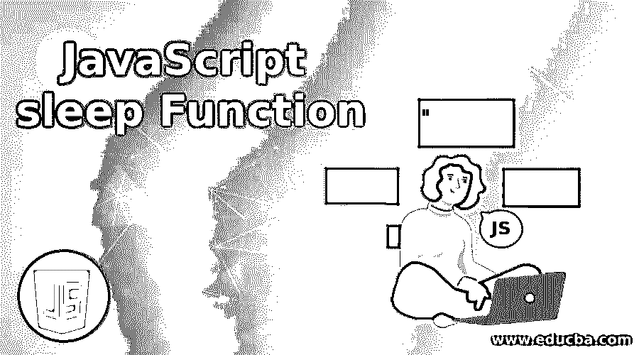
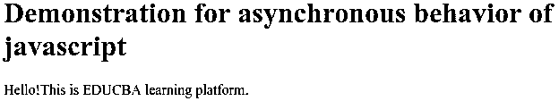
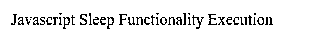
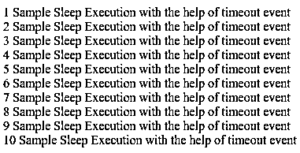
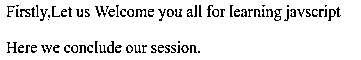
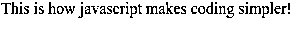
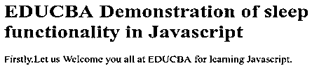
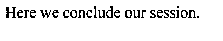

# JavaScript 睡眠功能

> 原文：<https://www.educba.com/javascript-sleep-function/>




## JavaScript 睡眠功能介绍

许多编程语言都提供了让特定线程休眠或暂停一段时间的功能。它们甚至为某些任务、方法或功能的执行提供这种功能。JavaScript 没有提供任何这样的 sleep 方法来延迟执行。但是我们可以在外部编写代码，用 JavaScript 获得这样的功能。JavaScript 的行为是异步的。因此，它承诺处理这种异步行为。根据具体情况，我们可以拒绝和解决要发送的承诺。除此之外，还有 async/await 函数，事实证明它们有助于在 JavaScript 中实现 sleep 类型的功能。为了理解 JavaScript 睡眠函数的概念，我们将通过与另一种同步语言的比较来讨论 JavaScript 的执行模型。Ruby 是一种同步执行的语言，但是当多线程出现时，ruby 有时会表现得不同步。考虑以下 ruby 代码:

**代码:**

<small>网页开发、编程语言、软件测试&其他</small>

```
require 'net/http'
require 'json'
sampleUrl = 'https://api.github.com/issues'
sampleUri = URI(sampleUrl)
sampleResponse = JSON.parse(Net::HTTP.get(sampleUri))
puts sampleResponse['message']
puts "Hey!Let us have a look on message."
```

**输出:**


其中“Not Found”是存储在上述 Github URL 的 issues 部分中的消息字符串。考虑 javascript 中的同一个例子，

**代码:**

```
<!DOCTYPE html>
<html>
<head>
<h1>Demonstration for asynchronous behavior of javascript</h1>
</head>
<body>
<script>
fetch('https://api.github.com/issues')
.then(sampleResponse => sampleResponse.json())
.then(sampleJson => document.write(sampleJson.message));
document.write("Hello!This is EDUCBA learning platform.");
</script>
</body>
</html>
```

**输出:**




然后它立即给出如下输出:


正如我们在 ruby 中看到的，首先从 URL 获取数据，然后显示消息属性值“Not Found ”,之后显示静态消息“嘿！让我们看一看消息。”在 JavaScript 的情况下，首先发送获取 URL 数据的请求，JavaScript 不等待响应，而是执行第二条语句，在控制台上显示“Hello ”,当发送请求的响应到达时，它显示消息值“Not Found”。请参考 URL https://api.github.com/issues 以获取要显示的数据。在这里，我们可以观察 JavaScript 的异步行为，因为它在执行时不等待任何东西，而是继续工作。

**语法:**

```
sleep(delayTime in milliseconds).then(() => {
//code to be executed
})
```

我们可以使用 sleep 以及 await 和 async 功能来获得执行之间的延迟或暂停。下面是使用相同的语法。

```
const myDelayedFunction = async () => {
await sleep(delayTime in milliseconds)
//code to be executed
}
myDelayedFunction()
```

await 函数有助于等待或暂停异步函数中的执行，以检索承诺，无论是解决还是拒绝，直到异步函数的执行。上述语法只是一个参考，说明我们如何通过在代码中编写这样的函数来定义和实现睡眠功能。实际的睡眠实现可以通过使用 JavaScript 中的超时事件来实现。这可以通过以下方式实现

**代码:**

```
<!DOCTYPE html>
<html>
<body>
<script>
function mySleepFunction(delayTime) {
return new Promise(resolve => setTimeout(resolve, delayTime));
}
async function myDelayedFunction() {
document.write('Javascript Sleep Functionality Execution');
for (let counter = 1; counter <11 ; counter++) {
await mySleepFunction(5000);
document.write( counter +" "+"Sample Sleep Execution with the help of timeout event" + " " + "</br>");
}
}
myDelayedFunction()
</script>
</body>
</html>
```

上面的代码解释了如何在 JavaScript 中实现类似睡眠的用法[。这里，mySleepFunction 是一个以毫秒为单位获取 delayTime 并返回 promise 的方法，借助于 javascript 中的 setTimeout 计时器事件，在 5000 毫秒后解析该 promise。如果您想要重复执行某个事件，也可以使用 setInterval 事件来代替 setTimeout。这里，我已经重复调用了 mySleepFunction，但其中的 setTimeout 事件在被调用后只返回一次 promise。每隔 5000 毫秒，即 5 秒钟，将显示消息“借助超时事件执行睡眠示例”以及计数器值。这将做 10 次，因为循环将迭代 10 次。](https://www.educba.com/javascript-cursor/)

**输出:**







每隔五秒钟，输出中就会添加一条消息。

使用 setTimeout 可以轻松实现睡眠功能，但也有必要考虑 setTimeOut 的异步行为。让我们借助一个例子来理解这一点。

**代码:**

```
<!DOCTYPE html>
<html>
<body>
<script>
document.write("Firstly,Let us Welcome you all for learning javscript</br></br>");
setTimeout(() => {   document.write("This is how javascript makes coding simpler!"); }, 2000);
document.write("Here we conclude our session.");
</script>
</body>
</html>
```

**输出:**







从上面的输出可以看出，在将语句放入 setTimeout 事件之前，会显示结论语句。出于这些原因，最好遵循第一个例子中用 javascript 实现睡眠功能的实践。

我们甚至可以使用 then callback 来代替 async 和 await，但是这使得代码看起来有点笨拙。尽管如此，你应该知道它是如何实现的。这里有一个例子来说明这一点。

**代码:**

```
<!DOCTYPE html>
<html>
<head>
<h1>EDUCBA Demonstration of  in Javascript</h1>
</head>sleep functionality
<body>
<script>
function sleep(milliseconds) {
return new Promise(resolvePromise => setTimeout(resolvePromise, milliseconds));
}
document.write("Firstly,Let us Welcome you all at EDUCBA for learning Javascript.");
sleep(1000)
.then(() => { document.write("This is how javscript makes coding simpler!</br></br>"); })
.then(() => {
sleep(1000)
.then(() => { document.write("Here we conclude our session."); })
});
</script>
</body>
</html>
```

**输出:**







这很好。除此之外，您还需要考虑在 javascript 中实现休眠功能时支持异步和等待功能的浏览器和版本。下面是支持此功能的浏览器及其最低版本列表。

### 推荐文章

这是一个 JavaScript 睡眠功能的指南。这里我们讨论了 JavaScript sleep 函数的介绍、它的例子和它的代码实现。您也可以浏览我们推荐的其他文章，了解更多信息——

1.  [JavaScript 字符串格式](https://www.educba.com/javascript-string-format/)
2.  [Javascript 嵌套函数](https://www.educba.com/javascript-nested-functions/)
3.  [JavaScript 日期函数](https://www.educba.com/javascript-date-function/)
4.  [JavaScript 比较字符串](https://www.educba.com/javascript-compare-strings/)


