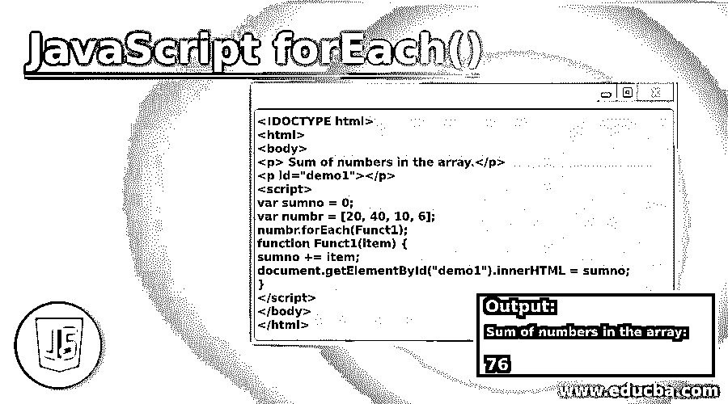
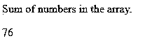
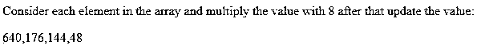
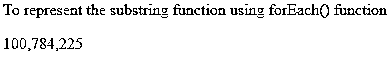
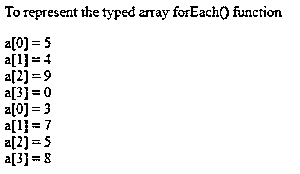

# JavaScript forEach()

> 原文：<https://www.educba.com/javascript-foreach/>




## JavaScript forEach()简介

JavaScript forEach()与数组中每个元素的函数执行相关，这意味着 forEach()方法只与数组中定义的元素相关。这只能在地图、数组和集合上使用，这代表了另一个事实，即元素应该以特定的顺序排列以执行某些活动。每当执行 for each()方法时，它都与回调函数相关联，回调函数将在有序数据结构(如映射、数组和集合)中的每个元素上执行。

### 句法

```
Ordered data structure(callback function() (present_value [,index[,data_structure]])[, thisArg])
arr.forEach(callback(present_value [, index [, array]])[, thisArg])
map.forEach(callback(present_value [, index [, map]])[, thisArg])
```

**说明:**

<small>网页开发、编程语言、软件测试&其他</small>

*   **callback—**callback 在这里表示在调用 forEach 方法时对数据结构的每个元素执行的最重要的函数。
*   **present _ value**–这里的 present value 是指元素数组中当前要处理的元素。
*   **Index—**表示数组中的当前值。
*   **data _ structure**–data _ structure 在这里表示数据结构，如数组、映射或集合一类有序的数据结构，用于方便地遍历和访问元素。
*   **this arg**–表示在传递参数时使用该参数执行回调函数时要使用的参数。

未定义返回类型 forEach()函数。

### forEach()方法在 JavaScript 中是如何工作的？

JavaScript 中的 forEach()方法大多与某种类型的有序数据结构相关联，如数组、映射和集合。因此，它的工作依赖于带有回调函数的 forEach()方法的调用。回调函数进一步依赖于对 forEach 方法的调用，一旦对数组中的每个元素以某种升序进行调用。它从不调用一些未定义、未初始化或已删除的索引属性。

此外，回调函数用三个参数调用:

*   要访问的元素的当前值
*   在有序数据结构(如数组、映射或集合)中定义的元素的索引。
*   遍历数组、映射或集合等数据结构中的对象。

现在，如果决定在如此定义的数据结构中传递 thisArg 参数，那么它将被用作回调的 this 函数。thisArg 的行为与该方法的其他函数类似。此外，它最终可由回调观察到，回调分别由该值决定。在 forEach()方法处理之前，数据结构中定义的元素的范围是确定的，然后它将被用作该函数的回调。因此，调用 forEach()方法后定义和固定的元素将不会被回调函数调用或访问。

如果元素在回调进行解析后被删除，这意味着如果在回调函数被调用后遍历元素后进行了任何删除，那么该值将被传递给 forEach()函数供其使用。还有一种情况，假设已经访问过的元素在迭代和遍历过程中被删除，那么后面的元素将被跳过，这将计划进一步执行回调函数。

与 map 数据结构不同，forEach()方法没有任何返回类型，它没有减少和停止数组功能的能力。forEach()方法不会复制和复制它所调用的数组，但是如果想要停止或中断 forEach()方法的循环，那么这是一个错误的选择。forEach()方法总是期望一个同步函数，使用异步函数的含义是非常糟糕的，可能会导致糟糕的输出。

### 在 JavaScript 中实现 forEach()的示例

以下是一些例子:

#### 示例#1

编写这个程序是为了使用 JavaScript 中的 forEach()方法获得数组中所有值的总和。

**代码:**

```
<!DOCTYPE html>
<html>
<body>
<p> Sum of numbers in the array.</p>
<p id="demo1"></p>
<script>
var sumno = 0;
var numbr = [20, 40, 10, 6];
numbr.forEach(Funct1);
function Funct1(item) {
sumno += item;
document.getElementById("demo1").innerHTML = sumno;
}
</script>
</body>
</html>
```

**输出:**




#### 实施例 2

这个程序是为数组中的每个元素编写的，用实际值的八倍来更新值。

**代码:**

```
<!DOCTYPE html>
<html>
<body>
<p> Consider each element in the array and multiply the value with 8 after that update the value:</p>
<p id="demo3"></p>
<script>
var numbr = [80, 22, 18, 6];
numbr.forEach(Function3)
function Function3(element, index, arr) {
arr[index] = element * 8;
}
document.getElementById("demo3").innerHTML = numbr;
</script>
</body>
</html>
```

**输出:**




#### 实施例 3

这个程序使用 JavaScript 的 forEach()方法来说明元素中的 substring 函数。

**代码:**

```
<!DOCTYPE html>
<html>
<body>
<p> To represent the substring function using forEach() function </p>
<script>
function func2() {
const items = [10, 28, 15];
const copy = [];
items.forEach(function(item1){
copy.push(item1*item1);
});
document.write(copy);
}
func2();
</script>
</body>
</html>
```

**输出:**




#### 实施例 4

这个程序分别使用 call back 和 forEach()方法获取一些类型化数组，并一次性打印所有类型化数组。

**代码:**

```
<!DOCTYPE html>
<html>
<body>
<p> To represent the typed array forEach() function </p>
<script>
const P = new Uint8Array([ 5, 4, 9, 0 ])
const Q = new Uint8Array([ 3, 7, 5, 8 ])
function callback(elmnt, index, array) {
document.write('a[' + index + '] = ' + elmnt + "<br>");
}
P.forEach(callback);
Q.forEach(callback);
</script>
</body>
</html>
```

**输出:**




**Note:** forEach() method is also browser compatible specifically with google chrome and Firefox. Internet explorer is not a much-preferred browser in this case of using the forEach method as it also deals with arrays like data structure.

### 结论

forEach()方法用于引用数组引用段，主要用于回调函数和元素同步，同时以排序方式访问和检索元素以供进一步利用，因此根本不适合以异步方式排列的元素。

### 推荐文章

这是 JavaScript forEach()的指南。这里我们讨论 JavaScript forEach()的介绍，语法，它是如何工作的，代码和输出的例子。您也可以浏览我们的其他相关文章，了解更多信息——

1.  [JavaScript 迭代数组](https://www.educba.com/javascript-iterate-array/)
2.  [JavaScript 中的数组](https://www.educba.com/arrays-in-javascript/)
3.  [JavaScript every()](https://www.educba.com/javascript-every/)
4.  [JavaScript 子数组()](https://www.educba.com/javascript-subarray/)


