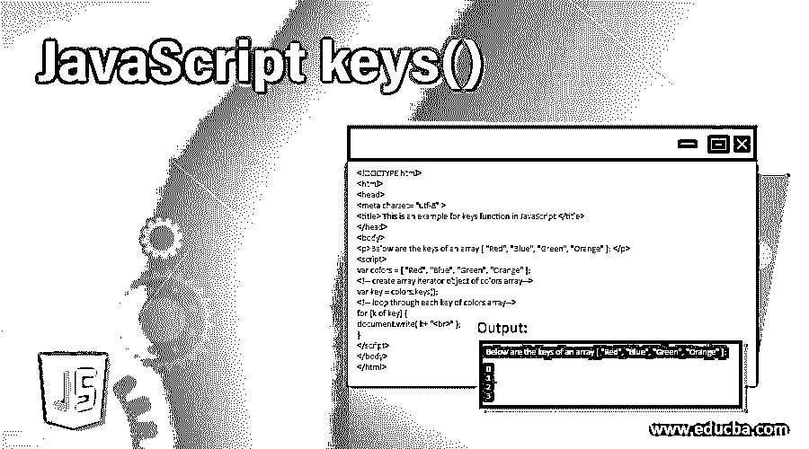
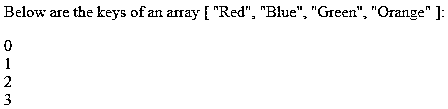
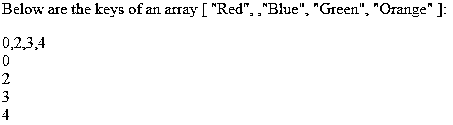
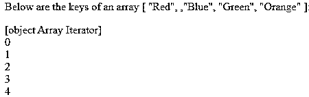

# JavaScript 键()

> 原文：<https://www.educba.com/javascript-keys/>




## JavaScript 键介绍()

JavaScript keys()方法用于创建并返回一个数组迭代器对象，该对象包含数组中每个索引的键。这个方法是 javascript 中的内置方法。此方法不接受任何参数。JavaScript keys()方法不影响原始数组，只是返回一个数组迭代器对象，它可以遍历每个键。

**语法**

<small>网页开发、编程语言、软件测试&其他</small>

JavaScript keys()方法的语法:

```
array.keys();
```

**参数:**

*   Keys()方法不接受任何参数。
*   **返回值:**这个方法的返回值是一个数组的迭代器对象。

### JavaScript keys()方法的示例

以下是 sre 的例子:

#### 示例#1

接下来，我们编写 html 代码，通过下面的例子更清楚地理解 javascript keys()方法，keys()方法用于返回数组的迭代器对象。

**代码:**

```
<!DOCTYPE html>
<html>
<head>
<meta charset= "utf-8" >
<title> This is an example for keys function in JavaScript </title>
</head>
<body>
<p>Below are the keys of an array [ "Red", "Blue", "Green", "Orange" ]: </p>
<script>
var colors = [ "Red", "Blue", "Green", "Orange" ];
<!-- create array iterator object of colors array -->
var key = colors.keys();
<!-- loop through each key of colors array -->
for (k of key) {
document.write( k+ "<br>" );
}
</script>
</body>
</html>
```

**输出:**




**解释:**在上面的代码中，创建了一个由[ "Red "、" Blue "、" Green "、" Orange" ]组成的数组，并使用了 keys()方法返回该数组的迭代器，在该数组中有四个元素。一个输出打印键是 0 到 3。因此，数组中的每个元素都会根据元素的数量分配一个键。

#### 实施例 2

下一个示例我们重写了上面的代码，其中 javascript keys()方法应用于一个数组，该数组包含缺失的元素或元素之间的空洞，如下面的代码所示

**代码:**

```
<!DOCTYPE html>
<html>
<head>
<meta charset= "utf-8" >
<title> This is an example for keys function in JavaScript </title>
</head>
<body>
<p>Below are the keys of an array [ "Red", ,"Blue", "Green", "Orange" ]: </p>
<script>
<!-- hole present in between an elements -->
var colors = [ "Red", ,"Blue", "Green", "Orange" ];
<!-- create array iterator object of colors array -->
var key = colors.keys();
<!-- loop through each key of colors array -->
for (k of key) {
document.write( k+ "<br>" );
}
</script>
</body>
</html>
```

**输出:**


**解释:**在上面的代码中，创建了一个由[ "Red "、" Blue "、" Green "、" Orange" ]组成的数组，并使用了 keys()方法返回该数组的迭代器，在该数组中，有四个元素和一个孔。一个输出打印键是 0 到 4。因此，一个键也以递增的顺序被分配给那个孔，因此 keys()方法不会忽略数组中的孔。

#### 实施例 3

如果我们想只获取当前元素的 key 或者忽略数组中的漏洞，我们需要使用 Object.keys()方法，如下所示:

**代码:**

```
<!DOCTYPE html>
<html>
<head>
<meta charset= "utf-8" >
<title> This is an example for keys function in JavaScript </title>
</head>
<body>
<p>Below are the keys of an array [ "Red", ,"Blue", "Green", "Orange" ]: </p>
<script>
var colors = [ "Red", ,"Blue", "Green", "Orange" ];
<!-- create array iterator object of colors array -->
var key = Object.keys(colors);
document.write( key+ "<br>" );
<!-- loop through each key of colors array -->
for (k of key) {
document.write( k+ "<br>" );
}
</script>
</body>
</html>
```

**输出:**




**解释:**在上面的代码中，创建了一个由[ "Red "、" Blue "、" Green "、" Orange" ]组成的数组，其中包含一个洞或空元素。然后使用 Object.keys()方法返回数组的键，正如我们在输出中看到的。因此，为该孔分配了一个键，但 object.keys()方法忽略了数组中孔的键(索引)。

#### 实施例 4

在下一个示例代码中，我们为 javascript keys()方法重写了上述代码，以应用于常量数组。如下例所示——

**代码:**

```
<!DOCTYPE html>
<html>
<head>
<meta charset= "utf-8" >
<title> This is an example for keys function in JavaScript </title>
</head>
<body>
<p>Below are the keys of an array [ "Red", ,"Blue", "Green", "Orange" ]: </p>
<script>
const colors = [ "Red", ,"Blue", "Green", "Orange" ];
<!-- create array iterator object of colors array -->
const key = colors.keys();
document.write( key+ "<br>" );
<!-- loop through each key of colors array -->
for (k of key) {
document.write( k+ "<br>" );
}
</script>
</body>
</html>
```

**输出:**




**解释:**如上代码中常量数组是通过使用 const 关键字由[ "Red "，" Blue "，" Green "，" Orange" ]创建的，这个关键字用于创建一个变量或数组的只读引用。稍后使用 keys()方法返回这个数组的迭代器。输出是打印键迭代器和从 0 到 4 的键(索引)号。因此，常量数组也分配了一个键。

### 结论

JavaScript keys()方法是 JavaScript 中的一个内置方法，它返回一个数组迭代器对象，该对象包含数组中每个索引的键。JavaScript keys()方法不会忽略数组中存在的漏洞。如果我们需要忽略漏洞，可以使用 object.keys()方法。

### 推荐文章

这是一个 JavaScript 键的指南()。在这里，我们讨论 JavaScript keys()的介绍以及语法和示例，以便更好地理解。您也可以浏览我们的其他相关文章，了解更多信息——

1.  [JavaScript 光标](https://www.educba.com/javascript-cursor/)
2.  [JavaScript 声明数组](https://www.educba.com/javascript-declare-array/)
3.  [Javascript 抛出异常](https://www.educba.com/javascript-throw-exception/)
4.  [JavaScript 中的动态数组](https://www.educba.com/dynamic-array-in-javascript/)


