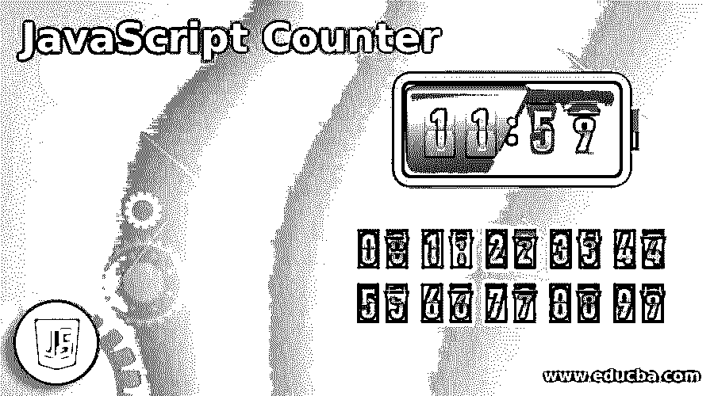
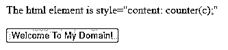
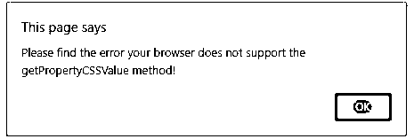
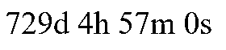
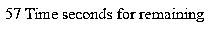

# JavaScript 计数器

> 原文：<https://www.educba.com/javascript-counter/>




## JavaScript 计数器简介

计数器是在应用程序中使用仪表板的重要组件之一，而我们在 web 应用程序中使用它时，它将通过一些脚本编码来创建，并且它还制作了一个简单的投票计数器来计算包中的项目数，投票。在实际场景中，它主要使用名为 Pusher 的 API 来创建和使用名为 node.js 应用程序的技术。在这些包的帮助下，我们将创建我们自己的定制视图，并且它还仔细听取更改，特别是单个项目的投票数。

### 语法和参数

基本上，javascript 使用函数和参数，即使初始化的变量被赋予了正确的语法，特别是在客户端环境下，它也在浏览器本身中被验证。在 Javascript 中，计数器是 UI 交互的特性之一，它将通过一种或多种方式实现，比如我们必须初始化和声明计数变量，另一种方式是我们使用 Pusher API 对网页中用户定义的自定义视图进行计数。

<small>网页开发、编程语言、软件测试&其他</small>

```
<html>
<head>
<script>
var v= 60;
var v1 =setInterval(functionname,1000);
</script></head>
<body></body>
</html>
```

使用上面的代码，我们将调用一些默认的方法来绑定没有加密的数据。对于每一个通道，投票人计数将根据脚本中初始化的投票人变量而变化。

### JavaScript 中 Counter 是怎么做的？

我们可以在脚本中使用许多不同的 api，但是每一个 api 都有自己的特点，有优点也有缺点。因为 Pusher API 是一种 API，它将用于基于 web 的应用程序的真实世界用户计数，借助于我们将在数据库中存储和提取数据的方法。这是为应用程序添加实时功能的最简单的方法之一。因为如果用户以前没有注册，每个基于网络的应用程序都会注册免费帐户。它可以创建应用程序，从“应用程序密钥”部分复制出应用程序证书，如应用程序 ID、密钥或任何其他加密和解密数据，因此需要我们自己的应用程序与基于 pusher 的 API 进行交互。

有时计数器是使用默认框架实现的，比如 jquery，除此之外还有计数器插件，javascript 有一些默认插件，比如滚动触发计数器插件，它在 purecounter.js 下，因为它基于用户对 UI 中数据计数的需求。每当我们使用 html 代码时，它必须用在 dom 元素上，这些元素需要将用户数据处理到浏览器中，它也存储在浏览器缓存中作为临时存储。dom 元素用于获取用户在字段中输入的文本数据，并显示在应用程序字段中已经输入的单词总数中。我们需要在 javascript 中创建两个函数，它接受 antextarea 元素的值来计算总字数，并将其显示在占位符元素上。

### JavaScript 计数器的示例

下面是一些例子:

#### 示例#1

**代码:**

```
<!DOCTYPE html>
<html>
<head>
<script type=*"text/javascript"*>
function demo() {
var d = document.getElementById ("first");
if (window.getComputedStyle) {
var comp = window.getComputedStyle (d, null);
try {
var v = comp.getPropertyCSSValue ("content");
try {
varcvalue = null;
if (v) {
if (v.cssValueType == CSSValue.CSS_PRIMITIVE_VALUE) {
if (v.primitiveType == CSSPrimitiveValue.CSS_COUNTER) {
cvalue = value.getCounterValue ();
}
}
else {
if (v.cssValueType == CSSValue.CSS_VALUE_LIST) {
if (v.length> 0) {
if (v[0].primitiveType == CSSPrimitiveValue.CSS_COUNTER) {
counterValue = v[0].getCounterValue ();
}
}
}
}
}
if (cvalue) {
alert ("(identifier: " + cvalue.identifier +
", listStyle: " + cvalue.listStyle +
", separator: " + cvalue.separator + ")");
}
else {
alert ("The value of the counter-increment property is not a counter function!");
}
}
catch (e) {
alert ("Please find the error your browser does not support the getCounterValue method!");
}
}
catch (e) {
alert ("Please find the error your browser does not support the getPropertyCSSValue method!");
}
}
else {
alert ("Please find the error your browser does not support the getComputedStyle method!");
}
}
</script>
</head>
<body>
<div id="first" style="content: counter(c);">The html element is style="content: counter(c);"</div>
<br/>
<button onclick="demo()">Welcome To My Domain!</button>
</body>
</html>
```

**输出:**







#### 实施例 2

**代码:**

```
<!DOCTYPE HTML>
<html>
<head>
<meta name="viewport" content="width=device-width, initial-scale=1">
<style>
p {
display: inline;
font-size: 40px;
margin-top: 0px;
}
</style>
</head>
<body>
<p id="days"></p>
<p id="hours"></p>
<p id="mins"></p>
<p id="secs"></p>
<h2 id="end"></h2>
<script>
var c = new Date("Jul 28, 2022 22:24:16").getTime();
var mf = setInterval(function() {
var n = new Date().getTime();
var t = c - n;
var da = Math.floor(t / (1000 * 60 * 60 * 24));
var ho = Math.floor((t % (1000 * 60 * 60 * 24)) / (1000 * 60 * 60));
var mins = Math.floor((t % (1000 * 60 * 60)) / (1000 * 60));
var sec = Math.floor((t % (1000 * 60)) / 1000);
document.getElementById("days").innerHTML = da + "d "
document.getElementById("hours").innerHTML = ho + "h "
document.getElementById("mins").innerHTML = mins + "m "
document.getElementById("secs").innerHTML = sec + "s "
if (t < 0) {
clearInterval(mf);
document.getElementById("days").innerHTML = ""
document.getElementById("hours").innerHTML = ""
document.getElementById("mins").innerHTML = ""
document.getElementById("secs").innerHTML = ""
document.getElementById("end").innerHTML = "TIMES UP Please try new dates!!";
}
}, 1000);
</script>
</body>
</html>
```

**输出:**




#### 实施例 3

**代码:**

```
<!DOCTYPE HTML>
<html>
<body>
<div id="first"></div>
<script>
var tf = 60;
var e = document.getElementById('first');
var t = setInterval(demo, 1000);
function demo() {
if (tf == -1) {
clearTimeout(t);
second();
} else {
e.innerHTML = tf + ' Time seconds for remaining';
tf--;
}
}
function second() {
alert("Hi Welcome User");
}
</script>
</body>
</html>
```

**输出:**




### 结论

一般来说，JS 用于代码片段操作，它可用于所有场景。它根据用户的要求自动增加计数器的值。如果我们需要改变定制的时间，即使我们不接触 html 代码，它也只会在脚本中进行修改。

### 推荐文章

这是一个 JavaScript 计数器指南。在这里，我们还讨论了 javascript 中的简介和计数器是如何工作的？以及不同的示例及其代码实现。您也可以看看以下文章，了解更多信息–

1.  [JavaScript object.is()](https://www.educba.com/javascript-object-is/)
2.  [JavaScript 动画](https://www.educba.com/javascript-animation/)
3.  [JavaScript elseIf](https://www.educba.com/javascript-elseif/)
4.  [JavaScript 数组切片](https://www.educba.com/javascript-array-slice/)


