# JavaScript 延迟

> 原文：<https://www.educba.com/javascript-delay/>

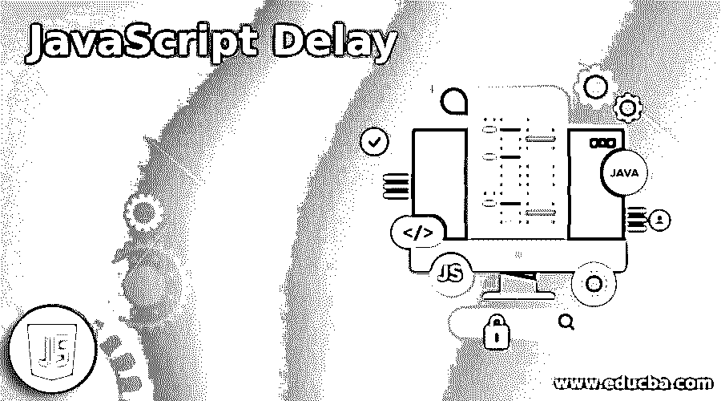


## JavaScript 延迟的定义

长期以来，web 平台为 JavaScript 程序员提供了许多功能，允许他们在特定时间间隔过后异步执行代码，并反复异步执行一组代码，直到用户告诉它停止。其中一个函数是 setTimeout，它在以毫秒为单位的指定时间后执行一个方法。因为 JavaScript 不提供任何等待命令来允许循环延迟，所以这种方法非常有用。JavaScript 可以启动一个动作或在指定的时间间隔后重复它。

**语法:**

<small>网页开发、编程语言、软件测试&其他</small>

下面是提供延迟的 setTimeout 函数的语法。

```
setTimeout(fn_name, ms, a1, a2, a3...)
```

**参数:**

*   **fn_name:** 要执行的函数的名称。
*   **毫秒:**毫秒数。
*   **a1，a2，a3:** 传递给函数的参数。

### JavaScript 中的延迟函数是如何工作的？

如前所述，setTimeout()有不同的参数。作为第一个参数，调用一个函数，该函数必须在调用 setTimeout()时执行。第二个参数是以毫秒为单位的时间量。让我们看一个例子。

```
<button onclick="variable = setTimeout(func, 3000)">Click me</button>
<button onclick="clearTimeout(variable)">Stop execution</button>
<script>
function func() {
alert("This message is displayed after 3 seconds!");}
```

这里有两个按钮。点击我，停止执行。单击 Click me 按钮时，将调用 func()函数，3 秒钟后显示一条消息。

同时，在单击停止执行按钮时，将调用 clearTimeout。clearTimeout()方法停止 setTimeout()中提到的函数执行。如果 setTimeout 中的函数尚未执行，此方法可以停止执行。

### JavaScript 延迟的例子

让我们看看 setTimeout 函数的一些示例程序。

#### 示例#1

3 秒钟后显示文本的 Javascript 程序，该文本定义了 setTimeout 中的函数。

**代码:**

```
<!DOCTYPE html>
<html>
<body>
<button onclick="func1()">Click me</button>
<script>
function func1() {
setTimeout(function(){ alert("This message is displayed after 3 seconds!"); }, 3000);
}
</script>
<p>Please click the button "Click me" and see what happens after 3 seconds.</p>
</body>
</html>
```

**输出:**

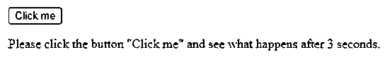


在这个程序中，创建了一个按钮“Click me ”,它在单击按钮时调用函数 func1()。在函数 func1 中，调用 setTimeout()的时间为 3000 毫秒，函数是在方法本身中定义的。按钮下方还会显示一段文字“请点击按钮“点击我”并查看 3 秒后会发生什么”。在执行代码时，可以看到显示了带有特定文本的按钮。单击该按钮时，会显示一条消息，如下所示。

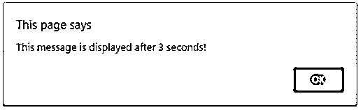


#### 实施例 2

Javascript 程序在 3 秒后显示文本，如果按钮在 3 秒前被点击，则停止执行。

**代码:**

```
<!DOCTYPE html>
<html>
<body>
<button onclick="variabl = setTimeout(func, 3000)">Click me</button>
<button onclick="clearTimeout(variabl)">Stop execution</button>
<p>Please click the button "Click me" and see what happens after 3 seconds.</p>
<p>Try to stop the function execution by clicking the stop button before completing 3 seconds.</p>
<script>
function func() {
alert("This message is displayed after 3 seconds!");
}
</script>
</body>
</html>
```

**输出:**

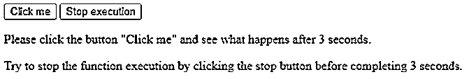


在这个程序中，有两个按钮。点击我，停止执行。单击 Click me 按钮时，将调用 func()函数，该函数在 3 秒钟后显示一条消息，如下所示。类似地，在单击停止执行按钮时，将调用 clearTimeout。

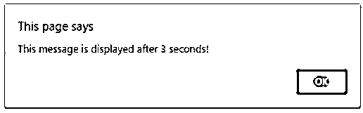


#### 实施例 3

Javascript 程序在 3 秒钟后显示一个文本。

**代码:**

```
<!DOCTYPE html>
<html>
<body>
<button onclick="variabl = setTimeout(func, 3000)">Click me</button>
<p>Please click the button "Click me" and see what happens after 3 seconds.</p>
<script>
function func() {
alert("This message is displayed after 3 seconds!");
}
</script>
</body>
</html>
```

**输出:**

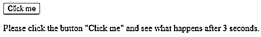


与程序 1 类似，创建了一个按钮“Click me ”,它在单击按钮时调用函数 func1()。区别在于函数是单独定义的。在执行代码时，可以看到显示了带有特定文本的按钮。单击该按钮时，会显示一条消息，如下所示。

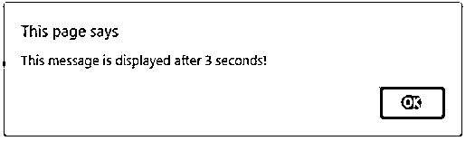


#### 实施例 4

Javascript 程序每 2 秒显示一个定时文本，直到 6 秒。

**代码:**

```
<!DOCTYPE html>
<html>
<body>
<p>Please click the button "TIMED TEXT" and see what happens after every two seconds.</p>
<button onclick="func()">TIMED TEXT</button>
<input type="text" id="textt">
<script>
function func() {
var v = document.getElementById("textt");
setTimeout(function(){ v.value="2 secs" }, 2000);
setTimeout(function(){ v.value="4 secs" }, 4000);
setTimeout(function(){ v.value="6 secs" }, 6000);
}
</script>
</body>
</html>
```

**输出:**

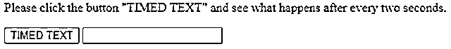


在这个程序中，创建了一个按钮“TIMED TEXT ”,单击该按钮将调用 func()函数。在该函数中，setTimeout()被调用三次，间隔为 2000 毫秒。在执行代码时，可以看到显示了带有特定文本的按钮。单击该按钮时，在如下所示的文本框中会显示一条消息。

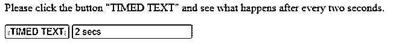


两秒钟后，定时文本变为 4 秒钟，如下所示。

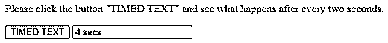


两秒钟后，定时文本变为 4 秒钟，如下所示。

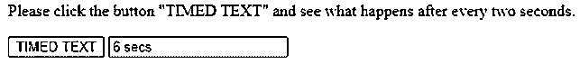


#### 实施例 5

单击按钮后打开窗口的 Javascript 程序。

**代码:**

```
<!DOCTYPE html>
<html>
<body>
<p> Open a new window by clicking the button. . .</p>
<button onclick="func()"> Click here </button>
<script>
function func() {
var v = window.open("", "v", "width=500, height=250");
v.document.write("<p> New window </p>");
setTimeout(function(){ v.close() }, 2000);
}
</script>
</body>
</html>
```

**输出:**


在这个程序中，创建了一个按钮“Click here ”,它在单击按钮时调用 func()函数。点击按钮，一个新的窗口就会打开。在该函数中，以 2000 毫秒为时间调用 setTimeout()。在执行代码时，可以看到显示了带有特定文本的按钮。单击该按钮，将打开一个新窗口，如下所示。2000 毫秒后，打开的窗口自动关闭。

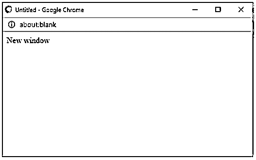


### 结论

在 Javascript 中，setTimeoutis 是一个在以毫秒为单位的指定时间后执行方法的函数。JavaScript 可以启动一个动作或在指定的时间间隔后重复它。在本文中，setTimeout 函数通过语法、工作原理和示例进行了详细解释。

### 推荐文章

这是一个 JavaScript 延迟指南。这里我们也讨论一下 javascript 中的延迟函数是如何工作的？以及一个不同的示例及其代码实现。您也可以看看以下文章，了解更多信息–

1.  [JavaScript 动画](https://www.educba.com/javascript-animation/)
2.  [JavaScript 数组切片](https://www.educba.com/javascript-array-slice/)
3.  [JavaScript 转换成 JSON](https://www.educba.com/javascript-convert-to-json/)
4.  [JavaScript 数组包含](https://www.educba.com/javascript-array-contain/)


