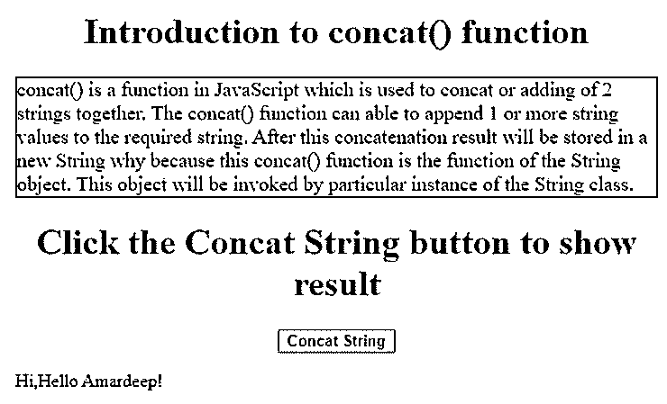
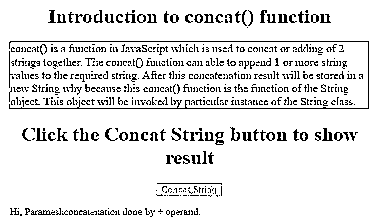
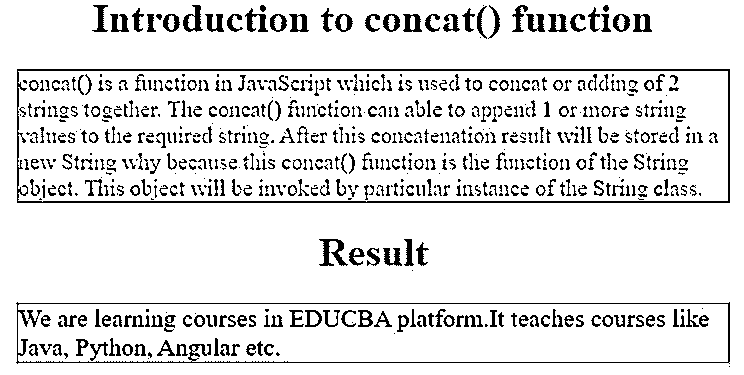

# JavaScript concat String

> 原文：<https://www.educba.com/javascript-concat-string/>


## JavaScript 串联字符串简介

concat()是 JavaScript 中的一个函数，用于将两个字符串连接或相加。concat()函数能够将一个或多个字符串值追加到所需的字符串中。在这之后，串联结果将被存储在一个新的字符串中，因为这个 concat()函数是 String 对象的函数。该对象将由 String 类的特定实例调用。

### JavaScript 中的 concat 函数是如何工作的？

JavaScript 串联有两种方式。我们可以用“+”操作数或 concat()函数追加两个或更多的字符串。

<small>网页开发、编程语言、软件测试&其他</small>

**语法 1:**

“+”操作数的 JavaScript 语法如下所示:

```
"String1"+"String4"+"String3"+.....
```

**语法 2:**

concat()函数的 JavaScript 语法如下所示:

```
string.concat(string1, string2,... string_n);
```

**接受的参数或自变量:**

*   string1、string2、…string_n 是字符串值，根据我们的要求附加到所需的现有字符串或空字符串。
*   这些值总是附加在字符串的末尾。

**返回值:**

*   它返回一个新的字符串。

**Note:** All values will be converted to a string if we perform concat or + operand operation. The concat() function should not change the actual value of the string.

### JavaScript 串联字符串的示例

下面是提到的例子:

#### 示例#1

使用 concat()函数连接两个字符串。

**代码:**

```
<!DOCTYPE html>
<html>
<head>
<!--CSS styles Code-->
<style>
h1
{
color: green;
text-align: center;
}
.button
{
text-align: center;
}
.p
{
color: blue;
border: 1px solid maroon;
font-size: 18px;
}
</style>
<!--JavaScript Code-->
<script>
function getConcateString() {
varfirstString = "Hi,";
varsecondString = "Hello Amardeep!";
var result = firstString.concat(secondString);/*when we click on the button then concatenation displayed*/
document.getElementById("output").innerHTML = result;
}11
</script>
</head>
<body>
<h1>Introduction to concat() function</h1>
<p class="p">
concat() is a function in JavaScript which is used to concat or adding of 2 strings together. The concat() function can able to append 1 or more string values to the required string. After this concatenation result will be stored in a new String why because this concat() function is the function of the String object. This object will be invoked by particular instance of the String class.
</p>
<h1>Click the Concat String button to show result</h1>
<div class="button">
<button style="color:red;font-weight: bold" onclick="getConcateString()">Concat String</button>
</div>
<p id="output"></p>
</body>
</html>
```

**输出:**




#### 实施例 2

使用+操作数连接两个字符串。

**代码:**

```
<!DOCTYPE html>
<html>
<head>
<!--CSS styles Code-->
<style>
h1
{
color: blue;
text-align: center;
}
.button
{
text-align: center;
}
.p
{
color: green;
border: 1px solid maroon;
font-size: 18px;
}
</style>
<!--JavaScript Code-->
<script>
function getPlusOperandConcat() {
varfirstString = "Hi, Paramesh";
varsecondString = "concatenation done by + operand.";
var result = firstString+secondString;/*when we click on the button then concatenation displayed*/
document.getElementById("output").innerHTML = result;
}11
</script>
</head>
<body>
<h1>Introduction to concat() function</h1>
<p class="p">
concat() is a function in JavaScript which is used to concat or adding of 2 strings together. The concat() function can able to append 1 or more string values to the required string. After this concatenation result will be stored in a new String why because this concat() function is the function of the String object. This object will be invoked by particular instance of the String class.
</p>
<h1>Click the Concat String button to show result</h1>
<div class="button">
<button style="color:fuchsia;font-weight: bold" onclick="getPlusOperandConcat()">Concat String</button>
</div>
<p id="output"></p>
</body>
</html>
```

**输出:**




#### 实施例 3

使用 concat()函数连接两个以上的字符串。

**代码:**

```
<!DOCTYPE html>
<html>
<head>
<!--CSS styles Code-->
<style>
h1
{
color: brown;
text-align: center;
}
.p
{
color: fuchsia;
border: 1px solid maroon;
font-size: 18px;
}
.out
{
color: navy;
border: 1px solid red;
font-size: 20px;
}
</style>
</head>
<body>
<h1>Introduction to concat() function</h1>
<p class="p">
concat() is a function in JavaScript which is used to concat or adding of 2 strings together. The concat() function can able to append 1 or more string values to the required string. After this concatenation result will be stored in a new String why because this concat() function is the function of the String object. This object will be invoked by particular instance of the String class.
</p>
<h1>Result</h1>
<!--JavaScript Code-->
<script>
function getPlusOperandConcat() {
varfirstString = "We are learning courses in EDUCBA platform.";
var result =firstString.concat("It teaches courses like ","Java,"," Python,"," Angular etc.") ;/*when we click on the button then concatenation displayed*/
document.write("<p class='out'>"+result+"<p>");
}
getPlusOperandConcat();
</script>
</body>
</html>
```

**输出:**




### 结论

JavaScript concat()是一个函数，用于将两个或多个字符串相加或追加在一起。通过使用+操作数和 concat()函数，可以以两种方式完成这个 JavaScript 串联。

### 推荐文章

这是一个 JavaScript 串联字符串的指南。这里我们讨论 JavaScript concat String 的介绍，concat 函数如何与编程实例一起工作。您也可以看看以下文章，了解更多信息–

1.  [JavaScript 中的多态性](https://www.educba.com/polymorphism-in-javascript/)
2.  [JavaScript 窗口事件](https://www.educba.com/javascript-window-events/)
3.  [JavaScript entries()](https://www.educba.com/javascript-entries/)
4.  [JavaScript 展平数组](https://www.educba.com/javascript-flatten-array/)


